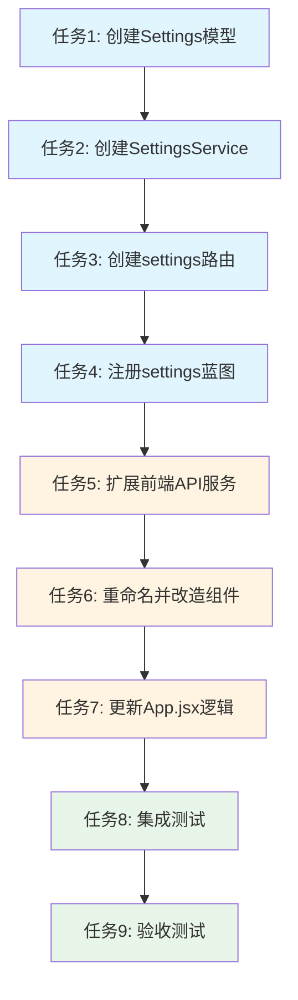

# 产品线设置功能 - 任务拆分文档

## 一、任务概述

将产品线筛选功能改造为持久化的产品线显示设置功能，包括后端配置存储、前端配置管理和UI改造。

## 二、任务依赖关系图

## 三、原子任务列表

### 任务1: 创建Settings模型

**输入契约:**
- 前置依赖: 无
- 输入数据: 无
- 环境依赖: Python环境，现有models目录结构

**输出契约:**
- 输出数据: Settings类，包含visibleProductLines属性
- 交付物: `backend/models/settings.py`
- 验收标准:
  - ✅ Settings类正确实现__init__、to_dict、from_dict方法
  - ✅ validate方法正确验证数据类型
  - ✅ 代码包含完整的中文注释
  - ✅ 符合现有代码规范

**实现约束:**
- 技术栈: Python
- 接口规范: 与现有Model类保持一致
- 质量要求: 包含数据验证逻辑

**依赖关系:**
- 后置任务: 任务2
- 并行任务: 无

---

### 任务2: 创建SettingsService

**输入契约:**
- 前置依赖: 任务1完成
- 输入数据: Settings模型
- 环境依赖: file_handler工具类

**输出契约:**
- 输出数据: SettingsService类
- 交付物: `backend/services/settings_service.py`
- 验收标准:
  - ✅ get_settings方法正确读取配置
  - ✅ update_visible_productlines方法正确保存配置
  - ✅ reset_settings方法正确重置配置
  - ✅ 文件不存在时返回默认配置
  - ✅ 文件损坏时有降级处理
  - ✅ 代码包含完整的中文注释

**实现约束:**
- 技术栈: Python
- 接口规范: 与现有Service类保持一致
- 质量要求: 完善的错误处理

**依赖关系:**
- 后置任务: 任务3
- 并行任务: 无

---

### 任务3: 创建settings路由

**输入契约:**
- 前置依赖: 任务2完成
- 输入数据: SettingsService
- 环境依赖: Flask框架，decorators工具

**输出契约:**
- 输出数据: settings蓝图
- 交付物: `backend/routes/settings.py`
- 验收标准:
  - ✅ GET /api/settings 接口正常工作
  - ✅ PUT /api/settings/visible-productlines 接口正常工作
  - ✅ POST /api/settings/reset 接口正常工作
  - ✅ 使用@handle_errors装饰器
  - ✅ 参数验证完善
  - ✅ 返回格式符合规范
  - ✅ 代码包含完整的中文注释

**实现约束:**
- 技术栈: Flask
- 接口规范: RESTful风格，与现有路由保持一致
- 质量要求: 统一的错误处理和响应格式

**依赖关系:**
- 后置任务: 任务4
- 并行任务: 无

---

### 任务4: 注册settings蓝图

**输入契约:**
- 前置依赖: 任务3完成
- 输入数据: settings蓝图
- 环境依赖: backend/app.py

**输出契约:**
- 输出数据: 更新后的app.py
- 交付物: 修改`backend/app.py`
- 验收标准:
  - ✅ settings蓝图正确注册
  - ✅ 路由可以正常访问
  - ✅ 不影响现有路由

**实现约束:**
- 技术栈: Flask
- 接口规范: 与现有蓝图注册方式一致
- 质量要求: 最小化改动

**依赖关系:**
- 后置任务: 任务5
- 并行任务: 无

---

### 任务5: 扩展前端API服务

**输入契约:**
- 前置依赖: 任务4完成（后端API可用）
- 输入数据: 后端API接口
- 环境依赖: frontend/src/services/api.js

**输出契约:**
- 输出数据: 新增settings相关API函数
- 交付物: 修改`frontend/src/services/api.js`
- 验收标准:
  - ✅ getSettings函数正确实现
  - ✅ updateVisibleProductLines函数正确实现
  - ✅ resetSettings函数正确实现
  - ✅ 错误处理与现有API保持一致
  - ✅ 代码包含完整的中文注释

**实现约束:**
- 技术栈: JavaScript
- 接口规范: 与现有API函数保持一致
- 质量要求: 统一的错误处理

**依赖关系:**
- 后置任务: 任务6、任务7
- 并行任务: 无

---

### 任务6: 重命名并改造ProductLineFilter组件

**输入契约:**
- 前置依赖: 任务5完成
- 输入数据: 现有ProductLineFilter组件
- 环境依赖: Ant Design组件库

**输出契约:**
- 输出数据: ProductLineSettings组件
- 交付物: 
  - 创建`frontend/src/components/ProductLineSettings.jsx`
  - 删除`frontend/src/components/ProductLineFilter.jsx`
- 验收标准:
  - ✅ 组件重命名为ProductLineSettings
  - ✅ Card标题改为"显示设置"
  - ✅ 子标题改为"产品线显示设置"
  - ✅ 保持现有交互逻辑不变
  - ✅ 代码包含完整的中文注释

**实现约束:**
- 技术栈: React + Ant Design
- 接口规范: Props接口保持不变
- 质量要求: UI文案准确，交互流畅

**依赖关系:**
- 后置任务: 任务7
- 并行任务: 无

---

### 任务7: 更新App.jsx逻辑

**输入契约:**
- 前置依赖: 任务5、任务6完成
- 输入数据: 
  - getSettings、updateVisibleProductLines API
  - ProductLineSettings组件
- 环境依赖: React Hooks

**输出契约:**
- 输出数据: 更新后的App组件
- 交付物: 修改`frontend/src/App.jsx`
- 验收标准:
  - ✅ 导入ProductLineSettings替换ProductLineFilter
  - ✅ loadData函数并行加载settings
  - ✅ 首次使用时默认全选并保存
  - ✅ handleProductLineSelectionChange自动保存配置
  - ✅ 错误处理完善，有降级方案
  - ✅ 代码包含完整的中文注释

**实现约束:**
- 技术栈: React
- 接口规范: 保持现有组件接口
- 质量要求: 
  - 配置加载不阻塞渲染
  - UI优先更新
  - 静默保存

**依赖关系:**
- 后置任务: 任务8
- 并行任务: 无

---

### 任务8: 集成测试

**输入契约:**
- 前置依赖: 任务1-7全部完成
- 输入数据: 完整的功能实现
- 环境依赖: 开发环境，测试数据

**输出契约:**
- 输出数据: 测试结果报告
- 交付物: 测试通过确认
- 验收标准:
  - ✅ 首次使用默认显示所有产品线
  - ✅ 勾选/取消勾选自动保存
  - ✅ 刷新页面配置保持
  - ✅ 关闭浏览器重开配置保持
  - ✅ 配置文件格式正确
  - ✅ 错误场景降级正常
  - ✅ 无控制台错误

**实现约束:**
- 技术栈: 手动测试
- 接口规范: 按验收标准执行
- 质量要求: 覆盖所有场景

**依赖关系:**
- 后置任务: 任务9
- 并行任务: 无

---

### 任务9: 验收测试

**输入契约:**
- 前置依赖: 任务8完成
- 输入数据: 集成测试结果
- 环境依赖: 生产环境模拟

**输出契约:**
- 输出数据: 验收报告
- 交付物: 
  - `docs/产品线设置功能/ACCEPTANCE_产品线设置功能.md`
  - `docs/产品线设置功能/FINAL_产品线设置功能.md`
- 验收标准:
  - ✅ 所有功能验收标准通过
  - ✅ 所有技术验收标准通过
  - ✅ 所有性能验收标准通过
  - ✅ 文档完整准确

**实现约束:**
- 技术栈: 文档编写
- 接口规范: 按CONSENSUS文档验收
- 质量要求: 全面、准确

**依赖关系:**
- 后置任务: 无
- 并行任务: 无

## 四、任务执行顺序

### 阶段1: 后端开发（任务1-4）
1. 任务1: 创建Settings模型
2. 任务2: 创建SettingsService
3. 任务3: 创建settings路由
4. 任务4: 注册settings蓝图

**预计时间:** 1-2小时
**关键里程碑:** 后端API可用

### 阶段2: 前端开发（任务5-7）
5. 任务5: 扩展前端API服务
6. 任务6: 重命名并改造组件
7. 任务7: 更新App.jsx逻辑

**预计时间:** 1-2小时
**关键里程碑:** 前端功能完成

### 阶段3: 测试验收（任务8-9）
8. 任务8: 集成测试
9. 任务9: 验收测试

**预计时间:** 0.5-1小时
**关键里程碑:** 功能交付

## 五、风险控制

### 5.1 任务级风险

| 任务 | 风险 | 应对措施 |
|------|------|----------|
| 任务2 | 文件读写失败 | 完善异常处理，提供降级方案 |
| 任务7 | 配置加载时序问题 | 使用Promise.all确保顺序 |
| 任务8 | 测试覆盖不全 | 按验收标准逐项测试 |

### 5.2 依赖风险

| 依赖 | 风险 | 应对措施 |
|------|------|----------|
| file_handler | 工具类变更 | 使用现有稳定版本 |
| Ant Design | 组件API变更 | 保持现有版本 |
| React Hooks | 状态管理复杂 | 简化状态逻辑 |

## 六、质量检查清单

### 6.1 代码质量
- [ ] 所有代码包含完整的中文注释
- [ ] 函数级注释包含参数说明和返回值
- [ ] 代码符合现有项目规范
- [ ] 无ESLint/Pylint警告

### 6.2 功能质量
- [ ] 所有API接口正常工作
- [ ] 所有UI交互正常
- [ ] 配置正确保存和加载
- [ ] 错误处理完善

### 6.3 文档质量
- [ ] ACCEPTANCE文档完整
- [ ] FINAL文档准确
- [ ] 代码注释清晰
- [ ] API文档完整

## 七、交付物清单

### 7.1 后端代码
- [ ] `backend/models/settings.py`
- [ ] `backend/services/settings_service.py`
- [ ] `backend/routes/settings.py`
- [ ] `backend/app.py` (修改)

### 7.2 前端代码
- [ ] `frontend/src/services/api.js` (修改)
- [ ] `frontend/src/components/ProductLineSettings.jsx`
- [ ] `frontend/src/App.jsx` (修改)
- [ ] 删除 `frontend/src/components/ProductLineFilter.jsx`

### 7.3 数据文件
- [ ] `data/settings.json` (自动创建)

### 7.4 文档
- [ ] `docs/产品线设置功能/ALIGNMENT_产品线设置功能.md` ✅
- [ ] `docs/产品线设置功能/CONSENSUS_产品线设置功能.md` ✅
- [ ] `docs/产品线设置功能/DESIGN_产品线设置功能.md` ✅
- [ ] `docs/产品线设置功能/TASK_产品线设置功能.md` ✅
- [ ] `docs/产品线设置功能/ACCEPTANCE_产品线设置功能.md`
- [ ] `docs/产品线设置功能/FINAL_产品线设置功能.md`

## 八、注意事项

### 8.1 开发注意事项
1. 严格按照任务顺序执行，不要跳过
2. 每完成一个任务立即验证
3. 遇到问题立即记录并寻求帮助
4. 保持代码风格与现有项目一致

### 8.2 测试注意事项
1. 测试前备份现有数据
2. 测试覆盖正常和异常场景
3. 验证配置文件格式正确
4. 确认不影响现有功能

### 8.3 文档注意事项
1. 及时更新ACCEPTANCE文档
2. 记录所有问题和解决方案
3. 最终文档需完整准确
4. 包含TODO清单（如有）
