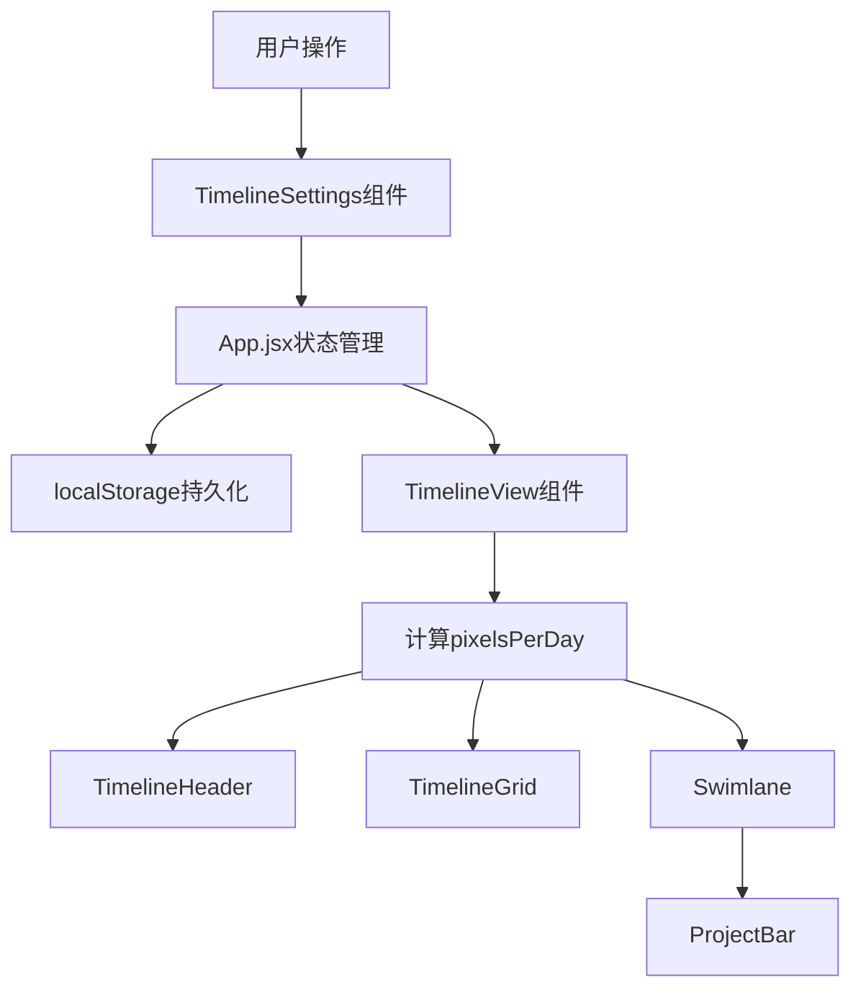
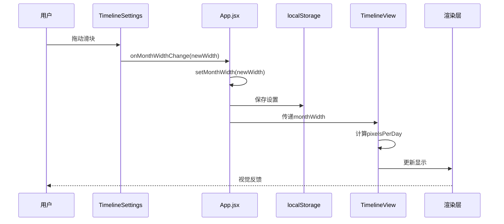
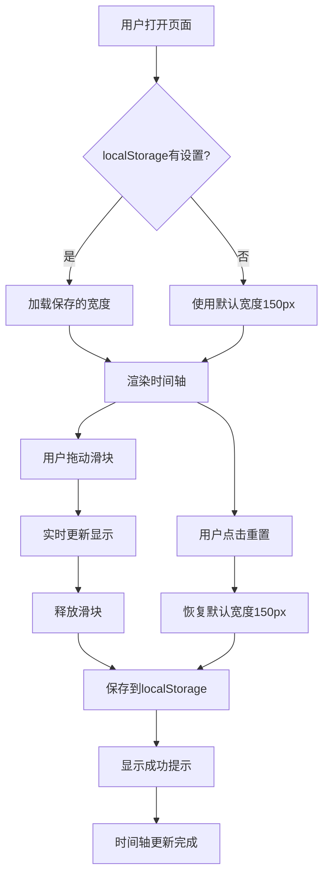
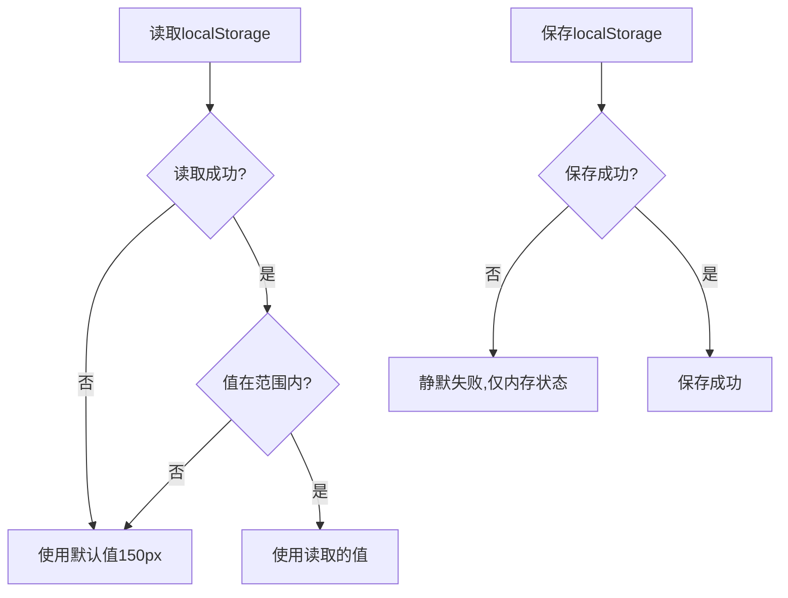
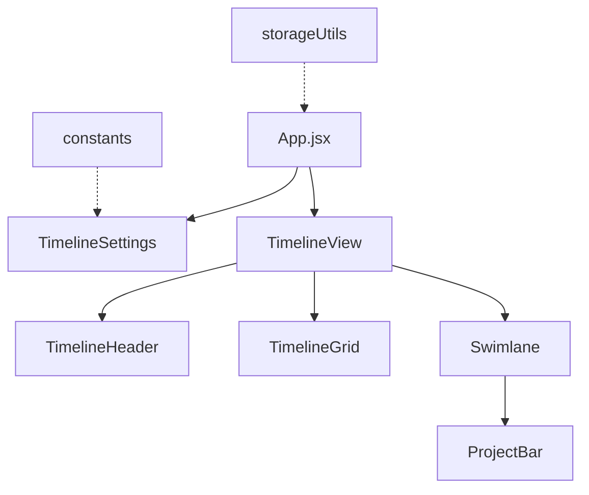

# DESIGN - 单月宽度设置功能架构设计

## 📋 设计概述

**任务名称**：单月宽度设置功能  
**设计时间**：2025-10-21 09:36  
**设计版本**：v1.0

## 🏗 系统架构

### 整体架构图



### 数据流向图



## 🔧 核心模块设计

### 模块1: 状态管理层（App.jsx）

#### 职责
- 管理 monthWidth 全局状态
- 处理 localStorage 读写
- 提供状态更新回调

#### 接口定义
```typescript
interface MonthWidthState {
  monthWidth: number  // 当前单月宽度（100-500px）
}

interface MonthWidthHandlers {
  handleMonthWidthChange: (newWidth: number) => void
  handleMonthWidthReset: () => void
}
```

#### 核心逻辑
```javascript
// 初始化状态（从localStorage读取）
const [monthWidth, setMonthWidth] = useState(() => {
  try {
    const saved = localStorage.getItem('timeline_month_width')
    if (saved) {
      const { monthWidth } = JSON.parse(saved)
      // 验证范围
      if (monthWidth >= 100 && monthWidth <= 500) {
        return monthWidth
      }
    }
  } catch (error) {
    console.error('读取单月宽度设置失败:', error)
  }
  return 150 // 默认值
})

// 处理宽度变化
const handleMonthWidthChange = useCallback((newWidth) => {
  setMonthWidth(newWidth)
  try {
    localStorage.setItem('timeline_month_width', JSON.stringify({ monthWidth: newWidth }))
  } catch (error) {
    console.error('保存单月宽度设置失败:', error)
  }
}, [])

// 处理重置
const handleMonthWidthReset = useCallback(() => {
  handleMonthWidthChange(150)
  message.success('已重置为默认宽度')
}, [handleMonthWidthChange])
```

### 模块2: UI控件层（TimelineSettings.jsx）

#### 职责
- 渲染单月宽度调整控件
- 处理用户交互
- 显示当前宽度值

#### 接口定义
```typescript
interface TimelineSettingsProps {
  // ... 现有props
  monthWidth: number
  onMonthWidthChange: (newWidth: number) => void
  onMonthWidthReset: () => void
}
```

#### 组件结构
```jsx
<Card title="时间轴设置">
  {/* 现有内容 */}
  
  {/* 单月宽度控制 */}
  <div className="month-width-control">
    <div className="control-label">单月宽度</div>
    <Slider 
      min={100}
      max={500}
      value={monthWidth}
      onChange={handleSliderChange}
      onAfterChange={handleSliderAfterChange}
      tooltip={{ formatter: (value) => `${value}px` }}
    />
    <div className="width-display">{monthWidth}px</div>
    <Button 
      onClick={onMonthWidthReset}
      size="small"
      block
    >
      重置为默认
    </Button>
  </div>
</Card>
```

#### 核心逻辑
```javascript
// 实时更新显示（拖动时）
const handleSliderChange = useCallback((value) => {
  // 仅更新显示，不触发保存
  setLocalWidth(value)
}, [])

// 拖动结束后保存（防抖）
const handleSliderAfterChange = useCallback((value) => {
  onMonthWidthChange(value)
  message.success('单月宽度已更新')
}, [onMonthWidthChange])
```

### 模块3: 计算层（TimelineView.jsx）

#### 职责
- 接收 monthWidth 参数
- 计算 pixelsPerDay
- 计算 totalWidth
- 传递给子组件

#### 接口定义
```typescript
interface TimelineViewProps {
  // ... 现有props
  monthWidth: number  // 单月宽度（像素）
}

interface TimelineParams {
  minDate: Dayjs
  maxDate: Dayjs
  totalDays: number
  pixelsPerDay: number  // 从monthWidth计算得出
  totalWidth: number    // 从pixelsPerDay计算得出
  months: MonthInfo[]
}
```

#### 核心计算逻辑
```javascript
useEffect(() => {
  // 计算基础参数
  const params = customTimelineRange 
    ? calculateCustomTimelineParams(...)
    : calculateTimelineParams(projects)
  
  // 从单月宽度计算每天像素数
  const pixelsPerDay = monthWidth / 30
  
  // 计算总宽度
  const totalWidth = params.totalDays * pixelsPerDay
  
  // 设置完整参数
  setTimelineParams({
    ...params,
    pixelsPerDay,
    totalWidth
  })
}, [projects, productLines, customTimelineRange, monthWidth])
```

### 模块4: 渲染层（子组件）

#### 影响的组件
1. **TimelineHeader** - 使用 pixelsPerDay 渲染月份刻度
2. **TimelineGrid** - 使用 pixelsPerDay 渲染周网格
3. **ProjectBar** - 使用 pixelsPerDay 计算项目块位置和宽度

#### 无需修改
这些组件已经通过 `timelineParams.pixelsPerDay` 获取参数，无需修改代码，只需确保传递正确的参数即可。

## 📊 数据模型

### localStorage 数据结构
```json
{
  "timeline_month_width": {
    "monthWidth": 150
  }
}
```

### 状态数据结构
```javascript
// App.jsx 状态
{
  monthWidth: 150  // number, 100-500
}

// TimelineParams 扩展
{
  minDate: Dayjs,
  maxDate: Dayjs,
  totalDays: number,
  pixelsPerDay: number,  // 从 monthWidth 计算
  totalWidth: number,    // 从 pixelsPerDay 计算
  months: Array<{
    date: Dayjs,
    label: string,
    days: number,
    offsetDays: number
  }>
}
```

## 🎨 UI设计规范

### 布局设计
```
┌─────────────────────────────────┐
│ 时间轴设置                       │
├─────────────────────────────────┤
│ [时间范围设置区域]               │
│                                  │
│ [缩放控制区域]                   │
│                                  │
├─────────────────────────────────┤ ← 分隔线
│ 单月宽度                         │
│ ━━━━━━●━━━━━━━━━━━━━━━━━━━━━   │ ← 滑块
│          150px                   │ ← 当前值
│ [    重置为默认    ]             │ ← 重置按钮
└─────────────────────────────────┘
```

### 样式规范
```css
/* 单月宽度控制区域 */
.month-width-control {
  margin-top: 16px;
  padding-top: 16px;
  border-top: 1px solid #f0f0f0;
}

/* 标签样式 */
.month-width-control .control-label {
  font-weight: 500;
  margin-bottom: 12px;
  color: #262626;
  font-size: 14px;
}

/* 滑块样式 */
.month-width-control .ant-slider {
  margin-bottom: 8px;
}

/* 宽度显示样式 */
.month-width-control .width-display {
  text-align: center;
  font-size: 14px;
  color: #1890ff;
  font-weight: 500;
  margin-bottom: 12px;
}

/* 重置按钮样式 */
.month-width-control .ant-btn {
  width: 100%;
}
```

## 🔄 交互流程设计

### 用户操作流程


### 错误处理流程


## 📐 算法设计

### 核心算法1: 宽度到像素转换
```javascript
/**
 * 从单月宽度计算每天像素数
 * @param {number} monthWidth - 单月宽度（像素）
 * @returns {number} 每天像素数
 */
function calculatePixelsPerDay(monthWidth) {
  // 假设每月30天
  return monthWidth / 30
}

// 示例：
// monthWidth = 150px → pixelsPerDay = 5px/天
// monthWidth = 300px → pixelsPerDay = 10px/天
// monthWidth = 100px → pixelsPerDay = 3.33px/天
```

### 核心算法2: 滚动位置保持
```javascript
/**
 * 调整宽度时保持当前查看位置
 * @param {number} oldWidth - 旧宽度
 * @param {number} newWidth - 新宽度
 * @param {HTMLElement} scrollContainer - 滚动容器
 */
function maintainScrollPosition(oldWidth, newWidth, scrollContainer) {
  // 1. 记录当前滚动位置
  const oldScrollLeft = scrollContainer.scrollLeft
  
  // 2. 计算当前查看的日期位置（相对位置）
  const oldPixelsPerDay = oldWidth / 30
  const currentDayOffset = oldScrollLeft / oldPixelsPerDay
  
  // 3. 计算新的滚动位置
  const newPixelsPerDay = newWidth / 30
  const newScrollLeft = currentDayOffset * newPixelsPerDay
  
  // 4. 应用新的滚动位置
  requestAnimationFrame(() => {
    scrollContainer.scrollLeft = newScrollLeft
  })
}
```

### 核心算法3: 宽度验证
```javascript
/**
 * 验证单月宽度值
 * @param {any} value - 待验证的值
 * @returns {number} 验证后的宽度值
 */
function validateMonthWidth(value) {
  // 类型检查
  if (typeof value !== 'number' || isNaN(value)) {
    return 150 // 默认值
  }
  
  // 范围检查
  if (value < 100) return 100
  if (value > 500) return 500
  
  return value
}
```

## 🔌 接口设计

### Props 接口

#### TimelineSettings 组件
```typescript
interface TimelineSettingsProps {
  // 现有props
  projects: Project[]
  currentRange: TimelineRange
  onRangeChange: (range: TimelineRange) => void
  visibleMonths: number
  onZoomChange: (months: number) => void
  
  // 新增props
  monthWidth: number
  onMonthWidthChange: (width: number) => void
  onMonthWidthReset: () => void
}
```

#### TimelineView 组件
```typescript
interface TimelineViewProps {
  // 现有props
  projects: Project[]
  productLines: ProductLine[]
  selectedProductLines: string[]
  onEditProject: (project: Project) => void
  customTimelineRange: TimelineRange
  visibleMonths: number
  owners: Owner[]
  boardType: string
  onBoardTypeChange: (type: string) => void
  
  // 新增props
  monthWidth: number
}
```

### 事件接口
```typescript
// 宽度变化事件
type MonthWidthChangeHandler = (newWidth: number) => void

// 重置事件
type MonthWidthResetHandler = () => void
```

## 🎯 性能优化设计

### 优化策略

#### 1. 防抖处理
```javascript
// 使用 lodash debounce 或自定义防抖
const debouncedSave = useMemo(
  () => debounce((width) => {
    localStorage.setItem('timeline_month_width', JSON.stringify({ monthWidth: width }))
  }, 300),
  []
)
```

#### 2. useCallback 优化
```javascript
// 所有回调函数使用 useCallback
const handleMonthWidthChange = useCallback((newWidth) => {
  setMonthWidth(newWidth)
  debouncedSave(newWidth)
}, [debouncedSave])
```

#### 3. useMemo 优化
```javascript
// 计算结果使用 useMemo
const pixelsPerDay = useMemo(() => {
  return monthWidth / 30
}, [monthWidth])
```

#### 4. 渲染优化
```javascript
// 使用 React.memo 包装子组件
const TimelineHeader = React.memo(({ timelineParams }) => {
  // ...
})
```

## 🧪 测试设计

### 单元测试用例

#### 测试1: 宽度计算
```javascript
describe('calculatePixelsPerDay', () => {
  test('默认宽度150px应返回5px/天', () => {
    expect(calculatePixelsPerDay(150)).toBe(5)
  })
  
  test('最小宽度100px应返回3.33px/天', () => {
    expect(calculatePixelsPerDay(100)).toBeCloseTo(3.33, 2)
  })
  
  test('最大宽度500px应返回16.67px/天', () => {
    expect(calculatePixelsPerDay(500)).toBeCloseTo(16.67, 2)
  })
})
```

#### 测试2: 宽度验证
```javascript
describe('validateMonthWidth', () => {
  test('有效值应原样返回', () => {
    expect(validateMonthWidth(200)).toBe(200)
  })
  
  test('小于最小值应返回100', () => {
    expect(validateMonthWidth(50)).toBe(100)
  })
  
  test('大于最大值应返回500', () => {
    expect(validateMonthWidth(600)).toBe(500)
  })
  
  test('无效值应返回默认值150', () => {
    expect(validateMonthWidth('abc')).toBe(150)
    expect(validateMonthWidth(null)).toBe(150)
    expect(validateMonthWidth(undefined)).toBe(150)
  })
})
```

#### 测试3: localStorage 操作
```javascript
describe('localStorage operations', () => {
  beforeEach(() => {
    localStorage.clear()
  })
  
  test('应正确保存宽度设置', () => {
    saveMonthWidth(200)
    const saved = JSON.parse(localStorage.getItem('timeline_month_width'))
    expect(saved.monthWidth).toBe(200)
  })
  
  test('应正确读取宽度设置', () => {
    localStorage.setItem('timeline_month_width', JSON.stringify({ monthWidth: 200 }))
    expect(getMonthWidth()).toBe(200)
  })
  
  test('读取失败应返回默认值', () => {
    expect(getMonthWidth()).toBe(150)
  })
})
```

### 集成测试用例

#### 测试4: 完整交互流程
```javascript
describe('Month width adjustment flow', () => {
  test('用户调整宽度后应正确更新时间轴', async () => {
    // 1. 渲染组件
    const { getByRole } = render(<App />)
    
    // 2. 找到滑块
    const slider = getByRole('slider')
    
    // 3. 拖动滑块
    fireEvent.change(slider, { target: { value: 300 } })
    
    // 4. 验证时间轴更新
    await waitFor(() => {
      const timeline = getByTestId('timeline-content')
      // 验证宽度变化
    })
    
    // 5. 验证localStorage
    const saved = JSON.parse(localStorage.getItem('timeline_month_width'))
    expect(saved.monthWidth).toBe(300)
  })
})
```

## 📋 依赖关系

### 组件依赖图


### 数据依赖
- **TimelineSettings** 依赖 App.jsx 的 monthWidth 状态
- **TimelineView** 依赖 App.jsx 的 monthWidth 状态
- **所有渲染组件** 依赖 TimelineView 计算的 pixelsPerDay

## ✅ 设计验证

### 架构合理性
- ✅ 单一职责：每个模块职责明确
- ✅ 低耦合：组件间通过props通信
- ✅ 高内聚：相关逻辑集中在同一模块
- ✅ 可扩展：易于添加新功能
- ✅ 可测试：逻辑清晰，易于编写测试

### 性能考虑
- ✅ 防抖优化：避免频繁操作
- ✅ useCallback：避免不必要的重渲染
- ✅ useMemo：缓存计算结果
- ✅ React.memo：优化子组件渲染

### 用户体验
- ✅ 实时反馈：拖动时立即显示
- ✅ 平滑过渡：宽度变化自然
- ✅ 清晰提示：操作结果明确
- ✅ 容错处理：异常情况优雅降级

---

**文档状态**：✅ 已完成  
**创建时间**：2025-10-21 09:36  
**最后更新**：2025-10-21 09:36
