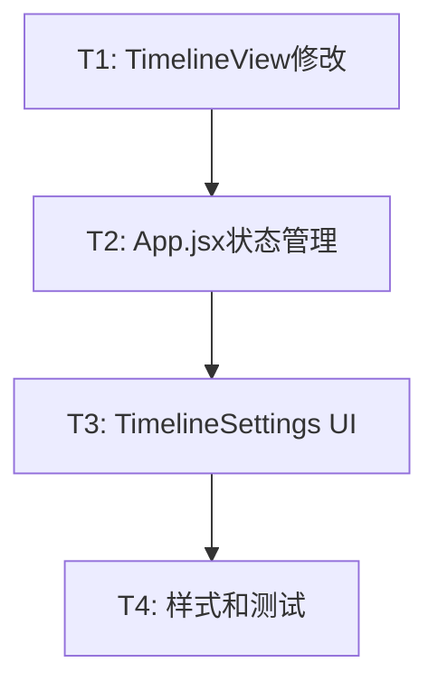

# TASK - 单月宽度设置功能任务拆分

## 📋 任务概述

**任务名称**：单月宽度设置功能  
**拆分时间**：2025-10-21 09:38  
**任务总数**：4个原子任务

## 🎯 任务依赖关系图



## 📝 原子任务清单

### T1: 修改TimelineView组件接收monthWidth参数

#### 任务描述
修改TimelineView.jsx组件，使其能够接收monthWidth参数，并使用该参数动态计算pixelsPerDay，替换原有的硬编码值。

#### 输入契约
- **前置依赖**：无
- **输入数据**：
  - monthWidth prop（number类型，100-500范围）
- **环境依赖**：
  - React 18.2.0
  - dayjs库

#### 输出契约
- **输出数据**：
  - 动态计算的pixelsPerDay值
  - 更新后的timelineParams对象
- **交付物**：
  - 修改后的TimelineView.jsx文件
- **验收标准**：
  - ✅ 接收monthWidth prop
  - ✅ 使用monthWidth/30计算pixelsPerDay
  - ✅ 移除硬编码的pixelsPerDay=5
  - ✅ 时间轴宽度随monthWidth变化
  - ✅ 代码包含完整注释

#### 实现约束
- **技术栈**：React Hooks（useEffect, useMemo）
- **接口规范**：
  ```typescript
  interface TimelineViewProps {
    // ... 现有props
    monthWidth: number  // 新增
  }
  ```
- **质量要求**：
  - 使用useMemo优化pixelsPerDay计算
  - 保持现有功能不受影响
  - 添加JSDoc注释

#### 依赖关系
- **前置任务**：无
- **后置任务**：T2（App.jsx需要传递monthWidth）
- **并行任务**：无

---

### T2: 实现App.jsx状态管理和持久化

#### 任务描述
在App.jsx中添加monthWidth状态管理，实现localStorage读写，提供状态更新回调函数。

#### 输入契约
- **前置依赖**：T1完成（TimelineView已支持monthWidth）
- **输入数据**：
  - localStorage中的保存值（可选）
- **环境依赖**：
  - React 18.2.0
  - Ant Design message组件
  - localStorage API

#### 输出契约
- **输出数据**：
  - monthWidth状态（默认150）
  - handleMonthWidthChange回调
  - handleMonthWidthReset回调
- **交付物**：
  - 修改后的App.jsx文件
- **验收标准**：
  - ✅ 初始化时从localStorage读取
  - ✅ 读取失败使用默认值150
  - ✅ 值范围验证（100-500）
  - ✅ 状态变化时保存到localStorage
  - ✅ 提供重置功能
  - ✅ 显示成功提示消息
  - ✅ 错误处理完善

#### 实现约束
- **技术栈**：React Hooks（useState, useCallback）
- **接口规范**：
  ```typescript
  const [monthWidth, setMonthWidth] = useState<number>(150)
  const handleMonthWidthChange: (width: number) => void
  const handleMonthWidthReset: () => void
  ```
- **质量要求**：
  - 使用useCallback优化回调
  - try-catch包裹localStorage操作
  - 添加完整的错误日志

#### 依赖关系
- **前置任务**：T1
- **后置任务**：T3（TimelineSettings需要这些回调）
- **并行任务**：无

---

### T3: 实现TimelineSettings UI控件

#### 任务描述
在TimelineSettings.jsx组件中添加单月宽度调整控件，包括Slider滑块、宽度显示和重置按钮。

#### 输入契约
- **前置依赖**：T2完成（App.jsx已提供状态和回调）
- **输入数据**：
  - monthWidth prop（当前宽度值）
  - onMonthWidthChange回调
  - onMonthWidthReset回调
- **环境依赖**：
  - Ant Design Slider组件
  - Ant Design Button组件
  - Ant Design message组件

#### 输出契约
- **输出数据**：
  - 用户调整的宽度值
- **交付物**：
  - 修改后的TimelineSettings.jsx文件
- **验收标准**：
  - ✅ Slider范围100-500px
  - ✅ 实时显示当前宽度值
  - ✅ 拖动时显示tooltip
  - ✅ 释放后触发onChange
  - ✅ 重置按钮功能正常
  - ✅ 显示成功提示
  - ✅ UI布局美观

#### 实现约束
- **技术栈**：React Hooks（useCallback）
- **接口规范**：
  ```typescript
  interface TimelineSettingsProps {
    // ... 现有props
    monthWidth: number
    onMonthWidthChange: (width: number) => void
    onMonthWidthReset: () => void
  }
  ```
- **质量要求**：
  - 使用useCallback优化事件处理
  - 组件结构清晰
  - 添加完整注释

#### 依赖关系
- **前置任务**：T2
- **后置任务**：T4（需要添加样式）
- **并行任务**：无

---

### T4: 添加样式和集成测试

#### 任务描述
为单月宽度控件添加CSS样式，进行完整的功能测试和Chrome DevTools测试。

#### 输入契约
- **前置依赖**：T1、T2、T3全部完成
- **输入数据**：
  - 完整的功能实现
- **环境依赖**：
  - Chrome浏览器
  - Chrome DevTools MCP工具
  - 本地开发服务器

#### 输出契约
- **输出数据**：
  - 测试报告
- **交付物**：
  - 修改后的timeline-settings.css文件
  - 测试验证结果
- **验收标准**：
  - ✅ 样式符合设计规范
  - ✅ 分隔线显示正常
  - ✅ 滑块样式美观
  - ✅ 宽度显示突出
  - ✅ 重置按钮全宽显示
  - ✅ 功能测试通过
  - ✅ 持久化测试通过
  - ✅ 兼容性测试通过
  - ✅ Chrome DevTools测试通过

#### 实现约束
- **技术栈**：CSS3
- **接口规范**：
  ```css
  .month-width-control { /* 容器样式 */ }
  .month-width-control .control-label { /* 标签样式 */ }
  .month-width-control .width-display { /* 宽度显示样式 */ }
  ```
- **质量要求**：
  - 样式与现有风格一致
  - 响应式适配
  - 浏览器兼容性

#### 测试清单
1. **功能测试**
   - [ ] 滑块拖动流畅
   - [ ] 宽度值实时更新
   - [ ] 时间轴立即响应
   - [ ] localStorage保存成功
   - [ ] 页面刷新后恢复
   - [ ] 重置功能正常
   - [ ] 提示消息显示

2. **边界测试**
   - [ ] 最小值100px正常
   - [ ] 最大值500px正常
   - [ ] 无效值使用默认值
   - [ ] localStorage不可用降级

3. **兼容性测试**
   - [ ] 进度看板正常
   - [ ] 人员看板正常
   - [ ] 与时间范围设置无冲突
   - [ ] 与缩放功能无冲突

4. **Chrome DevTools测试**
   - [ ] 使用MCP工具打开页面
   - [ ] 截图验证UI显示
   - [ ] 测试滑块交互
   - [ ] 验证时间轴变化
   - [ ] 检查localStorage存储

#### 依赖关系
- **前置任务**：T1、T2、T3
- **后置任务**：无
- **并行任务**：无

---

## 📊 任务统计

### 任务分类
- **前端修改**：4个任务
- **后端修改**：0个任务
- **测试任务**：1个任务（T4）

### 工作量估算
| 任务 | 预计时间 | 复杂度 |
|------|---------|--------|
| T1   | 30分钟  | 简单   |
| T2   | 45分钟  | 中等   |
| T3   | 45分钟  | 中等   |
| T4   | 30分钟  | 简单   |
| **总计** | **2.5小时** | - |

### 风险评估
| 任务 | 风险等级 | 风险描述 | 缓解措施 |
|------|---------|---------|---------|
| T1   | 低      | 计算逻辑简单 | 充分测试 |
| T2   | 中      | localStorage可能失败 | 错误处理和降级 |
| T3   | 低      | UI组件成熟 | 参考现有实现 |
| T4   | 低      | 样式调整 | 渐进式测试 |

## 🔄 执行顺序

### 推荐执行顺序
1. **第一步**：执行T1（修改TimelineView）
   - 建立基础支持
   - 验证计算逻辑

2. **第二步**：执行T2（实现状态管理）
   - 完成数据流
   - 测试持久化

3. **第三步**：执行T3（实现UI控件）
   - 完成用户交互
   - 验证端到端流程

4. **第四步**：执行T4（样式和测试）
   - 完善视觉效果
   - 全面测试验证

### 并行执行可能性
- T1和T2可以并行开发（但T2需要等T1完成才能测试）
- T3必须等待T2完成
- T4必须等待所有前置任务完成

## ✅ 验收标准总览

### 功能完整性
- [ ] 用户可以调整单月宽度（100-500px）
- [ ] 调整后时间轴立即更新
- [ ] 设置自动保存到localStorage
- [ ] 页面刷新后设置恢复
- [ ] 重置功能正常工作
- [ ] 进度看板和人员看板都支持

### 技术质量
- [ ] 所有代码包含完整注释
- [ ] 使用React Hooks最佳实践
- [ ] localStorage操作包含错误处理
- [ ] 性能优化（useCallback、useMemo）
- [ ] 与现有功能无冲突

### 用户体验
- [ ] 操作流畅无卡顿
- [ ] 视觉反馈清晰
- [ ] 提示消息友好
- [ ] 样式美观统一
- [ ] 移动端适配良好

## 📝 实施注意事项

### 开发规范
1. **代码注释**：每个函数必须包含JSDoc注释
2. **错误处理**：所有localStorage操作必须try-catch
3. **性能优化**：使用useCallback和useMemo
4. **类型安全**：虽然是JS项目，但要注意类型一致性

### 测试要求
1. **单元测试**：测试核心计算逻辑
2. **集成测试**：测试完整交互流程
3. **浏览器测试**：使用Chrome DevTools MCP工具
4. **兼容性测试**：确保与现有功能兼容

### 提交规范
1. **提交粒度**：每个任务单独提交
2. **提交信息**：清晰描述修改内容
3. **代码审查**：自我审查代码质量
4. **文档更新**：同步更新相关文档

## 🚀 下一步行动

1. ✅ 完成任务拆分（当前文档）
2. ⏭️ 进入Approve阶段（人工审批）
3. ⏭️ 进入Automate阶段（按顺序执行T1-T4）
4. ⏭️ 进入Assess阶段（质量评估）

---

**文档状态**：✅ 已完成  
**创建时间**：2025-10-21 09:38  
**最后更新**：2025-10-21 09:38
