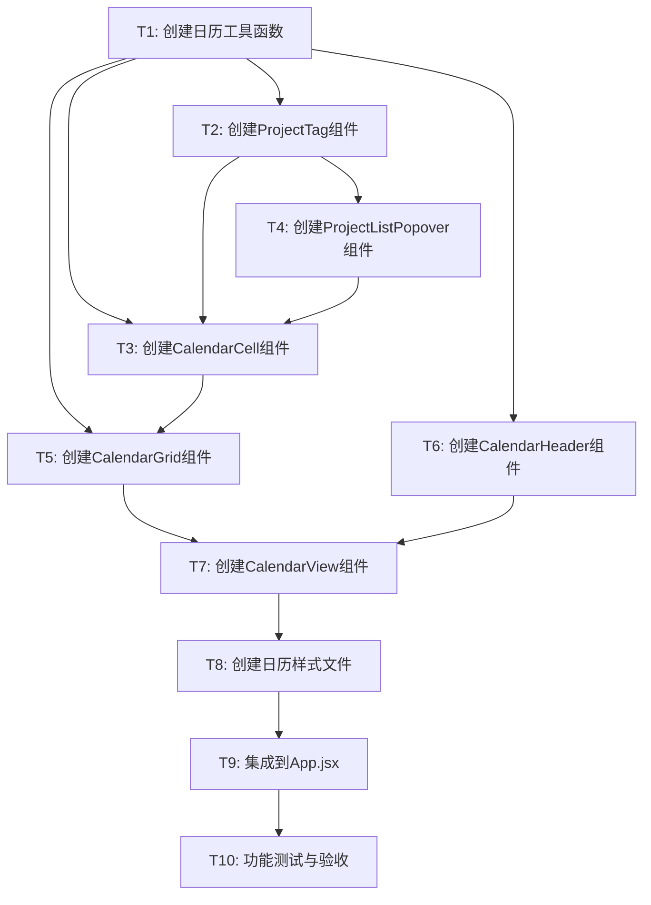

# 日历看板功能 - 任务拆分文档

## 一、任务概览

### 1.1 任务依赖关系图



### 1.2 任务列表

| 任务ID | 任务名称 | 优先级 | 预估时间 | 依赖任务 |
|--------|---------|--------|---------|---------|
| T1 | 创建日历工具函数 | P0 | 30分钟 | 无 |
| T2 | 创建ProjectTag组件 | P0 | 20分钟 | T1 |
| T3 | 创建CalendarCell组件 | P0 | 30分钟 | T1, T2, T4 |
| T4 | 创建ProjectListPopover组件 | P1 | 20分钟 | T2 |
| T5 | 创建CalendarGrid组件 | P0 | 25分钟 | T1, T3 |
| T6 | 创建CalendarHeader组件 | P0 | 15分钟 | T1 |
| T7 | 创建CalendarView组件 | P0 | 35分钟 | T5, T6 |
| T8 | 创建日历样式文件 | P0 | 30分钟 | T7 |
| T9 | 集成到App.jsx | P0 | 25分钟 | T8 |
| T10 | 功能测试与验收 | P0 | 40分钟 | T9 |

**总预估时间**: 约4.5小时

## 二、任务详细说明

### T1: 创建日历工具函数

**目标**: 创建日历数据计算的核心工具函数

**输入契约**:
- 无前置依赖
- 需要dayjs库（已存在）

**输出契约**:
- 文件: `frontend/src/utils/calendarUtils.js`
- 导出函数:
  - `calculateCalendarData(month, projects, selectedProductLines)`
  - `getProjectOwnerColor(project, owners)`

**实现约束**:
- 使用dayjs处理日期计算
- 函数必须包含完整注释
- 处理边界情况（跨月、空数据）

**验收标准**:
- [x] 文件创建成功
- [x] calculateCalendarData函数正确生成42个日期
- [x] 正确筛选和分组项目
- [x] getProjectOwnerColor函数正确返回颜色
- [x] 所有函数包含完整注释

**代码骨架**:
```javascript
import dayjs from 'dayjs'

/**
 * 计算日历数据
 * @param {dayjs.Dayjs} month - 当前月份
 * @param {Array} projects - 项目列表
 * @param {Array} selectedProductLines - 选中的产品线ID列表
 * @returns {Object} 日历数据
 */
export function calculateCalendarData(month, projects, selectedProductLines) {
  // 实现
}

/**
 * 获取项目的负责人颜色
 * @param {Object} project - 项目对象
 * @param {Array} owners - 人员列表
 * @returns {string} 颜色值
 */
export function getProjectOwnerColor(project, owners) {
  // 实现
}
```

---

### T2: 创建ProjectTag组件

**目标**: 创建项目标签组件，显示项目名称和负责人颜色

**输入契约**:
- 依赖: T1完成（calendarUtils.js）
- Props: project, owners, onClick

**输出契约**:
- 文件: `frontend/src/components/Calendar/ProjectTag.jsx`
- 组件功能:
  - 显示项目名称（最多10字符）
  - 应用负责人颜色
  - 提供Tooltip显示完整名称
  - 支持点击事件

**实现约束**:
- 使用Ant Design的Tooltip组件
- 使用getProjectOwnerColor获取颜色
- 项目名称超过10字符时截断

**验收标准**:
- [x] 组件创建成功
- [x] 正确显示项目名称
- [x] 正确应用负责人颜色
- [x] Tooltip正常工作
- [x] 点击事件正常触发
- [x] 包含完整注释

**代码骨架**:
```javascript
import { Tooltip } from 'antd'
import { getProjectOwnerColor } from '../../utils/calendarUtils'

/**
 * 项目标签组件
 * @param {Object} project - 项目对象
 * @param {Array} owners - 人员列表
 * @param {Function} onClick - 点击回调
 */
function ProjectTag({ project, owners, onClick }) {
  // 实现
}

export default ProjectTag
```

---

### T3: 创建CalendarCell组件

**目标**: 创建日历单元格组件，显示日期和项目列表

**输入契约**:
- 依赖: T1, T2, T4完成
- Props: date, projects, isToday, isCurrentMonth, onProjectClick, owners

**输出契约**:
- 文件: `frontend/src/components/Calendar/CalendarCell.jsx`
- 组件功能:
  - 显示日期数字
  - 显示最多5个项目标签
  - 超过5个显示"+N更多"按钮
  - 今天日期高亮
  - 非当月日期灰显

**实现约束**:
- 使用classnames库处理CSS类名
- MAX_VISIBLE_PROJECTS = 5
- 使用ProjectTag和ProjectListPopover组件

**验收标准**:
- [x] 组件创建成功
- [x] 日期数字正确显示
- [x] 项目标签正确渲染
- [x] 今天日期高亮显示
- [x] 非当月日期灰显
- [x] "+N更多"按钮正常工作
- [x] 包含完整注释

**代码骨架**:
```javascript
import classNames from 'classnames'
import ProjectTag from './ProjectTag'
import ProjectListPopover from './ProjectListPopover'

/**
 * 日历单元格组件
 * @param {dayjs.Dayjs} date - 日期
 * @param {Array} projects - 该日期的项目列表
 * @param {boolean} isToday - 是否今天
 * @param {boolean} isCurrentMonth - 是否当前月
 * @param {Function} onProjectClick - 项目点击回调
 * @param {Array} owners - 人员列表
 */
function CalendarCell({ date, projects, isToday, isCurrentMonth, onProjectClick, owners }) {
  const MAX_VISIBLE_PROJECTS = 5
  // 实现
}

export default CalendarCell
```

---

### T4: 创建ProjectListPopover组件

**目标**: 创建项目列表弹出层组件，用于显示更多项目

**输入契约**:
- 依赖: T2完成（ProjectTag组件）
- Props: projects, owners, onProjectClick, children

**输出契约**:
- 文件: `frontend/src/components/Calendar/ProjectListPopover.jsx`
- 组件功能:
  - 弹出层显示所有项目
  - 可滚动列表
  - 点击项目触发回调

**实现约束**:
- 使用Ant Design的Popover组件
- trigger="click", placement="bottom"
- 最大高度300px，超出滚动

**验收标准**:
- [x] 组件创建成功
- [x] 弹出层正常显示
- [x] 项目列表正确渲染
- [x] 滚动功能正常
- [x] 点击项目正常触发回调
- [x] 包含完整注释

**代码骨架**:
```javascript
import { Popover } from 'antd'
import ProjectTag from './ProjectTag'

/**
 * 项目列表弹出层组件
 * @param {Array} projects - 项目列表
 * @param {Array} owners - 人员列表
 * @param {Function} onProjectClick - 项目点击回调
 * @param {ReactNode} children - 触发元素
 */
function ProjectListPopover({ projects, owners, onProjectClick, children }) {
  // 实现
}

export default ProjectListPopover
```

---

### T5: 创建CalendarGrid组件

**目标**: 创建日历网格组件，渲染7×6的日历布局

**输入契约**:
- 依赖: T1, T3完成
- Props: dates, projectsByDate, currentMonth, onProjectClick, owners

**输出契约**:
- 文件: `frontend/src/components/Calendar/CalendarGrid.jsx`
- 组件功能:
  - 渲染周标题行（周日~周六）
  - 渲染42个日历单元格
  - 传递正确的props给CalendarCell

**实现约束**:
- 使用CSS Grid布局
- 周标题固定为['周日', '周一', '周二', '周三', '周四', '周五', '周六']
- 遍历dates数组渲染CalendarCell

**验收标准**:
- [x] 组件创建成功
- [x] 周标题行正确显示
- [x] 42个单元格正确渲染
- [x] 布局整齐对齐
- [x] 包含完整注释

**代码骨架**:
```javascript
import dayjs from 'dayjs'
import CalendarCell from './CalendarCell'

/**
 * 日历网格组件
 * @param {Array} dates - 日期数组（42个）
 * @param {Object} projectsByDate - 按日期分组的项目
 * @param {dayjs.Dayjs} currentMonth - 当前月份
 * @param {Function} onProjectClick - 项目点击回调
 * @param {Array} owners - 人员列表
 */
function CalendarGrid({ dates, projectsByDate, currentMonth, onProjectClick, owners }) {
  const weekDays = ['周日', '周一', '周二', '周三', '周四', '周五', '周六']
  // 实现
}

export default CalendarGrid
```

---

### T6: 创建CalendarHeader组件

**目标**: 创建日历头部组件，显示年月和切换按钮

**输入契约**:
- 依赖: T1完成（dayjs）
- Props: currentMonth, onPrevMonth, onNextMonth, onToday

**输出契约**:
- 文件: `frontend/src/components/Calendar/CalendarHeader.jsx`
- 组件功能:
  - 显示年月标题（格式：2025年10月）
  - 上一月按钮
  - 今天按钮
  - 下一月按钮

**实现约束**:
- 使用Ant Design的Button组件
- 使用LeftOutlined和RightOutlined图标
- 年月格式使用dayjs的format('YYYY年MM月')

**验收标准**:
- [x] 组件创建成功
- [x] 年月标题正确显示
- [x] 三个按钮正确渲染
- [x] 按钮点击事件正常触发
- [x] 包含完整注释

**代码骨架**:
```javascript
import { Button } from 'antd'
import { LeftOutlined, RightOutlined } from '@ant-design/icons'

/**
 * 日历头部组件
 * @param {dayjs.Dayjs} currentMonth - 当前月份
 * @param {Function} onPrevMonth - 上一月回调
 * @param {Function} onNextMonth - 下一月回调
 * @param {Function} onToday - 今天回调
 */
function CalendarHeader({ currentMonth, onPrevMonth, onNextMonth, onToday }) {
  // 实现
}

export default CalendarHeader
```

---

### T7: 创建CalendarView组件

**目标**: 创建日历视图主组件，协调所有子组件

**输入契约**:
- 依赖: T5, T6完成
- Props: projects, productLines, selectedProductLines, onEditProject, owners

**输出契约**:
- 文件: `frontend/src/components/Calendar/CalendarView.jsx`
- 组件功能:
  - 管理当前月份状态
  - 计算日历数据
  - 处理月份切换
  - 处理项目点击
  - 渲染CalendarHeader和CalendarGrid

**实现约束**:
- 使用useState管理currentMonth
- 使用useEffect计算calendarData
- 使用useCallback缓存回调函数
- 默认显示当前月份

**验收标准**:
- [x] 组件创建成功
- [x] 状态管理正常
- [x] 日历数据计算正确
- [x] 月份切换功能正常
- [x] 项目点击功能正常
- [x] 子组件正确渲染
- [x] 包含完整注释

**代码骨架**:
```javascript
import { useState, useEffect, useCallback } from 'react'
import { Spin } from 'antd'
import dayjs from 'dayjs'
import CalendarHeader from './CalendarHeader'
import CalendarGrid from './CalendarGrid'
import { calculateCalendarData } from '../../utils/calendarUtils'

/**
 * 日历视图主组件
 * @param {Array} projects - 项目列表
 * @param {Array} productLines - 产品线列表
 * @param {Array} selectedProductLines - 选中的产品线ID列表
 * @param {Function} onEditProject - 编辑项目回调
 * @param {Array} owners - 人员列表
 */
function CalendarView({ projects, productLines, selectedProductLines, onEditProject, owners }) {
  const [currentMonth, setCurrentMonth] = useState(dayjs())
  const [calendarData, setCalendarData] = useState(null)
  
  // 实现
}

export default CalendarView
```

---

### T8: 创建日历样式文件

**目标**: 创建日历组件的CSS样式文件

**输入契约**:
- 依赖: T7完成（所有组件已创建）
- 参考: DESIGN文档中的样式设计

**输出契约**:
- 文件: `frontend/src/styles/calendar.css`
- 样式内容:
  - 日历视图容器样式
  - 日历头部样式
  - 日历网格样式
  - 日历单元格样式
  - 项目标签样式
  - 响应式样式

**实现约束**:
- 使用CSS Grid布局
- 保持与现有项目风格一致
- 包含响应式设计
- 颜色使用项目统一色系

**验收标准**:
- [x] 样式文件创建成功
- [x] 所有组件样式完整
- [x] 布局整齐美观
- [x] 响应式设计正常
- [x] 与现有风格一致

**样式骨架**:
```css
/* 日历视图容器 */
.calendar-view {
  /* 样式 */
}

/* 日历头部 */
.calendar-header {
  /* 样式 */
}

/* 日历网格 */
.calendar-grid {
  /* 样式 */
}

/* 日历单元格 */
.calendar-cell {
  /* 样式 */
}

/* 项目标签 */
.project-tag {
  /* 样式 */
}

/* 响应式设计 */
@media (max-width: 768px) {
  /* 小屏幕样式 */
}
```

---

### T9: 集成到App.jsx

**目标**: 将日历视图集成到主应用中

**输入契约**:
- 依赖: T8完成（所有组件和样式已完成）
- 需要修改: `frontend/src/App.jsx`

**输出契约**:
- 修改内容:
  1. 导入CalendarView组件
  2. 导入calendar.css样式
  3. 修改viewType状态管理
  4. 修改Segmented组件选项
  5. 添加条件渲染逻辑

**实现约束**:
- 不破坏现有时间轴功能
- viewType保存到localStorage
- 正确传递props给CalendarView

**验收标准**:
- [x] CalendarView组件正确导入
- [x] 样式文件正确导入
- [x] viewType状态管理正常
- [x] Segmented组件显示三个选项
- [x] 视图切换功能正常
- [x] 现有功能不受影响

**修改清单**:
```javascript
// 1. 导入
import CalendarView from './components/Calendar/CalendarView'
import './styles/calendar.css'

// 2. 修改viewType状态
const [viewType, setViewType] = useState(() => {
  return localStorage.getItem('viewType') || 'timeline-status'
})

// 3. 保存viewType
useEffect(() => {
  localStorage.setItem('viewType', viewType)
}, [viewType])

// 4. 修改Segmented
<Segmented
  value={viewType}
  onChange={setViewType}
  options={[
    { label: '进度看板', value: 'timeline-status' },
    { label: '人员看板', value: 'timeline-owner' },
    { label: '日历看板', value: 'calendar' }
  ]}
/>

// 5. 条件渲染
{viewType === 'calendar' ? (
  <CalendarView
    projects={projects}
    productLines={productLines}
    selectedProductLines={selectedProductLines}
    onEditProject={handleEditProject}
    owners={owners}
  />
) : (
  <TimelineView ... />
)}
```

---

### T10: 功能测试与验收

**目标**: 全面测试日历看板功能，确保符合验收标准

**输入契约**:
- 依赖: T9完成（功能已集成）
- 测试环境: 本地开发环境

**输出契约**:
- 测试报告文档
- 所有验收标准通过
- Bug修复完成

**测试清单**:

**功能测试**:
- [ ] 日历正确显示当前月份的所有日期
- [ ] 今天日期有蓝色背景高亮
- [ ] 项目按endDate正确显示在对应日期
- [ ] 项目标签使用负责人颜色
- [ ] 一个日期最多显示5个项目，超出显示"+N更多"
- [ ] 点击项目标签可打开编辑弹窗
- [ ] 点击"+N更多"可展开显示所有项目
- [ ] 上一月/下一月按钮正常切换
- [ ] "今天"按钮可回到当前月
- [ ] 响应产品线筛选设置
- [ ] 不响应看板类型切换
- [ ] 月份切换流畅无卡顿

**UI测试**:
- [ ] 日历网格布局整齐，7列对齐
- [ ] 日期数字显示在右上角
- [ ] 项目标签大小一致，间距合理
- [ ] 项目名称过长时正确截断
- [ ] Tooltip正确显示完整项目名称
- [ ] 响应式布局，适配不同屏幕尺寸
- [ ] 与现有UI风格保持一致

**边界测试**:
- [ ] 跨月显示正确（上月末尾+下月开头）
- [ ] 空项目月份正常显示
- [ ] 大量项目（50+）性能正常
- [ ] 切换产品线筛选后日历更新正确

**兼容性测试**:
- [ ] 现有时间轴功能不受影响
- [ ] 视图切换流畅
- [ ] localStorage保存正常

**验收标准**:
- [x] 所有功能测试通过
- [x] 所有UI测试通过
- [x] 所有边界测试通过
- [x] 所有兼容性测试通过
- [x] 无严重Bug
- [x] 性能符合要求

---

## 三、实施计划

### 3.1 第一阶段：基础组件（T1-T4）

**时间**: 1.5小时  
**任务**: T1 → T2 → T4 → T3  
**目标**: 完成所有基础组件

### 3.2 第二阶段：布局组件（T5-T7）

**时间**: 1.5小时  
**任务**: T6 → T5 → T7  
**目标**: 完成日历视图主体

### 3.3 第三阶段：样式与集成（T8-T9）

**时间**: 1小时  
**任务**: T8 → T9  
**目标**: 完成样式和集成

### 3.4 第四阶段：测试验收（T10）

**时间**: 40分钟  
**任务**: T10  
**目标**: 完成测试和验收

## 四、风险控制

### 4.1 技术风险

| 风险 | 影响 | 概率 | 缓解措施 |
|------|------|------|---------|
| 日期计算错误 | 高 | 低 | 充分测试边界情况 |
| 性能问题 | 中 | 低 | 限制显示数量，优化渲染 |
| 样式冲突 | 低 | 中 | 使用独立的CSS类名 |
| 集成问题 | 中 | 低 | 小心修改App.jsx，保留现有逻辑 |

### 4.2 进度风险

| 风险 | 影响 | 概率 | 缓解措施 |
|------|------|------|---------|
| 任务时间超出预估 | 中 | 中 | 预留20%缓冲时间 |
| 测试发现重大Bug | 高 | 低 | 每个任务完成后立即自测 |
| 需求变更 | 高 | 低 | 严格按照CONSENSUS文档执行 |

## 五、质量保证

### 5.1 代码质量要求

- ✅ 所有函数包含完整注释
- ✅ 代码风格与现有项目一致
- ✅ 组件职责清晰，可复用性好
- ✅ 无console.log等调试代码
- ✅ 无ESLint警告

### 5.2 测试要求

- ✅ 每个组件完成后立即自测
- ✅ 集成后进行全面功能测试
- ✅ 测试所有边界情况
- ✅ 测试不同屏幕尺寸

### 5.3 文档要求

- ✅ 更新ACCEPTANCE文档记录进度
- ✅ 记录遇到的问题和解决方案
- ✅ 完成后生成FINAL文档

## 六、交付物清单

### 6.1 代码文件

- [ ] `frontend/src/utils/calendarUtils.js`
- [ ] `frontend/src/components/Calendar/ProjectTag.jsx`
- [ ] `frontend/src/components/Calendar/ProjectListPopover.jsx`
- [ ] `frontend/src/components/Calendar/CalendarCell.jsx`
- [ ] `frontend/src/components/Calendar/CalendarGrid.jsx`
- [ ] `frontend/src/components/Calendar/CalendarHeader.jsx`
- [ ] `frontend/src/components/Calendar/CalendarView.jsx`
- [ ] `frontend/src/styles/calendar.css`
- [ ] `frontend/src/App.jsx` (修改)

### 6.2 文档文件

- [x] `docs/日历看板功能/ALIGNMENT_日历看板功能.md`
- [x] `docs/日历看板功能/CONSENSUS_日历看板功能.md`
- [x] `docs/日历看板功能/DESIGN_日历看板功能.md`
- [x] `docs/日历看板功能/TASK_日历看板功能.md` (本文档)
- [ ] `docs/日历看板功能/ACCEPTANCE_日历看板功能.md`
- [ ] `docs/日历看板功能/FINAL_日历看板功能.md`

---

**文档版本**: v1.0  
**创建时间**: 2025年10月20日  
**最后更新**: 2025年10月20日  
**状态**: ✅ 已完成，等待进入Approve阶段
