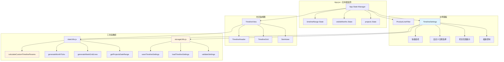
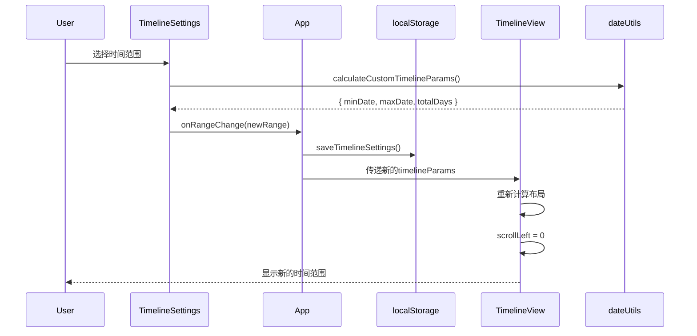

# 架构设计文档 - 时间范围设置功能

## 一、整体架构

### 1.1 系统架构图



### 1.2 数据流向图



## 二、核心组件设计

### 2.1 TimelineSettings 组件

#### 组件职责
- 提供时间范围快捷选项
- 提供自定义日期范围选择
- 显示项目时间范围提示
- 集成缩放控制
- 管理设置持久化

#### 组件接口

```javascript
/**
 * 时间轴设置组件
 * @param {Array} projects - 项目列表
 * @param {Object} currentRange - 当前时间范围 { type, customRange }
 * @param {Function} onRangeChange - 时间范围变化回调
 * @param {Number} visibleMonths - 当前缩放级别
 * @param {Function} onZoomChange - 缩放变化回调
 */
function TimelineSettings({
  projects,
  currentRange,
  onRangeChange,
  visibleMonths,
  onZoomChange
})
```

#### 组件状态

```javascript
const [rangeType, setRangeType] = useState('1year')
const [customRange, setCustomRange] = useState(null)
const [showCustomPicker, setShowCustomPicker] = useState(false)
const [projectsDateRange, setProjectsDateRange] = useState(null)
```

#### 组件结构

```jsx
<Card title="时间轴设置" size="small">
  {/* 项目时间范围提示 */}
  <div className="project-range-hint">
    项目时间范围: {projectsDateRange}
  </div>
  
  {/* 时间范围快捷选项 */}
  <Radio.Group value={rangeType} onChange={handleRangeTypeChange}>
    <Space direction="vertical">
      <Radio value="3months">最近3个月</Radio>
      <Radio value="6months">最近半年</Radio>
      <Radio value="1year">最近一年</Radio>
      <Radio value="custom">自定义</Radio>
    </Space>
  </Radio.Group>
  
  {/* 自定义日期选择器 */}
  {showCustomPicker && (
    <div className="custom-range-picker">
      <DatePicker.RangePicker
        value={customRange}
        onChange={handleCustomRangeChange}
        disabledDate={disabledDate}
      />
      <Space>
        <Button onClick={handleApply}>应用</Button>
        <Button onClick={handleReset}>重置</Button>
      </Space>
    </div>
  )}
  
  {/* 缩放控制 */}
  <div className="zoom-controls">
    <Button icon={<ZoomOutOutlined />} onClick={handleZoomOut} />
    <span>{visibleMonths}个月</span>
    <Button icon={<ZoomInOutlined />} onClick={handleZoomIn} />
  </div>
</Card>
```

### 2.2 修改 TimelineView 组件

#### 修改点1: 移除缩放控制UI

```javascript
// 删除以下代码块
<div className="timeline-zoom-controls">
  <button className="zoom-button" onClick={handleZoomOut}>
    <ZoomOutOutlined />
  </button>
  <span className="zoom-level">{visibleMonths}个月</span>
  <button className="zoom-button" onClick={handleZoomIn}>
    <ZoomInOutlined />
  </button>
</div>
```

#### 修改点2: 接收外部时间范围参数

```javascript
/**
 * 时间轴主视图组件
 * @param {array} projects - 项目列表
 * @param {array} productLines - 产品线列表
 * @param {array} selectedProductLines - 选中的产品线ID列表
 * @param {function} onEditProject - 编辑项目回调
 * @param {object} customTimelineRange - 自定义时间范围 { type, customRange }
 * @param {number} visibleMonths - 视口显示月份数
 */
function TimelineView({ 
  projects, 
  productLines, 
  selectedProductLines, 
  onEditProject,
  customTimelineRange,  // 新增
  visibleMonths         // 保留但从外部传入
})
```

#### 修改点3: 使用自定义时间范围计算

```javascript
useEffect(() => {
  // 使用自定义时间范围计算参数
  const params = customTimelineRange 
    ? calculateCustomTimelineParams(
        customTimelineRange.type, 
        customTimelineRange.customRange
      )
    : calculateTimelineParams(projects)
  
  // ... 其余逻辑保持不变
}, [projects, productLines, customTimelineRange, visibleMonths])
```

#### 修改点4: 添加滚动到起始位置的逻辑

```javascript
/**
 * 当时间范围变化时，滚动到起始位置
 */
useEffect(() => {
  if (!scrollContainerRef.current || !timelineParams) return
  
  // 滚动到起始位置
  scrollContainerRef.current.scrollLeft = 0
  syncHeaderScroll()
}, [customTimelineRange, timelineParams, syncHeaderScroll])
```

### 2.3 修改 App 组件

#### 状态管理

```javascript
// 新增状态
const [timelineRange, setTimelineRange] = useState(() => {
  // 从localStorage加载设置
  const saved = loadTimelineSettings()
  return saved?.timelineRange || { type: '1year', customRange: null }
})

const [visibleMonths, setVisibleMonths] = useState(() => {
  const saved = loadTimelineSettings()
  return saved?.visibleMonths || DEFAULT_VISIBLE_MONTHS
})
```

#### 回调函数

```javascript
/**
 * 处理时间范围变化
 */
const handleRangeChange = useCallback((newRange) => {
  setTimelineRange(newRange)
  // 保存到localStorage
  saveTimelineSettings({ timelineRange: newRange, visibleMonths })
}, [visibleMonths])

/**
 * 处理缩放变化
 */
const handleZoomChange = useCallback((newVisibleMonths) => {
  setVisibleMonths(newVisibleMonths)
  // 保存到localStorage
  saveTimelineSettings({ timelineRange, visibleMonths: newVisibleMonths })
}, [timelineRange])
```

#### 布局结构

```jsx
<div className="app-container">
  <div className="sidebar">
    {/* 产品线筛选器 */}
    <ProductLineFilter
      productLines={productLines}
      selectedProductLines={selectedProductLines}
      onSelectionChange={setSelectedProductLines}
    />
    
    {/* 时间轴设置 - 新增 */}
    <TimelineSettings
      projects={projects}
      currentRange={timelineRange}
      onRangeChange={handleRangeChange}
      visibleMonths={visibleMonths}
      onZoomChange={handleZoomChange}
    />
  </div>
  
  <div className="main-content">
    {/* 时间轴视图 */}
    <TimelineView
      projects={projects}
      productLines={productLines}
      selectedProductLines={selectedProductLines}
      onEditProject={handleEditProject}
      customTimelineRange={timelineRange}
      visibleMonths={visibleMonths}
    />
  </div>
</div>
```

## 三、工具函数设计

### 3.1 dateUtils.js 新增函数

#### 函数1: calculateCustomTimelineParams

```javascript
/**
 * 根据范围类型计算时间轴参数
 * @param {string} rangeType - 范围类型: '3months' | '6months' | '1year' | 'custom'
 * @param {object} customRange - 自定义范围 { startDate, endDate }
 * @returns {object} { minDate, maxDate, totalDays }
 */
export function calculateCustomTimelineParams(rangeType, customRange) {
  const now = dayjs()
  let minDate, maxDate
  
  switch (rangeType) {
    case '3months':
      // 当前月前后各1.5个月
      minDate = now.subtract(1.5, 'month').startOf('month')
      maxDate = now.add(1.5, 'month').endOf('month')
      break
      
    case '6months':
      // 当前月前后各3个月
      minDate = now.subtract(3, 'month').startOf('month')
      maxDate = now.add(3, 'month').endOf('month')
      break
      
    case '1year':
      // 当前月前6个月，后5个月（共12个月）
      minDate = now.subtract(6, 'month').startOf('month')
      maxDate = now.add(5, 'month').endOf('month')
      break
      
    case 'custom':
      if (!customRange || !customRange.startDate || !customRange.endDate) {
        // 如果自定义范围无效，回退到默认1年
        minDate = now.subtract(6, 'month').startOf('month')
        maxDate = now.add(5, 'month').endOf('month')
      } else {
        minDate = dayjs(customRange.startDate).startOf('month')
        maxDate = dayjs(customRange.endDate).endOf('month')
      }
      break
      
    default:
      // 默认1年
      minDate = now.subtract(6, 'month').startOf('month')
      maxDate = now.add(5, 'month').endOf('month')
  }
  
  const totalDays = maxDate.diff(minDate, 'day')
  
  return {
    minDate,
    maxDate,
    totalDays
  }
}
```

#### 函数2: getProjectsDateRange

```javascript
/**
 * 获取所有项目的时间范围
 * @param {Array} projects - 项目列表
 * @returns {object|null} { minDate, maxDate } 或 null（无项目时）
 */
export function getProjectsDateRange(projects) {
  if (!projects || projects.length === 0) {
    return null
  }
  
  const dates = projects.flatMap(p => [
    dayjs(p.startDate),
    dayjs(p.endDate)
  ])
  
  const minDate = dayjs.min(dates)
  const maxDate = dayjs.max(dates)
  
  return {
    minDate: minDate.format('YYYY-MM-DD'),
    maxDate: maxDate.format('YYYY-MM-DD')
  }
}
```

#### 函数3: validateDateRange

```javascript
/**
 * 验证日期范围
 * @param {string} startDate - 开始日期
 * @param {string} endDate - 结束日期
 * @returns {object} { valid: boolean, error: string }
 */
export function validateDateRange(startDate, endDate) {
  const start = dayjs(startDate)
  const end = dayjs(endDate)
  
  // 检查日期有效性
  if (!start.isValid() || !end.isValid()) {
    return { valid: false, error: '日期格式无效' }
  }
  
  // 检查开始日期 < 结束日期
  if (!start.isBefore(end)) {
    return { valid: false, error: '开始日期必须早于结束日期' }
  }
  
  // 检查最小跨度（1个月）
  const monthsDiff = end.diff(start, 'month')
  if (monthsDiff < 1) {
    return { valid: false, error: '时间范围至少需要1个月' }
  }
  
  // 检查最大跨度（5年）
  const yearsDiff = end.diff(start, 'year', true)
  if (yearsDiff > 5) {
    return { 
      valid: true, 
      warning: '时间范围超过5年，可能影响性能' 
    }
  }
  
  return { valid: true }
}
```

### 3.2 storageUtils.js 新增文件

```javascript
/**
 * localStorage工具函数
 * 处理时间轴设置的持久化
 */

const STORAGE_KEY = 'timeline_settings'

/**
 * 保存时间轴设置
 * @param {object} settings - 设置对象
 */
export function saveTimelineSettings(settings) {
  try {
    const data = {
      timelineRange: settings.timelineRange,
      visibleMonths: settings.visibleMonths,
      timestamp: Date.now()
    }
    localStorage.setItem(STORAGE_KEY, JSON.stringify(data))
  } catch (error) {
    console.error('保存设置失败:', error)
  }
}

/**
 * 加载时间轴设置
 * @returns {object|null} 设置对象或null
 */
export function loadTimelineSettings() {
  try {
    const data = localStorage.getItem(STORAGE_KEY)
    if (!data) return null
    
    const settings = JSON.parse(data)
    
    // 验证数据结构
    if (!validateSettings(settings)) {
      console.warn('设置数据无效，使用默认值')
      return null
    }
    
    return settings
  } catch (error) {
    console.error('加载设置失败:', error)
    return null
  }
}

/**
 * 验证设置数据结构
 * @param {object} settings - 设置对象
 * @returns {boolean} 是否有效
 */
export function validateSettings(settings) {
  if (!settings || typeof settings !== 'object') {
    return false
  }
  
  // 验证timelineRange
  if (!settings.timelineRange || typeof settings.timelineRange !== 'object') {
    return false
  }
  
  const validTypes = ['3months', '6months', '1year', 'custom']
  if (!validTypes.includes(settings.timelineRange.type)) {
    return false
  }
  
  // 如果是自定义类型，验证customRange
  if (settings.timelineRange.type === 'custom') {
    const { customRange } = settings.timelineRange
    if (!customRange || !customRange.startDate || !customRange.endDate) {
      return false
    }
  }
  
  // 验证visibleMonths
  if (typeof settings.visibleMonths !== 'number' || 
      settings.visibleMonths < 2 || 
      settings.visibleMonths > 12) {
    return false
  }
  
  return true
}

/**
 * 清除时间轴设置
 */
export function clearTimelineSettings() {
  try {
    localStorage.removeItem(STORAGE_KEY)
  } catch (error) {
    console.error('清除设置失败:', error)
  }
}
```

## 四、样式设计

### 4.1 TimelineSettings 组件样式

```css
/* frontend/src/styles/timeline-settings.css */

.timeline-settings-card {
  margin-bottom: 16px;
}

.timeline-settings-card .ant-card-body {
  padding: 16px;
}

/* 项目时间范围提示 */
.project-range-hint {
  color: #8c8c8c;
  font-size: 12px;
  margin-bottom: 12px;
  padding: 8px;
  background-color: #f5f5f5;
  border-radius: 4px;
}

.project-range-hint.no-projects {
  color: #bfbfbf;
}

/* 时间范围选项 */
.range-options {
  margin-bottom: 16px;
}

.range-options .ant-radio-wrapper {
  display: block;
  margin-bottom: 8px;
}

/* 自定义日期选择器 */
.custom-range-picker {
  margin-top: 12px;
  padding: 12px;
  background-color: #fafafa;
  border-radius: 4px;
}

.custom-range-picker .ant-picker {
  width: 100%;
  margin-bottom: 12px;
}

.range-actions {
  display: flex;
  gap: 8px;
}

.range-actions .ant-btn {
  flex: 1;
}

/* 警告提示 */
.range-warning {
  margin-top: 8px;
  padding: 8px;
  background-color: #fff7e6;
  border: 1px solid #ffd591;
  border-radius: 4px;
  color: #d46b08;
  font-size: 12px;
}

/* 缩放控制 */
.zoom-controls {
  display: flex;
  align-items: center;
  justify-content: center;
  gap: 12px;
  padding-top: 16px;
  margin-top: 16px;
  border-top: 1px solid #f0f0f0;
}

.zoom-controls .ant-btn {
  width: 32px;
  height: 32px;
  padding: 0;
  display: flex;
  align-items: center;
  justify-content: center;
}

.zoom-controls .zoom-level {
  min-width: 60px;
  text-align: center;
  font-size: 14px;
  color: #595959;
}
```

### 4.2 App 布局样式调整

```css
/* frontend/src/styles/index.css */

.app-container {
  display: flex;
  height: 100vh;
  overflow: hidden;
}

.sidebar {
  width: 280px;
  padding: 16px;
  background-color: #fafafa;
  border-right: 1px solid #e8e8e8;
  overflow-y: auto;
  flex-shrink: 0;
}

.main-content {
  flex: 1;
  display: flex;
  flex-direction: column;
  overflow: hidden;
}

/* 移除原有的缩放控制样式 */
/* .timeline-zoom-controls { ... } 删除 */
```

## 五、接口定义

### 5.1 组件Props接口

#### TimelineSettings Props
```typescript
interface TimelineSettingsProps {
  projects: Project[]
  currentRange: {
    type: '3months' | '6months' | '1year' | 'custom'
    customRange: {
      startDate: string
      endDate: string
    } | null
  }
  onRangeChange: (range: TimelineRange) => void
  visibleMonths: number
  onZoomChange: (months: number) => void
}
```

#### TimelineView Props（修改后）
```typescript
interface TimelineViewProps {
  projects: Project[]
  productLines: ProductLine[]
  selectedProductLines: string[]
  onEditProject: (project: Project) => void
  customTimelineRange: TimelineRange  // 新增
  visibleMonths: number               // 从外部传入
}
```

### 5.2 数据结构接口

#### TimelineRange
```typescript
interface TimelineRange {
  type: '3months' | '6months' | '1year' | 'custom'
  customRange: {
    startDate: string  // YYYY-MM-DD
    endDate: string    // YYYY-MM-DD
  } | null
}
```

#### TimelineSettings（localStorage）
```typescript
interface TimelineSettings {
  timelineRange: TimelineRange
  visibleMonths: number
  timestamp: number
}
```

## 六、异常处理策略

### 6.1 日期验证异常
- **场景**: 用户输入无效日期范围
- **处理**: 显示错误提示，禁用"应用"按钮
- **恢复**: 用户修正日期后自动启用按钮

### 6.2 localStorage异常
- **场景**: localStorage不可用或数据损坏
- **处理**: 捕获异常，使用默认值
- **日志**: console.error记录错误信息

### 6.3 性能警告
- **场景**: 时间范围超过5年
- **处理**: 显示警告提示，但允许继续
- **建议**: 提示用户缩小范围以获得更好性能

### 6.4 数据不一致
- **场景**: 加载的设置数据结构不匹配
- **处理**: 验证失败时使用默认值
- **清理**: 清除无效的localStorage数据

## 七、性能优化策略

### 7.1 渲染优化
- 使用 `React.memo` 包装 TimelineSettings 组件
- 使用 `useCallback` 缓存回调函数
- 使用 `useMemo` 缓存计算结果

### 7.2 大时间范围优化
- 网格线生成使用虚拟化（仅生成可见区域）
- 月份刻度按需渲染
- 项目块使用CSS transform优化位置计算

### 7.3 localStorage优化
- 防抖保存（避免频繁写入）
- 数据压缩（如果数据量大）
- 异步读写（不阻塞主线程）

## 八、测试策略

### 8.1 单元测试

#### dateUtils测试
```javascript
describe('calculateCustomTimelineParams', () => {
  test('3months范围计算正确', () => {
    const result = calculateCustomTimelineParams('3months', null)
    expect(result.totalDays).toBeGreaterThan(80)
    expect(result.totalDays).toBeLessThan(100)
  })
  
  test('custom范围计算正确', () => {
    const customRange = {
      startDate: '2025-01-01',
      endDate: '2025-12-31'
    }
    const result = calculateCustomTimelineParams('custom', customRange)
    expect(result.totalDays).toBe(365)
  })
})

describe('validateDateRange', () => {
  test('有效范围验证通过', () => {
    const result = validateDateRange('2025-01-01', '2025-12-31')
    expect(result.valid).toBe(true)
  })
  
  test('无效范围验证失败', () => {
    const result = validateDateRange('2025-12-31', '2025-01-01')
    expect(result.valid).toBe(false)
  })
})
```

#### storageUtils测试
```javascript
describe('saveTimelineSettings', () => {
  test('保存设置成功', () => {
    const settings = {
      timelineRange: { type: '1year', customRange: null },
      visibleMonths: 4
    }
    saveTimelineSettings(settings)
    const loaded = loadTimelineSettings()
    expect(loaded.timelineRange.type).toBe('1year')
  })
})
```

### 8.2 组件测试

```javascript
describe('TimelineSettings', () => {
  test('渲染快捷选项', () => {
    render(<TimelineSettings {...props} />)
    expect(screen.getByText('最近3个月')).toBeInTheDocument()
    expect(screen.getByText('最近半年')).toBeInTheDocument()
    expect(screen.getByText('最近一年')).toBeInTheDocument()
  })
  
  test('选择自定义后显示日期选择器', () => {
    render(<TimelineSettings {...props} />)
    fireEvent.click(screen.getByText('自定义'))
    expect(screen.getByRole('textbox')).toBeInTheDocument()
  })
})
```

### 8.3 集成测试

```javascript
describe('时间范围设置集成测试', () => {
  test('完整流程：选择范围 -> 应用 -> 时间轴更新', async () => {
    render(<App />)
    
    // 选择"最近3个月"
    fireEvent.click(screen.getByText('最近3个月'))
    
    // 等待时间轴更新
    await waitFor(() => {
      // 验证时间轴范围已更新
      expect(screen.getByText(/2025-/)).toBeInTheDocument()
    })
  })
})
```

## 九、部署注意事项

### 9.1 向后兼容
- 首次部署时，检测旧版本localStorage数据
- 提供数据迁移逻辑（如果需要）
- 确保无localStorage时使用默认值

### 9.2 浏览器兼容
- 测试localStorage在隐私模式下的行为
- 处理localStorage配额超限异常
- 提供降级方案（内存存储）

### 9.3 性能监控
- 监控大时间范围下的渲染性能
- 记录localStorage读写耗时
- 收集用户使用的时间范围分布

## 十、总结

本架构设计遵循以下原则：
1. **单一职责**: 每个组件和函数职责明确
2. **开闭原则**: 易于扩展，不修改现有代码
3. **依赖倒置**: 通过Props和回调解耦组件
4. **最小影响**: 最小化对现有代码的修改
5. **性能优先**: 考虑大时间范围下的性能优化
6. **用户体验**: 提供流畅的交互和清晰的反馈

下一步将进入任务拆分阶段（TASK文档）。
