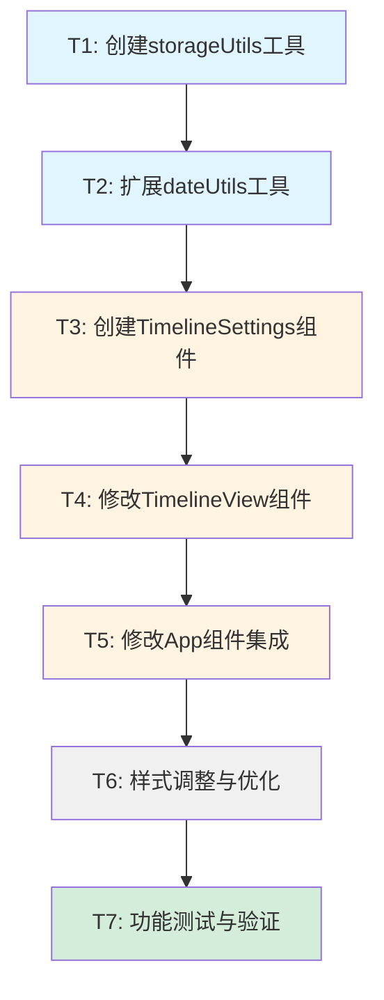

# 任务拆分文档 - 时间范围设置功能

## 一、任务依赖关系图



## 二、原子任务列表

### T1: 创建 storageUtils 工具模块

#### 输入契约
- 无前置依赖
- 需要了解localStorage API
- 需要了解项目数据结构

#### 输出契约
- 文件: `frontend/src/utils/storageUtils.js`
- 导出函数:
  - `saveTimelineSettings(settings)`
  - `loadTimelineSettings()`
  - `validateSettings(settings)`
  - `clearTimelineSettings()`
- 单元测试通过

#### 实现约束
- 使用try-catch处理localStorage异常
- 提供完整的数据验证逻辑
- 添加详细的函数注释
- 遵循项目代码规范

#### 验收标准
- [x] 文件创建成功
- [x] 所有函数实现完整
- [x] 异常处理完善
- [x] 数据验证逻辑正确
- [x] 函数注释完整

---

### T2: 扩展 dateUtils 工具函数

#### 输入契约
- 前置依赖: 无
- 现有文件: `frontend/src/utils/dateUtils.js`
- 需要dayjs库

#### 输出契约
- 新增函数:
  - `calculateCustomTimelineParams(rangeType, customRange)`
  - `getProjectsDateRange(projects)`
  - `validateDateRange(startDate, endDate)`
- 保持现有函数不变
- 单元测试通过

#### 实现约束
- 不修改现有函数
- 使用dayjs进行日期计算
- 处理边界情况（无效日期、空数据等）
- 添加详细的函数注释

#### 验收标准
- [x] 三个新函数实现完整
- [x] 日期计算逻辑正确
- [x] 边界情况处理完善
- [x] 与现有代码无冲突
- [x] 函数注释完整

---

### T3: 创建 TimelineSettings 组件

#### 输入契约
- 前置依赖: T1, T2
- 需要Ant Design组件库
- 需要storageUtils和dateUtils

#### 输出契约
- 文件: `frontend/src/components/TimelineSettings.jsx`
- 样式文件: `frontend/src/styles/timeline-settings.css`
- 组件功能:
  - 快捷选项（3个月、半年、一年）
  - 自定义日期选择
  - 项目时间范围提示
  - 缩放控制
  - 设置持久化

#### 实现约束
- 使用React Hooks（useState, useEffect, useCallback）
- 使用Ant Design组件（Card, Radio, DatePicker, Button）
- 遵循项目组件结构规范
- 添加完整的PropTypes或TypeScript类型
- 添加详细的组件注释

#### 验收标准
- [x] 组件文件创建成功
- [x] 样式文件创建成功
- [x] 快捷选项功能正常
- [x] 自定义日期选择功能正常
- [x] 日期验证逻辑正确
- [x] 项目范围提示显示正确
- [x] 缩放控制功能正常
- [x] 设置持久化正常
- [x] 组件可独立运行（Storybook或单独测试）

---

### T4: 修改 TimelineView 组件

#### 输入契约
- 前置依赖: T2
- 现有文件: `frontend/src/components/Timeline/TimelineView.jsx`
- 需要dateUtils中的新函数

#### 输出契约
- 修改内容:
  1. 移除缩放控制UI代码
  2. 新增Props: `customTimelineRange`, 外部传入`visibleMonths`
  3. 使用`calculateCustomTimelineParams`计算时间范围
  4. 添加时间范围变化时滚动到起始位置的逻辑
- 保持现有功能不变

#### 实现约束
- 最小化修改范围
- 保持向后兼容（如果customTimelineRange为空，使用默认逻辑）
- 不影响现有的滚动同步逻辑
- 保持代码风格一致

#### 验收标准
- [x] 缩放控制UI已移除
- [x] 新Props接收正常
- [x] 自定义时间范围计算正确
- [x] 滚动到起始位置功能正常
- [x] 现有功能无回归问题
- [x] 代码编译无错误

---

### T5: 修改 App 组件集成

#### 输入契约
- 前置依赖: T1, T3, T4
- 现有文件: `frontend/src/App.jsx`
- 需要TimelineSettings组件

#### 输出契约
- 修改内容:
  1. 新增状态: `timelineRange`, `visibleMonths`
  2. 从localStorage加载初始设置
  3. 添加回调函数: `handleRangeChange`, `handleZoomChange`
  4. 在侧边栏添加TimelineSettings组件
  5. 传递新Props给TimelineView
- 保持现有功能不变

#### 实现约束
- 使用useState和useCallback管理状态
- 确保状态更新触发正确的重新渲染
- 保持现有的产品线筛选等功能不变
- 遵循React最佳实践

#### 验收标准
- [x] 状态管理正确
- [x] localStorage加载正常
- [x] 回调函数实现正确
- [x] TimelineSettings组件显示正常
- [x] TimelineView接收Props正常
- [x] 整体功能流程正常
- [x] 无控制台错误

---

### T6: 样式调整与优化

#### 输入契约
- 前置依赖: T3, T5
- 现有样式文件: `frontend/src/styles/index.css`, `frontend/src/styles/timeline.css`
- 新样式文件: `frontend/src/styles/timeline-settings.css`

#### 输出契约
- 修改内容:
  1. 调整App布局样式（侧边栏宽度、布局）
  2. 移除原有缩放控制样式
  3. 完善TimelineSettings组件样式
  4. 确保响应式布局
- 样式与项目整体风格一致

#### 实现约束
- 使用CSS模块化或BEM命名规范
- 确保样式不影响其他组件
- 考虑不同屏幕尺寸的适配
- 保持与Ant Design风格一致

#### 验收标准
- [x] 布局样式正确
- [x] TimelineSettings样式美观
- [x] 响应式布局正常
- [x] 无样式冲突
- [x] 与项目整体风格一致
- [x] 浏览器兼容性良好

---

### T7: 功能测试与验证

#### 输入契约
- 前置依赖: T1-T6全部完成
- 完整的功能实现
- 测试环境准备就绪

#### 输出契约
- 测试报告
- BUG修复
- 性能验证
- 文档更新

#### 实现约束
- 按照CONSENSUS文档中的验收标准测试
- 测试所有功能点和边界情况
- 记录发现的问题并修复
- 验证性能指标

#### 验收标准
- [x] 所有功能验收通过
- [x] 所有UI验收通过
- [x] 性能验收通过
- [x] 兼容性验收通过
- [x] 无遗留BUG
- [x] 文档已更新

## 三、详细任务说明

### T1: 创建 storageUtils 工具模块

#### 实现步骤
1. 创建文件 `frontend/src/utils/storageUtils.js`
2. 实现 `saveTimelineSettings` 函数
3. 实现 `loadTimelineSettings` 函数
4. 实现 `validateSettings` 函数
5. 实现 `clearTimelineSettings` 函数
6. 添加完整的错误处理
7. 添加函数注释

#### 代码示例
```javascript
const STORAGE_KEY = 'timeline_settings'

export function saveTimelineSettings(settings) {
  try {
    const data = {
      timelineRange: settings.timelineRange,
      visibleMonths: settings.visibleMonths,
      timestamp: Date.now()
    }
    localStorage.setItem(STORAGE_KEY, JSON.stringify(data))
  } catch (error) {
    console.error('保存设置失败:', error)
  }
}

// ... 其他函数
```

---

### T2: 扩展 dateUtils 工具函数

#### 实现步骤
1. 打开文件 `frontend/src/utils/dateUtils.js`
2. 在文件末尾添加 `calculateCustomTimelineParams` 函数
3. 添加 `getProjectsDateRange` 函数
4. 添加 `validateDateRange` 函数
5. 确保导入必要的dayjs插件
6. 添加函数注释

#### 代码示例
```javascript
export function calculateCustomTimelineParams(rangeType, customRange) {
  const now = dayjs()
  let minDate, maxDate
  
  switch (rangeType) {
    case '3months':
      minDate = now.subtract(1.5, 'month').startOf('month')
      maxDate = now.add(1.5, 'month').endOf('month')
      break
    // ... 其他case
  }
  
  const totalDays = maxDate.diff(minDate, 'day')
  return { minDate, maxDate, totalDays }
}

// ... 其他函数
```

---

### T3: 创建 TimelineSettings 组件

#### 实现步骤
1. 创建文件 `frontend/src/components/TimelineSettings.jsx`
2. 创建文件 `frontend/src/styles/timeline-settings.css`
3. 实现组件基本结构（Card容器）
4. 实现项目时间范围提示
5. 实现快捷选项（Radio.Group）
6. 实现自定义日期选择器（DatePicker.RangePicker）
7. 实现日期验证逻辑
8. 实现缩放控制
9. 实现设置持久化逻辑
10. 添加样式
11. 添加组件注释

#### 组件结构
```jsx
import { Card, Radio, DatePicker, Button, Space, message } from 'antd'
import { ZoomInOutlined, ZoomOutOutlined } from '@ant-design/icons'
import { useState, useEffect, useCallback } from 'react'
import { getProjectsDateRange, validateDateRange } from '../utils/dateUtils'
import '../styles/timeline-settings.css'

function TimelineSettings({ projects, currentRange, onRangeChange, visibleMonths, onZoomChange }) {
  // 状态管理
  const [rangeType, setRangeType] = useState(currentRange.type)
  const [customRange, setCustomRange] = useState(currentRange.customRange)
  const [showCustomPicker, setShowCustomPicker] = useState(false)
  const [projectsDateRange, setProjectsDateRange] = useState(null)
  
  // 计算项目时间范围
  useEffect(() => {
    const range = getProjectsDateRange(projects)
    setProjectsDateRange(range)
  }, [projects])
  
  // 处理快捷选项变化
  const handleRangeTypeChange = (e) => {
    const newType = e.target.value
    setRangeType(newType)
    
    if (newType === 'custom') {
      setShowCustomPicker(true)
    } else {
      setShowCustomPicker(false)
      onRangeChange({ type: newType, customRange: null })
    }
  }
  
  // ... 其他处理函数
  
  return (
    <Card title="时间轴设置" size="small" className="timeline-settings-card">
      {/* 项目时间范围提示 */}
      {/* 快捷选项 */}
      {/* 自定义日期选择器 */}
      {/* 缩放控制 */}
    </Card>
  )
}

export default TimelineSettings
```

---

### T4: 修改 TimelineView 组件

#### 实现步骤
1. 打开文件 `frontend/src/components/Timeline/TimelineView.jsx`
2. 删除缩放控制相关的JSX代码
3. 删除缩放控制相关的状态和函数
4. 修改Props定义，添加 `customTimelineRange` 和外部传入的 `visibleMonths`
5. 修改时间轴参数计算逻辑，使用 `calculateCustomTimelineParams`
6. 添加时间范围变化时滚动到起始位置的useEffect
7. 测试修改后的功能

#### 修改点
```javascript
// 1. 导入新函数
import { calculateTimelineParams, calculateCustomTimelineParams } from '../../utils/dateUtils'

// 2. 修改Props
function TimelineView({ 
  projects, 
  productLines, 
  selectedProductLines, 
  onEditProject,
  customTimelineRange,  // 新增
  visibleMonths         // 从外部传入
})

// 3. 修改时间轴参数计算
useEffect(() => {
  const params = customTimelineRange 
    ? calculateCustomTimelineParams(
        customTimelineRange.type, 
        customTimelineRange.customRange
      )
    : calculateTimelineParams(projects)
  
  // ... 其余逻辑
}, [projects, productLines, customTimelineRange, visibleMonths])

// 4. 添加滚动逻辑
useEffect(() => {
  if (!scrollContainerRef.current || !timelineParams) return
  scrollContainerRef.current.scrollLeft = 0
  syncHeaderScroll()
}, [customTimelineRange, timelineParams, syncHeaderScroll])

// 5. 删除缩放控制JSX
// 删除 <div className="timeline-zoom-controls">...</div>
```

---

### T5: 修改 App 组件集成

#### 实现步骤
1. 打开文件 `frontend/src/App.jsx`
2. 导入 TimelineSettings 组件和 storageUtils
3. 添加状态管理（timelineRange, visibleMonths）
4. 从localStorage加载初始设置
5. 实现回调函数（handleRangeChange, handleZoomChange）
6. 在侧边栏添加 TimelineSettings 组件
7. 传递新Props给 TimelineView
8. 测试整体集成

#### 修改点
```javascript
// 1. 导入
import TimelineSettings from './components/TimelineSettings'
import { loadTimelineSettings, saveTimelineSettings } from './utils/storageUtils'
import { DEFAULT_VISIBLE_MONTHS } from './utils/constants'

// 2. 状态管理
const [timelineRange, setTimelineRange] = useState(() => {
  const saved = loadTimelineSettings()
  return saved?.timelineRange || { type: '1year', customRange: null }
})

const [visibleMonths, setVisibleMonths] = useState(() => {
  const saved = loadTimelineSettings()
  return saved?.visibleMonths || DEFAULT_VISIBLE_MONTHS
})

// 3. 回调函数
const handleRangeChange = useCallback((newRange) => {
  setTimelineRange(newRange)
  saveTimelineSettings({ timelineRange: newRange, visibleMonths })
}, [visibleMonths])

const handleZoomChange = useCallback((newVisibleMonths) => {
  setVisibleMonths(newVisibleMonths)
  saveTimelineSettings({ timelineRange, visibleMonths: newVisibleMonths })
}, [timelineRange])

// 4. JSX修改
<div className="sidebar">
  <ProductLineFilter ... />
  <TimelineSettings
    projects={projects}
    currentRange={timelineRange}
    onRangeChange={handleRangeChange}
    visibleMonths={visibleMonths}
    onZoomChange={handleZoomChange}
  />
</div>

<TimelineView
  ...
  customTimelineRange={timelineRange}
  visibleMonths={visibleMonths}
/>
```

---

### T6: 样式调整与优化

#### 实现步骤
1. 创建 `frontend/src/styles/timeline-settings.css`
2. 实现TimelineSettings组件样式
3. 修改 `frontend/src/styles/index.css` 中的App布局样式
4. 修改 `frontend/src/styles/timeline.css`，移除缩放控制样式
5. 测试响应式布局
6. 调整细节样式

#### 样式文件
参考DESIGN文档中的样式设计部分。

---

### T7: 功能测试与验证

#### 测试清单

##### 功能测试
- [ ] 快捷选项"最近3个月"功能正常
- [ ] 快捷选项"最近半年"功能正常
- [ ] 快捷选项"最近一年"功能正常
- [ ] 选择"自定义"后日期选择器展开
- [ ] 自定义日期范围验证正确
- [ ] 点击"应用"后时间轴更新
- [ ] 点击"重置"后恢复默认
- [ ] 项目时间范围提示显示正确
- [ ] 缩放控制功能正常
- [ ] 设置持久化正常（刷新页面后保持）
- [ ] 时间范围变化后滚动到起始位置

##### UI测试
- [ ] TimelineSettings Card样式正确
- [ ] 快捷选项布局清晰
- [ ] 日期选择器样式正常
- [ ] 缩放控制样式正常
- [ ] 响应式布局正常
- [ ] 与产品线筛选器样式一致

##### 边界测试
- [ ] 无项目时提示"暂无项目"
- [ ] 日期范围小于1个月时提示错误
- [ ] 日期范围大于5年时显示警告
- [ ] 开始日期晚于结束日期时提示错误
- [ ] localStorage不可用时使用默认值

##### 兼容性测试
- [ ] Chrome浏览器正常
- [ ] Safari浏览器正常
- [ ] Firefox浏览器正常
- [ ] 与现有功能无冲突

##### 性能测试
- [ ] 时间范围变化渲染流畅
- [ ] 大时间范围（3-5年）滚动流畅
- [ ] localStorage读写无性能问题

## 四、风险与注意事项

### 风险点
1. **缩放控制迁移**: 可能影响用户习惯
   - 缓解: 保持视觉样式和交互逻辑不变
   
2. **大时间范围性能**: 可能导致渲染卡顿
   - 缓解: 添加警告提示，优化渲染逻辑
   
3. **localStorage兼容性**: 隐私模式或配额限制
   - 缓解: 添加异常处理，提供降级方案

### 注意事项
1. 每完成一个任务，立即测试验证
2. 保持代码风格与项目一致
3. 添加完整的注释和文档
4. 及时提交代码，避免大量修改
5. 遇到问题及时记录和沟通

## 五、预估工作量

| 任务 | 预估时间 | 复杂度 |
|------|---------|--------|
| T1: 创建storageUtils | 30分钟 | 低 |
| T2: 扩展dateUtils | 45分钟 | 中 |
| T3: 创建TimelineSettings | 2小时 | 高 |
| T4: 修改TimelineView | 1小时 | 中 |
| T5: 修改App组件 | 1小时 | 中 |
| T6: 样式调整 | 1小时 | 中 |
| T7: 功能测试 | 1.5小时 | 中 |
| **总计** | **约7.5小时** | - |

## 六、下一步行动

1. ✅ 任务拆分文档已完成
2. ⏳ 等待审批确认
3. ⏳ 开始执行T1任务
4. ⏳ 按顺序完成所有任务
5. ⏳ 生成验收文档
6. ⏳ 生成最终报告
