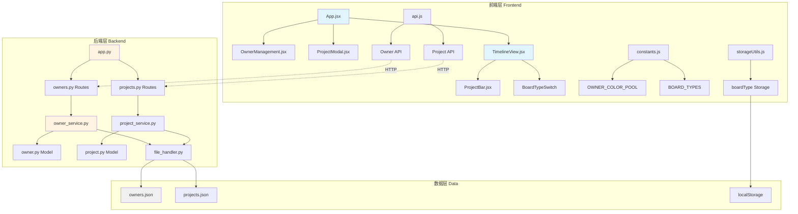
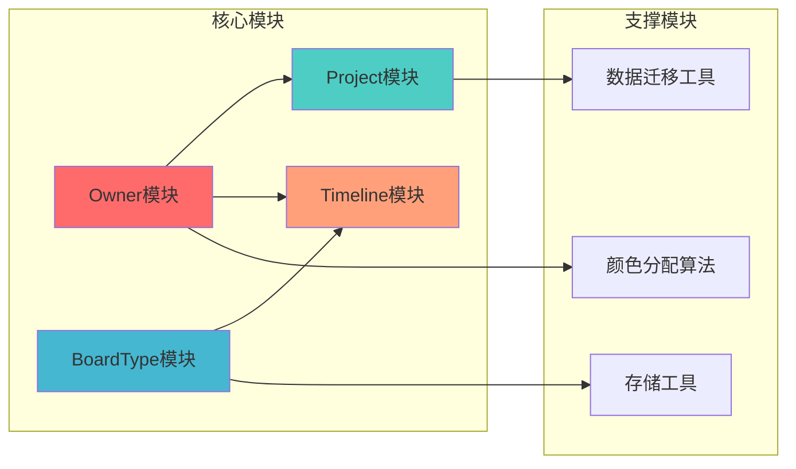
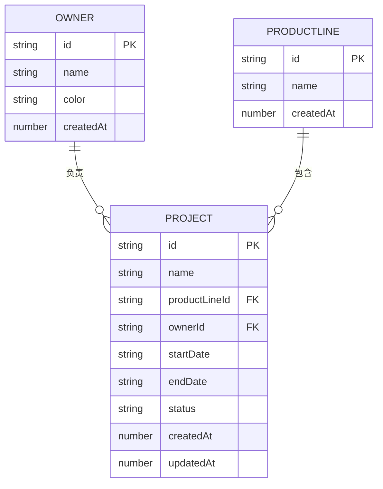
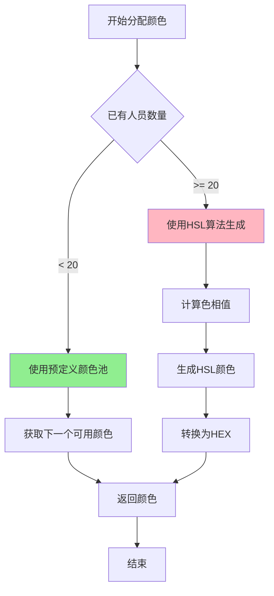
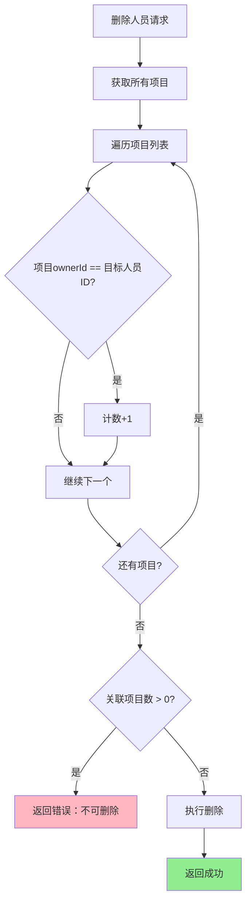
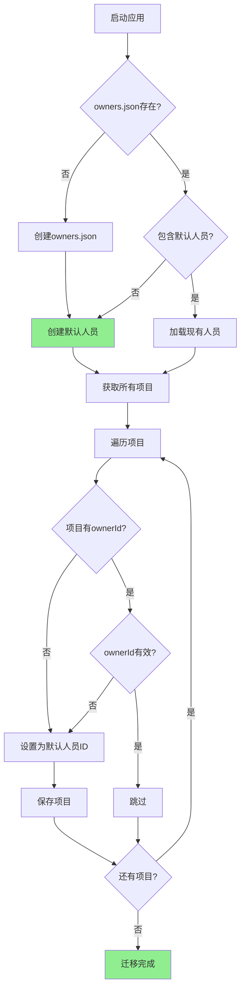
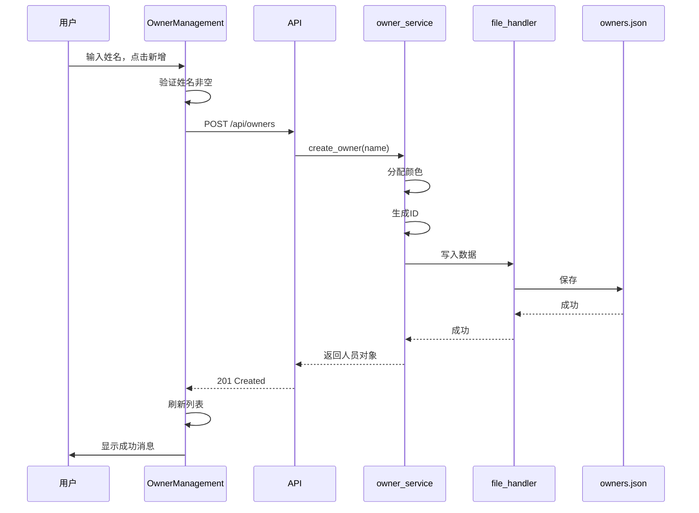
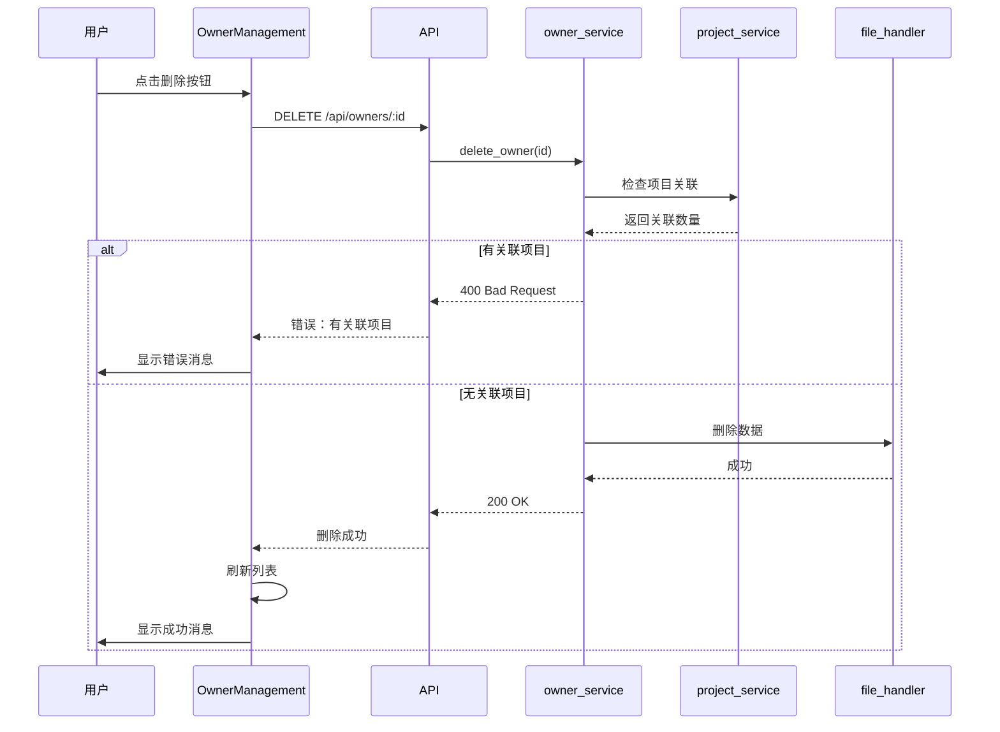
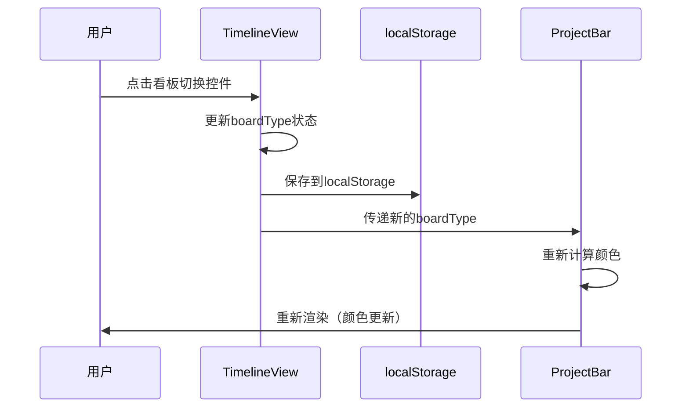

# DESIGN - 项目负责人与人员看板

## 一、系统架构设计

### 1.1 整体架构图



### 1.2 模块依赖关系



## 二、数据模型设计

### 2.1 Owner模型（人员）

#### 数据结构
```python
class Owner:
    """
    人员数据模型
    
    Attributes:
        id: 人员唯一标识符（owner-{UUID}格式）
        name: 人员姓名（必填，1-50字符）
        color: 分配的颜色（HEX格式，如#FF6B6B）
        createdAt: 创建时间戳（毫秒）
    """
    
    def __init__(self, name, id=None, color=None, createdAt=None):
        self.id = id or self._generate_id()
        self.name = name
        self.color = color or self._assign_color()
        self.createdAt = createdAt or self._get_current_timestamp()
        self.validate()
    
    def validate(self):
        """验证数据有效性"""
        # 验证姓名
        if not self.name or not isinstance(self.name, str):
            raise ValueError("人员姓名必须是非空字符串")
        if not self.name.strip():
            raise ValueError("人员姓名不能为空白字符")
        if len(self.name) > 50:
            raise ValueError("人员姓名长度不能超过50个字符")
        
        # 验证颜色格式
        if not re.match(r'^#[0-9A-Fa-f]{6}$', self.color):
            raise ValueError("颜色格式必须是HEX格式（如#FF6B6B）")
```

#### 字段说明
| 字段 | 类型 | 必填 | 说明 |
|------|------|------|------|
| id | string | 是 | 唯一标识，格式：owner-{uuid} |
| name | string | 是 | 人员姓名，1-50字符 |
| color | string | 是 | HEX颜色，自动分配 |
| createdAt | number | 是 | 创建时间戳（毫秒） |

#### 示例数据
```json
{
  "id": "owner-550e8400-e29b-41d4-a716-446655440000",
  "name": "张三",
  "color": "#FF6B6B",
  "createdAt": 1704067200000
}
```

### 2.2 Project模型扩展

#### 新增字段
```python
class Project:
    # ... 现有字段 ...
    ownerId: str  # 新增：项目负责人ID（必填）
```

#### 验证规则
```python
def validate(self):
    # ... 现有验证 ...
    
    # 验证负责人ID
    if not self.ownerId or not isinstance(self.ownerId, str):
        raise ValueError("项目负责人ID必须是非空字符串")
    
    # 验证负责人是否存在（在service层）
    if not owner_service.owner_exists(self.ownerId):
        raise ValueError(f"负责人ID {self.ownerId} 不存在")
```

#### 示例数据
```json
{
  "id": "proj-123",
  "name": "项目A",
  "productLineId": "pl-001",
  "ownerId": "owner-550e8400-e29b-41d4-a716-446655440000",
  "startDate": "2025-01-01",
  "endDate": "2025-03-31",
  "status": "开发",
  "createdAt": 1704067200000,
  "updatedAt": 1704067200000
}
```

### 2.3 数据关系图



## 三、API接口设计

### 3.1 Owner API

#### 获取所有人员
```
GET /api/owners

Response 200:
{
  "owners": [
    {
      "id": "owner-001",
      "name": "张三",
      "color": "#FF6B6B",
      "createdAt": 1704067200000,
      "projectCount": 5  // 关联项目数
    }
  ]
}

Response 500:
{
  "error": "获取人员列表失败"
}
```

#### 创建人员
```
POST /api/owners
Content-Type: application/json

Request:
{
  "name": "李四"
}

Response 201:
{
  "id": "owner-002",
  "name": "李四",
  "color": "#4ECDC4",  // 自动分配
  "createdAt": 1704067200000
}

Response 400:
{
  "error": "人员姓名不能为空"
}

Response 409:
{
  "error": "人员姓名已存在"
}
```

#### 删除人员
```
DELETE /api/owners/:id

Response 200:
{
  "message": "人员删除成功"
}

Response 400:
{
  "error": "该人员有关联项目，无法删除",
  "projectCount": 3
}

Response 404:
{
  "error": "人员不存在"
}
```

#### 获取人员关联项目数
```
GET /api/owners/:id/projects/count

Response 200:
{
  "ownerId": "owner-001",
  "projectCount": 5
}

Response 404:
{
  "error": "人员不存在"
}
```

### 3.2 Project API扩展

#### 创建项目（修改）
```
POST /api/projects
Content-Type: application/json

Request:
{
  "name": "项目A",
  "productLineId": "pl-001",
  "ownerId": "owner-001",  // 新增必填字段
  "startDate": "2025-01-01",
  "endDate": "2025-03-31",
  "status": "开发"
}

Response 201:
{
  "id": "proj-123",
  "name": "项目A",
  "productLineId": "pl-001",
  "ownerId": "owner-001",
  "startDate": "2025-01-01",
  "endDate": "2025-03-31",
  "status": "开发",
  "createdAt": 1704067200000,
  "updatedAt": 1704067200000
}

Response 400:
{
  "error": "项目负责人ID不能为空"
}

Response 404:
{
  "error": "负责人不存在"
}
```

## 四、核心算法设计

### 4.1 颜色分配算法

#### 算法流程


#### 实现代码
```python
class ColorAssigner:
    """颜色分配器"""
    
    # 预定义颜色池（20种高对比度颜色）
    COLOR_POOL = [
        '#FF6B6B', '#4ECDC4', '#45B7D1', '#FFA07A', '#98D8C8',
        '#F7DC6F', '#BB8FCE', '#85C1E2', '#F8B739', '#52B788',
        '#E74C3C', '#3498DB', '#9B59B6', '#1ABC9C', '#F39C12',
        '#E67E22', '#95A5A6', '#34495E', '#16A085', '#27AE60'
    ]
    
    @staticmethod
    def assign_color(existing_owners):
        """
        为新人员分配颜色
        
        Args:
            existing_owners: 已存在的人员列表
            
        Returns:
            str: HEX格式的颜色
        """
        owner_count = len(existing_owners)
        
        # 前20个使用预定义颜色
        if owner_count < len(ColorAssigner.COLOR_POOL):
            return ColorAssigner.COLOR_POOL[owner_count]
        
        # 超过20个使用HSL算法生成
        return ColorAssigner._generate_hsl_color(owner_count)
    
    @staticmethod
    def _generate_hsl_color(index):
        """
        使用HSL算法生成颜色
        色相均匀分布，保证视觉区分度
        
        Args:
            index: 人员索引
            
        Returns:
            str: HEX格式的颜色
        """
        # 黄金角度分割，确保颜色均匀分布
        golden_ratio = 0.618033988749895
        hue = (index * golden_ratio) % 1.0
        
        # 固定饱和度和亮度，确保颜色鲜艳
        saturation = 0.7
        lightness = 0.6
        
        # 转换HSL到RGB
        rgb = ColorAssigner._hsl_to_rgb(hue, saturation, lightness)
        
        # 转换RGB到HEX
        return ColorAssigner._rgb_to_hex(rgb)
    
    @staticmethod
    def _hsl_to_rgb(h, s, l):
        """HSL转RGB"""
        def hue_to_rgb(p, q, t):
            if t < 0: t += 1
            if t > 1: t -= 1
            if t < 1/6: return p + (q - p) * 6 * t
            if t < 1/2: return q
            if t < 2/3: return p + (q - p) * (2/3 - t) * 6
            return p
        
        if s == 0:
            r = g = b = l
        else:
            q = l * (1 + s) if l < 0.5 else l + s - l * s
            p = 2 * l - q
            r = hue_to_rgb(p, q, h + 1/3)
            g = hue_to_rgb(p, q, h)
            b = hue_to_rgb(p, q, h - 1/3)
        
        return (int(r * 255), int(g * 255), int(b * 255))
    
    @staticmethod
    def _rgb_to_hex(rgb):
        """RGB转HEX"""
        return '#{:02X}{:02X}{:02X}'.format(rgb[0], rgb[1], rgb[2])
```

### 4.2 项目关联检查算法

#### 算法流程


#### 实现代码
```python
def can_delete_owner(owner_id):
    """
    检查人员是否可以删除
    
    Args:
        owner_id: 人员ID
        
    Returns:
        tuple: (can_delete: bool, project_count: int)
    """
    projects = project_service.get_all_projects()
    project_count = sum(1 for p in projects if p.ownerId == owner_id)
    return (project_count == 0, project_count)
```

### 4.3 数据迁移算法

#### 迁移流程


#### 实现代码
```python
def migrate_owner_data():
    """
    数据迁移：为现有项目添加ownerId字段
    """
    # 1. 确保owners.json存在
    if not os.path.exists('data/owners.json'):
        create_default_owner_file()
    
    # 2. 确保默认人员存在
    owners = owner_service.get_all_owners()
    default_owner = next((o for o in owners if o.id == 'owner-default'), None)
    
    if not default_owner:
        default_owner = owner_service.create_default_owner()
    
    # 3. 迁移项目数据
    projects = project_service.get_all_projects()
    migrated_count = 0
    
    for project in projects:
        if not hasattr(project, 'ownerId') or not project.ownerId:
            project.ownerId = default_owner.id
            project_service.update_project(project.id, {'ownerId': default_owner.id})
            migrated_count += 1
    
    return migrated_count
```

## 五、组件设计

### 5.1 OwnerManagement组件

#### 组件结构
```jsx
<OwnerManagement>
  <Card title="人员管理">
    <Space direction="vertical" style={{ width: '100%' }}>
      {/* 新增人员表单 */}
      <Input.Group compact>
        <Input placeholder="输入人员姓名" />
        <Button type="primary">新增</Button>
      </Input.Group>
      
      {/* 人员列表 */}
      <List
        dataSource={owners}
        renderItem={owner => (
          <List.Item
            actions={[
              <Tooltip title={canDelete ? '删除' : `有${count}个关联项目`}>
                <Button 
                  danger 
                  disabled={!canDelete}
                  onClick={() => handleDelete(owner.id)}
                >
                  删除
                </Button>
              </Tooltip>
            ]}
          >
            <List.Item.Meta
              avatar={<Badge color={owner.color} />}
              title={owner.name}
              description={`${owner.projectCount} 个项目`}
            />
          </List.Item>
        )}
      />
    </Space>
  </Card>
</OwnerManagement>
```

#### 状态管理
```javascript
const [owners, setOwners] = useState([])
const [newOwnerName, setNewOwnerName] = useState('')
const [loading, setLoading] = useState(false)
const [projectCounts, setProjectCounts] = useState({})
```

#### 核心方法
```javascript
// 加载人员列表
const loadOwners = async () => {
  const data = await getOwners()
  setOwners(data.owners)
  
  // 加载每个人员的项目数
  const counts = {}
  for (const owner of data.owners) {
    const { projectCount } = await getOwnerProjectCount(owner.id)
    counts[owner.id] = projectCount
  }
  setProjectCounts(counts)
}

// 新增人员
const handleCreate = async () => {
  if (!newOwnerName.trim()) {
    message.warning('请输入人员姓名')
    return
  }
  
  try {
    await createOwner(newOwnerName.trim())
    message.success('人员创建成功')
    setNewOwnerName('')
    loadOwners()
  } catch (error) {
    message.error('人员创建失败: ' + error.message)
  }
}

// 删除人员
const handleDelete = async (ownerId) => {
  try {
    await deleteOwner(ownerId)
    message.success('人员删除成功')
    loadOwners()
  } catch (error) {
    message.error('人员删除失败: ' + error.message)
  }
}
```

### 5.2 ProjectModal组件修改

#### 新增负责人选择器
```jsx
{/* 项目负责人 */}
<Form.Item
  label="项目负责人"
  name="ownerId"
  rules={[{ required: true, message: '请选择项目负责人' }]}
>
  <Select
    placeholder="请选择项目负责人"
    dropdownRender={(menu) => (
      <>
        {menu}
        <div style={{ padding: '8px', borderTop: '1px solid #f0f0f0' }}>
          {isCreatingOwner ? (
            <div style={{ display: 'flex', gap: '8px' }}>
              <Input
                placeholder="输入人员姓名"
                value={newOwnerName}
                onChange={(e) => setNewOwnerName(e.target.value)}
                onPressEnter={handleCreateOwner}
                maxLength={50}
                autoFocus
              />
              <a onClick={handleCreateOwner}>确定</a>
              <a onClick={() => setIsCreatingOwner(false)}>取消</a>
            </div>
          ) : (
            <a onClick={() => setIsCreatingOwner(true)}>
              + 新建人员
            </a>
          )}
        </div>
      </>
    )}
  >
    {owners.map((owner) => (
      <Option key={owner.id} value={owner.id}>
        <Badge color={owner.color} /> {owner.name}
      </Option>
    ))}
  </Select>
</Form.Item>
```

### 5.3 TimelineView组件修改

#### 新增看板切换控件
```jsx
<div className="timeline-header-controls">
  <Segmented
    value={boardType}
    onChange={setBoardType}
    options={[
      { label: '进度看板', value: 'status' },
      { label: '人员看板', value: 'owner' }
    ]}
  />
</div>
```

#### 状态管理
```javascript
const [boardType, setBoardType] = useState(() => {
  // 从localStorage读取上次选择
  return localStorage.getItem('boardType') || 'status'
})

// 保存看板类型到localStorage
useEffect(() => {
  localStorage.setItem('boardType', boardType)
}, [boardType])
```

#### 传递给ProjectBar
```jsx
<ProjectBar
  project={project}
  timelineParams={timelineParams}
  row={row}
  onEdit={onEditProject}
  boardType={boardType}  // 新增
  owners={owners}        // 新增
/>
```

### 5.4 ProjectBar组件修改

#### 颜色选择逻辑
```javascript
function ProjectBar({ project, timelineParams, row, onEdit, boardType, owners }) {
  // 根据看板类型选择颜色
  const getColor = () => {
    if (boardType === 'owner') {
      // 人员看板：按负责人显示颜色
      const owner = owners.find(o => o.id === project.ownerId)
      return owner?.color || '#95A5A6'  // 默认灰色
    } else {
      // 进度看板：按状态显示颜色
      return STATUS_COLORS[project.status] || '#999'
    }
  }
  
  const color = getColor()
  const isPaused = project.status === '暂停'
  
  // ... 其余渲染逻辑
}
```

## 六、数据流设计

### 6.1 创建人员流程



### 6.2 删除人员流程



### 6.3 切换看板流程



## 七、文件结构

### 7.1 新增文件

```
backend/
├── models/
│   └── owner.py                    # 新增：人员模型
├── services/
│   └── owner_service.py            # 新增：人员服务
├── routes/
│   └── owners.py                   # 新增：人员路由
└── utils/
    └── migrate_owners.py           # 新增：数据迁移工具

frontend/src/
├── components/
│   └── OwnerManagement.jsx         # 新增：人员管理组件
└── utils/
    └── colorUtils.js               # 新增：颜色工具（可选）

data/
└── owners.json                     # 新增：人员数据文件
```

### 7.2 修改文件

```
backend/
├── models/
│   └── project.py                  # 修改：添加ownerId字段
├── services/
│   └── project_service.py          # 修改：验证ownerId
└── app.py                          # 修改：注册owners路由，添加迁移逻辑

frontend/src/
├── components/
│   ├── ProjectModal.jsx            # 修改：添加负责人选择器
│   └── Timeline/
│       ├── TimelineView.jsx        # 修改：添加看板切换控件
│       └── ProjectBar.jsx          # 修改：支持双色彩模式
├── services/
│   └── api.js                      # 修改：添加人员API
├── utils/
│   └── constants.js                # 修改：添加颜色池和看板类型
└── App.jsx                         # 修改：添加OwnerManagement组件
```

## 八、技术细节

### 8.1 颜色对比度保证

为确保颜色在白色背景上清晰可见，所有颜色需满足WCAG AA标准：

```javascript
// 计算颜色对比度
function getContrastRatio(color1, color2) {
  const l1 = getLuminance(color1)
  const l2 = getLuminance(color2)
  const lighter = Math.max(l1, l2)
  const darker = Math.min(l1, l2)
  return (lighter + 0.05) / (darker + 0.05)
}

// 确保对比度 >= 4.5:1
function ensureContrast(color) {
  const ratio = getContrastRatio(color, '#FFFFFF')
  return ratio >= 4.5
}
```

### 8.2 性能优化

#### 人员列表缓存
```javascript
// 使用useMemo缓存人员列表
const ownersMap = useMemo(() => {
  return owners.reduce((map, owner) => {
    map[owner.id] = owner
    return map
  }, {})
}, [owners])
```

#### ProjectBar优化
```javascript
// 使用React.memo避免不必要的重渲染
export default React.memo(ProjectBar, (prevProps, nextProps) => {
  return (
    prevProps.project.id === nextProps.project.id &&
    prevProps.boardType === nextProps.boardType &&
    prevProps.project.ownerId === nextProps.project.ownerId &&
    prevProps.project.status === nextProps.project.status
  )
})
```

### 8.3 错误处理

#### 后端错误处理
```python
@app.errorhandler(ValueError)
def handle_value_error(e):
    return jsonify({'error': str(e)}), 400

@app.errorhandler(FileNotFoundError)
def handle_file_not_found(e):
    return jsonify({'error': '数据文件不存在'}), 500
```

#### 前
