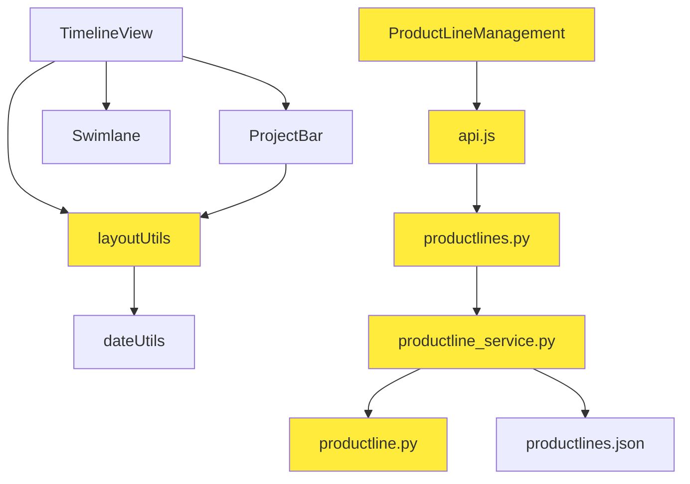
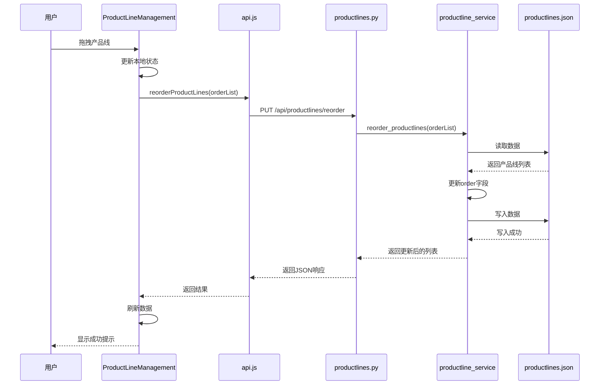

# 项目间隔与产品线排序优化 - 架构设计文档

## 一、系统架构概览

### 1.1 整体架构

本次优化涉及前端布局算法和产品线管理功能的扩展，不改变整体架构：

```
┌─────────────────────────────────────────────────────────────┐
│                        前端 (React)                          │
├─────────────────────────────────────────────────────────────┤
│  组件层                                                       │
│  ├─ TimelineView.jsx          (时间轴主视图)                │
│  ├─ ProjectBar.jsx            (项目块组件) ← 需求1影响      │
│  ├─ ProductLineManagement.jsx (产品线管理) ← 需求2影响      │
│  └─ Swimlane.jsx              (产品线泳道)                  │
├─────────────────────────────────────────────────────────────┤
│  工具层                                                       │
│  ├─ layoutUtils.js            (布局算法) ← 需求1修改        │
│  ├─ dateUtils.js              (日期工具)                    │
│  └─ api.js                    (API服务) ← 需求2扩展         │
└─────────────────────────────────────────────────────────────┘
                              ↕ HTTP API
┌─────────────────────────────────────────────────────────────┐
│                        后端 (Flask)                          │
├─────────────────────────────────────────────────────────────┤
│  路由层                                                       │
│  └─ productlines.py           (产品线路由) ← 需求2扩展      │
├─────────────────────────────────────────────────────────────┤
│  服务层                                                       │
│  └─ productline_service.py    (产品线服务) ← 需求2扩展      │
├─────────────────────────────────────────────────────────────┤
│  模型层                                                       │
│  └─ productline.py            (产品线模型) ← 需求2扩展      │
├─────────────────────────────────────────────────────────────┤
│  数据层                                                       │
│  └─ productlines.json         (产品线数据) ← 需求2扩展      │
└─────────────────────────────────────────────────────────────┘
```

### 1.2 模块依赖关系



## 二、需求1：项目间隔显示优化

### 2.1 核心设计

**设计原则**：
- 最小化修改范围
- 不影响数据存储
- 保持向后兼容

**修改点**：
- 文件：`frontend/src/utils/layoutUtils.js`
- 函数：`calculateProjectBarPosition`

### 2.2 算法设计

#### 原算法

```javascript
/**
 * 计算项目块的位置和尺寸
 */
export function calculateProjectBarPosition(project, timelineParams) {
  const { minDate, pixelsPerDay } = timelineParams
  
  // 计算起始位置
  const startOffset = dayjs(project.startDate).diff(minDate, 'day')
  const left = startOffset * pixelsPerDay
  
  // 计算宽度（包含结束日）
  const duration = dayjs(project.endDate).diff(project.startDate, 'day') + 1
  const width = duration * pixelsPerDay
  
  return { left, width }
}
```

#### 新算法

```javascript
/**
 * 计算项目块的位置和尺寸
 * 注意：宽度减去1天，用于显示项目间隔
 */
export function calculateProjectBarPosition(project, timelineParams) {
  const { minDate, pixelsPerDay } = timelineParams
  
  // 计算起始位置（不变）
  const startOffset = dayjs(project.startDate).diff(minDate, 'day')
  const left = startOffset * pixelsPerDay
  
  // 计算宽度（包含结束日，但减去1天用于间隔显示）
  const duration = dayjs(project.endDate).diff(project.startDate, 'day') + 1
  const width = duration * pixelsPerDay - pixelsPerDay  // ← 关键修改
  
  return { left, width }
}
```

### 2.3 视觉效果示意

```
原效果（项目块紧密相连）：
┌─────────────┐┌─────────────┐┌─────────────┐
│  项目A      ││  项目B      ││  项目C      │
│ 1/1 - 1/10  ││ 1/11 - 1/20 ││ 1/21 - 1/30 │
└─────────────┘└─────────────┘└─────────────┘

新效果（项目块之间有1天间隔）：
┌─────────────┐ ┌─────────────┐ ┌─────────────┐
│  项目A      │ │  项目B      │ │  项目C      │
│ 1/1 - 1/10  │ │ 1/11 - 1/20 │ │ 1/21 - 1/30 │
└─────────────┘ └─────────────┘ └─────────────┘
                ↑               ↑
              1天间隔         1天间隔
```

### 2.4 影响分析

**不影响的部分**：
- ✅ 项目数据存储（startDate, endDate保持不变）
- ✅ 项目编辑功能（用户看到的仍是实际日期）
- ✅ 项目位置计算（left偏移不变）
- ✅ 重叠检测算法（基于实际日期）
- ✅ 行分配算法（基于实际日期）

**影响的部分**：
- ⚠️ 项目块视觉宽度（减少1天）
- ⚠️ 项目块点击区域（略微缩小）

### 2.5 边界情况处理

**情况1：单天项目**
```javascript
// 项目：2025-01-01 到 2025-01-01（1天）
duration = 1
width = 1 * pixelsPerDay - pixelsPerDay = 0  // ❌ 宽度为0，不可见

// 解决方案：设置最小宽度
const width = Math.max(duration * pixelsPerDay - pixelsPerDay, pixelsPerDay * 0.5)
```

**情况2：两天项目**
```javascript
// 项目：2025-01-01 到 2025-01-02（2天）
duration = 2
width = 2 * pixelsPerDay - pixelsPerDay = pixelsPerDay  // ✅ 显示1天宽度
```

**最终算法（考虑边界情况）**：
```javascript
export function calculateProjectBarPosition(project, timelineParams) {
  const { minDate, pixelsPerDay } = timelineParams
  
  const startOffset = dayjs(project.startDate).diff(minDate, 'day')
  const left = startOffset * pixelsPerDay
  
  const duration = dayjs(project.endDate).diff(project.startDate, 'day') + 1
  // 减去1天间隔，但保证最小宽度为0.5天
  const width = Math.max(duration * pixelsPerDay - pixelsPerDay, pixelsPerDay * 0.5)
  
  return { left, width }
}
```

## 三、需求2：产品线排序功能

### 3.1 数据模型设计

#### 产品线模型扩展

```python
class ProductLine:
    """
    产品线数据模型类
    
    Attributes:
        id: 产品线唯一标识符
        name: 产品线名称
        createdAt: 创建时间戳
        order: 排序位置（新增） ← 关键字段
    """
    
    def __init__(self, name, id=None, createdAt=None, order=None):
        self.id = id or self._generate_id()
        self.name = name
        self.createdAt = createdAt or self._get_current_timestamp()
        self.order = order if order is not None else 0  # ← 新增
        self.validate()
    
    def to_dict(self):
        return {
            'id': self.id,
            'name': self.name,
            'createdAt': self.createdAt,
            'order': self.order  # ← 新增
        }
    
    @classmethod
    def from_dict(cls, data):
        return cls(
            name=data['name'],
            id=data.get('id'),
            createdAt=data.get('createdAt'),
            order=data.get('order', 0)  # ← 新增，默认0
        )
```

#### 数据文件格式

```json
{
  "productlines": [
    {
      "id": "pl-uuid-001",
      "name": "核心业务线",
      "createdAt": 1704067200000,
      "order": 0
    },
    {
      "id": "pl-uuid-002",
      "name": "创新业务线",
      "createdAt": 1704153600000,
      "order": 1
    }
  ]
}
```

### 3.2 后端架构设计

#### 服务层设计

```python
# productline_service.py

def get_all_productlines():
    """
    获取所有产品线（按order排序）
    """
    productlines = file_handler.read_productlines()
    # 数据迁移：为没有order字段的产品线添加order
    migrate_productline_order(productlines)
    # 按order排序
    productlines.sort(key=lambda x: x.get('order', 0))
    return productlines

def create_productline(name):
    """
    创建产品线（自动分配order）
    """
    productlines = file_handler.read_productlines()
    # 计算新的order值（最大order + 1）
    max_order = max([pl.get('order', 0) for pl in productlines], default=-1)
    new_order = max_order + 1
    
    new_pl = ProductLine(name=name, order=new_order)
    productlines.append(new_pl.to_dict())
    file_handler.write_productlines(productlines)
    return new_pl

def reorder_productlines(order_list):
    """
    批量更新产品线顺序
    
    Args:
        order_list: [{'id': 'pl-001', 'order': 0}, ...]
    """
    productlines = file_handler.read_productlines()
    
    # 创建ID到order的映射
    order_map = {item['id']: item['order'] for item in order_list}
    
    # 更新order
    for pl in productlines:
        if pl['id'] in order_map:
            pl['order'] = order_map[pl['id']]
    
    file_handler.write_productlines(productlines)
    return productlines

def migrate_productline_order(productlines):
    """
    数据迁移：为没有order字段的产品线添加order
    """
    needs_migration = False
    for i, pl in enumerate(productlines):
        if 'order' not in pl:
            pl['order'] = i
            needs_migration = True
    
    if needs_migration:
        file_handler.write_productlines(productlines)
```

#### API路由设计

```python
# productlines.py

@productlines_bp.route('/api/productlines/reorder', methods=['PUT'])
def reorder_productlines_route():
    """
    批量更新产品线顺序
    
    Request Body:
    {
        "orderList": [
            {"id": "pl-001", "order": 0},
            {"id": "pl-002", "order": 1}
        ]
    }
    
    Response:
    {
        "success": true,
        "productlines": [...]
    }
    """
    try:
        data = request.get_json()
        order_list = data.get('orderList', [])
        
        # 验证
        if not order_list or not isinstance(order_list, list):
            return jsonify({'error': '无效的排序数据'}), 400
        
        # 更新排序
        productlines = productline_service.reorder_productlines(order_list)
        
        return jsonify({
            'success': True,
            'productlines': productlines
        })
    except Exception as e:
        return jsonify({'error': str(e)}), 500
```

### 3.3 前端架构设计

#### 拖拽排序组件设计

```jsx
// ProductLineManagement.jsx

import {
  DndContext,
  closestCenter,
  KeyboardSensor,
  PointerSensor,
  useSensor,
  useSensors,
} from '@dnd-kit/core'
import {
  arrayMove,
  SortableContext,
  sortableKeyboardCoordinates,
  verticalListSortingStrategy,
  useSortable,
} from '@dnd-kit/sortable'
import { CSS } from '@dnd-kit/utilities'
import { HolderOutlined } from '@ant-design/icons'

/**
 * 可拖拽的表格行组件
 */
function DraggableRow({ id, children, ...props }) {
  const {
    attributes,
    listeners,
    setNodeRef,
    transform,
    transition,
    isDragging,
  } = useSortable({ id })

  const style = {
    transform: CSS.Transform.toString(transform),
    transition,
    opacity: isDragging ? 0.5 : 1,
    cursor: 'move',
  }

  return (
    <tr ref={setNodeRef} style={style} {...props}>
      <td {...attributes} {...listeners}>
        <HolderOutlined style={{ cursor: 'grab' }} />
      </td>
      {children}
    </tr>
  )
}

/**
 * 产品线管理组件（支持拖拽排序）
 */
function ProductLineManagement({ ... }) {
  const [sortedProductLines, setSortedProductLines] = useState([])
  
  // 配置拖拽传感器
  const sensors = useSensors(
    useSensor(PointerSensor),
    useSensor(KeyboardSensor, {
      coordinateGetter: sortableKeyboardCoordinates,
    })
  )
  
  // 初始化排序列表
  useEffect(() => {
    const sorted = [...productLines].sort((a, b) => a.order - b.order)
    setSortedProductLines(sorted)
  }, [productLines])
  
  /**
   * 处理拖拽结束
   */
  const handleDragEnd = async (event) => {
    const { active, over } = event
    
    if (active.id !== over.id) {
      const oldIndex = sortedProductLines.findIndex(pl => pl.id === active.id)
      const newIndex = sortedProductLines.findIndex(pl => pl.id === over.id)
      
      // 更新本地状态
      const newOrder = arrayMove(sortedProductLines, oldIndex, newIndex)
      setSortedProductLines(newOrder)
      
      // 生成order列表
      const orderList = newOrder.map((pl, index) => ({
        id: pl.id,
        order: index
      }))
      
      // 保存到后端
      try {
        await reorderProductLines(orderList)
        message.success('排序已保存')
        onRefresh()
      } catch (error) {
        message.error('保存排序失败')
        // 恢复原顺序
        setSortedProductLines(productLines)
      }
    }
  }
  
  return (
    <DndContext
      sensors={sensors}
      collisionDetection={closestCenter}
      onDragEnd={handleDragEnd}
    >
      <SortableContext
        items={sortedProductLines.map(pl => pl.id)}
        strategy={verticalListSortingStrategy}
      >
        <Table
          components={{
            body: {
              row: DraggableRow,
            },
          }}
          columns={[
            {
              title: '拖拽',
              key: 'drag',
              width: 50,
              render: () => null, // 由DraggableRow渲染
            },
            ...columns
          ]}
          dataSource={sortedProductLines}
          rowKey="id"
        />
      </SortableContext>
    </DndContext>
  )
}
```

#### API服务扩展

```javascript
// api.js

/**
 * 批量更新产品线顺序
 * @param {Array} orderList - 排序列表 [{id, order}, ...]
 * @returns {Promise<Object>} 更新后的产品线列表
 */
export async function reorderProductLines(orderList) {
  const response = await fetch(`${API_BASE_URL}/productlines/reorder`, {
    method: 'PUT',
    headers: {
      'Content-Type': 'application/json',
    },
    body: JSON.stringify({ orderList }),
  })
  
  if (!response.ok) {
    const error = await response.json()
    throw new Error(error.error || '更新排序失败')
  }
  
  return response.json()
}
```

### 3.4 数据流设计



### 3.5 时间轴显示排序

```jsx
// TimelineView.jsx

useEffect(() => {
  // 获取产品线并按order排序
  const fetchData = async () => {
    const pls = await getProductLines()
    // 后端已按order排序，直接使用
    setProductLines(pls)
  }
  fetchData()
}, [])

// 渲染产品线泳道
{productLines.map(pl => (
  <Swimlane key={pl.id} productLine={pl} projects={...} />
))}
```

## 四、接口契约定义

### 4.1 前端接口

#### layoutUtils.js

```typescript
/**
 * 计算项目块的位置和尺寸
 * @param project - 项目对象
 * @param timelineParams - 时间轴参数
 * @returns 位置和尺寸对象
 */
interface CalculateProjectBarPosition {
  (
    project: {
      startDate: string,  // YYYY-MM-DD
      endDate: string     // YYYY-MM-DD
    },
    timelineParams: {
      minDate: Dayjs,
      pixelsPerDay: number
    }
  ): {
    left: number,   // 左偏移（像素）
    width: number   // 宽度（像素）
  }
}
```

#### api.js

```typescript
/**
 * 批量更新产品线顺序
 */
interface ReorderProductLines {
  (orderList: Array<{
    id: string,
    order: number
  }>): Promise<{
    success: boolean,
    productlines: Array<ProductLine>
  }>
}
```

### 4.2 后端接口

#### API端点

```yaml
PUT /api/productlines/reorder:
  description: 批量更新产品线顺序
  request:
    content-type: application/json
    body:
      orderList:
        type: array
        items:
          type: object
          properties:
            id:
              type: string
              description: 产品线ID
            order:
              type: integer
              description: 排序位置
  response:
    200:
      content-type: application/json
      body:
        success:
          type: boolean
        productlines:
          type: array
          items: ProductLine对象
    400:
      description: 请求参数错误
    500:
      description: 服务器错误
```

#### 服务层接口

```python
def reorder_productlines(order_list: List[Dict[str, Any]]) -> List[Dict[str, Any]]:
    """
    批量更新产品线顺序
    
    Args:
        order_list: 排序列表 [{'id': 'pl-001', 'order': 0}, ...]
        
    Returns:
        更新后的产品线列表
        
    Raises:
        ValueError: 参数验证失败
        IOError: 文件操作失败
    """
    pass
```

## 五、异常处理策略

### 5.1 需求1：项目间隔显示

**异常情况**：
1. 单天项目宽度为0
2. pixelsPerDay为0或负数
3. 日期格式错误

**处理策略**：
```javascript
export function calculateProjectBarPosition(project, timelineParams) {
  try {
    const { minDate, pixelsPerDay } = timelineParams
    
    // 验证参数
    if (!pixelsPerDay || pixelsPerDay <= 0) {
      throw new Error('pixelsPerDay必须大于0')
    }
    
    const startOffset = dayjs(project.startDate).diff(minDate, 'day')
    const left = startOffset * pixelsPerDay
    
    const duration = dayjs(project.endDate).diff(project.startDate, 'day') + 1
    
    // 确保最小宽度
    const width = Math.max(
      duration * pixelsPerDay - pixelsPerDay,
      pixelsPerDay * 0.5
    )
    
    return { left, width }
  } catch (error) {
    console.error('计算项目块位置失败:', error)
    // 返回默认值
    return { left: 0, width: 100 }
  }
}
```

### 5.2 需求2：产品线排序

**异常情况**：
1. 拖拽操作失败
2. API调用失败
3. 数据迁移失败
4. 文件写入失败

**处理策略**：

**前端**：
```javascript
const handleDragEnd = async (event) => {
  try {
    // 拖拽逻辑
    const orderList = newOrder.map((pl, index) => ({
      id: pl.id,
      order: index
    }))
    
    await reorderProductLines(orderList)
    message.success('排序已保存')
    onRefresh()
  } catch (error) {
    console.error('保存排序失败:', error)
    message.error(error.message || '保存排序失败')
    // 恢复原顺序
    setSortedProductLines(productLines)
  }
}
```

**后端**：
```python
def reorder_productlines(order_list):
    """批量更新产品线顺序"""
    try:
        # 验证参数
        if not order_list or not isinstance(order_list, list):
            raise ValueError('orderList必须是非空数组')
        
        # 读取数据
        productlines = file_handler.read_productlines()
        
        # 备份数据
        backup_productlines(productlines)
        
        # 更新order
        order_map = {item['id']: item['order'] for item in order_list}
        for pl in productlines:
            if pl['id'] in order_map:
                pl['order'] = order_map[pl['id']]
        
        # 写入数据
        file_handler.write_productlines(productlines)
        
        return productlines
    except Exception as e:
        logger.error(f'更新产品线顺序失败: {str(e)}')
        # 恢复备份
        restore_productlines_backup()
        raise
```

## 六、性能优化设计

### 6.1 前端性能优化

**拖拽性能**：
```javascript
// 使用虚拟滚动（如果产品线数量>50）
import { FixedSizeList } from 'react-window'

// 防抖保存
const debouncedSave = useMemo(
  () => debounce(async (orderList) => {
    await reorderProductLines(orderList)
  }, 500),
  []
)
```

**渲染优化**：
```javascript
// 使用React.memo避免不必要的重渲染
const DraggableRow = React.memo(({ id, children, ...props }) => {
  // ...
})
```

### 6.2 后端性能优化

**文件IO优化**：
```python
# 使用文件锁避免并发写入
from utils.file_handler import with_file_lock

@with_file_lock
def reorder_productlines(order_list):
    # 批量更新，减少IO次数
    productlines = file_handler.read_productlines()
    # 一次性更新所有order
    # 一次性写入
    file_handler.write_productlines(productlines)
```

**缓存优化**：
```python
# 缓存产品线列表（可选）
from functools import lru_cache

@lru_cache(maxsize=1)
def get_cached_productlines():
    return file_handler.read_productlines()
```

## 七、测试策略

### 7.1 单元测试

**需求1测试**：
```javascript
describe('calculateProjectBarPosition', () => {
  test('正常项目应减少1天宽度', () => {
    const project = {
      startDate: '2025-01-01',
      endDate: '2025-01-10'
    }
    const params = {
      minDate: dayjs('2025-01-01'),
      pixelsPerDay: 10
    }
    const result = calculateProjectBarPosition(project, params)
    expect(result.width).toBe(90) // 10天 * 10px - 10px
  })
  
  test('单天项目应有最小宽度', () => {
    const project = {
      startDate: '2025-01-01',
      endDate: '2025-01-01'
    }
    const params = {
      minDate: dayjs('2025-01-01'),
      pixelsPerDay: 10
    }
    const result = calculateProjectBarPosition(project, params)
    expect(result.width).toBe(5) // 最小宽度0.5天
  })
})
```

**需求2测试**：
```python
def test_reorder_productlines():
    """测试产品线排序"""
    # 准备测试数据
    order_list = [
        {'id': 'pl-001', 'order': 1},
        {'id': 'pl-002', 'order': 0}
    ]
    
    # 执行排序
    result = reorder_productlines(order_list)
    
    # 验证结果
    assert result[0]['id'] == 'pl-002'
    assert result[0]['order'] == 0
    assert result[1]['id'] == 'pl-001'
    assert result[1]['order'] == 1
```

### 7.2 集成测试

**端到端测试**：
```javascript
describe('产品线排序集成测试', () => {
  test('拖拽排序后应保存到后端', async () => {
    // 1. 渲染组件
    render(<ProductLineManagement {...props} />)
    
    // 2. 模拟拖拽
    const firstRow = screen.getByText('产品线A')
    const secondRow = screen.getByText('产品线B')
    await dragAndDrop(firstRow, secondRow)
    
    // 3. 验证API调用
    expect(mockReorderAPI).toHaveBeenCalledWith([
      { id: 'pl-002', order: 0 },
      { id: 'pl-001', order: 1 }
    ])
    
    // 4. 验证UI更新
    expect(screen.getByText('排序已保存')).toBeInTheDocument()
  })
})
```

## 八、部
