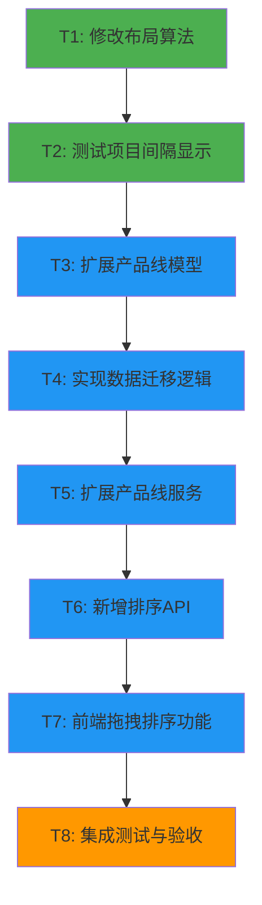

# 项目间隔与产品线排序优化 - 任务拆分文档

## 一、任务概览

本次优化包含2个主需求，拆分为8个原子任务，按依赖关系顺序执行。

### 任务依赖图

## 二、任务详细拆分

### 任务T1：修改布局算法（需求1）

**任务描述**：修改项目块宽度计算逻辑，实现1天视觉间隔

**输入契约**：
- 前置依赖：无
- 输入数据：现有 `layoutUtils.js` 文件
- 环境依赖：前端开发环境

**输出契约**：
- 输出数据：修改后的 `layoutUtils.js`
- 交付物：
  - 修改后的 `calculateProjectBarPosition` 函数
  - 函数注释更新
- 验收标准：
  - 项目块宽度 = (实际天数 × pixelsPerDay) - pixelsPerDay
  - 单天项目最小宽度 = pixelsPerDay × 0.5
  - 代码包含完整中文注释

**实现约束**：
- 技术栈：JavaScript + dayjs
- 接口规范：保持函数签名不变
- 质量要求：
  - 处理边界情况（单天项目）
  - 添加参数验证
  - 添加错误处理

**实现步骤**：
1. 打开 `frontend/src/utils/layoutUtils.js`
2. 定位 `calculateProjectBarPosition` 函数
3. 修改宽度计算逻辑
4. 添加最小宽度保护
5. 更新函数注释
6. 保存文件

**预估时间**：30分钟

---

### 任务T2：测试项目间隔显示（需求1）

**任务描述**：验证项目间隔显示效果，确保功能正常

**输入契约**：
- 前置依赖：T1完成
- 输入数据：修改后的布局算法
- 环境依赖：前端运行环境

**输出契约**：
- 输出数据：测试结果报告
- 交付物：
  - 视觉效果截图
  - 功能测试清单
- 验收标准：
  - 所有项目块之间有明显间隔
  - 单天项目可见
  - 缩放功能正常
  - 项目编辑功能不受影响

**实现约束**：
- 测试环境：本地开发环境
- 测试数据：使用现有项目数据

**实现步骤**：
1. 启动前端服务
2. 检查时间轴显示效果
3. 测试不同时长的项目（1天、2天、多天）
4. 测试缩放功能
5. 测试项目编辑功能
6. 记录测试结果

**预估时间**：30分钟

---

### 任务T3：扩展产品线模型（需求2）

**任务描述**：在产品线模型中增加 `order` 字段

**输入契约**：
- 前置依赖：T2完成
- 输入数据：现有 `productline.py` 文件
- 环境依赖：后端开发环境

**输出契约**：
- 输出数据：修改后的 `productline.py`
- 交付物：
  - 增加 `order` 字段的ProductLine类
  - 更新 `to_dict()` 方法
  - 更新 `from_dict()` 方法
- 验收标准：
  - `order` 字段默认值为0
  - `to_dict()` 包含 `order` 字段
  - `from_dict()` 支持 `order` 字段（向后兼容）
  - 代码包含完整中文注释

**实现约束**：
- 技术栈：Python 3.8+
- 接口规范：保持向后兼容
- 质量要求：
  - 不破坏现有功能
  - 支持旧数据格式

**实现步骤**：
1. 打开 `backend/models/productline.py`
2. 在 `__init__` 方法中添加 `order` 参数
3. 更新 `to_dict()` 方法
4. 更新 `from_dict()` 方法
5. 更新类文档字符串
6. 保存文件

**预估时间**：30分钟

---

### 任务T4：实现数据迁移逻辑（需求2）

**任务描述**：为现有产品线数据自动添加 `order` 字段

**输入契约**：
- 前置依赖：T3完成
- 输入数据：现有 `productlines.json` 数据
- 环境依赖：后端开发环境

**输出契约**：
- 输出数据：包含迁移逻辑的服务层代码
- 交付物：
  - `migrate_productline_order()` 函数
  - 迁移逻辑集成到 `get_all_productlines()`
- 验收标准：
  - 自动检测缺少 `order` 字段的数据
  - 按当前顺序分配 order 值（0, 1, 2, ...）
  - 迁移后自动保存
  - 不影响已有 `order` 字段的数据

**实现约束**：
- 技术栈：Python 3.8+
- 接口规范：不改变现有API
- 质量要求：
  - 幂等性（多次执行结果一致）
  - 数据安全（不丢失数据）

**实现步骤**：
1. 打开 `backend/services/productline_service.py`
2. 实现 `migrate_productline_order()` 函数
3. 在 `get_all_productlines()` 中调用迁移函数
4. 添加日志记录
5. 保存文件

**预估时间**：45分钟

---

### 任务T5：扩展产品线服务（需求2）

**任务描述**：实现产品线排序相关的服务层逻辑

**输入契约**：
- 前置依赖：T4完成
- 输入数据：扩展后的产品线模型
- 环境依赖：后端开发环境

**输出契约**：
- 输出数据：扩展后的 `productline_service.py`
- 交付物：
  - `reorder_productlines()` 函数
  - 修改 `create_productline()` 函数（自动分配order）
  - 修改 `get_all_productlines()` 函数（按order排序）
- 验收标准：
  - `reorder_productlines()` 批量更新order
  - 新产品线自动分配最大order+1
  - 获取产品线时按order排序
  - 包含完整错误处理

**实现约束**：
- 技术栈：Python 3.8+
- 接口规范：RESTful风格
- 质量要求：
  - 参数验证
  - 异常处理
  - 日志记录

**实现步骤**：
1. 打开 `backend/services/productline_service.py`
2. 实现 `reorder_productlines()` 函数
3. 修改 `create_productline()` 函数
4. 修改 `get_all_productlines()` 函数
5. 添加错误处理和日志
6. 保存文件

**预估时间**：60分钟

---

### 任务T6：新增排序API（需求2）

**任务描述**：实现产品线排序的HTTP API端点

**输入契约**：
- 前置依赖：T5完成
- 输入数据：扩展后的产品线服务
- 环境依赖：后端开发环境

**输出契约**：
- 输出数据：扩展后的 `productlines.py`
- 交付物：
  - `PUT /api/productlines/reorder` 路由
  - 请求参数验证
  - 响应格式定义
- 验收标准：
  - API接收 `orderList` 参数
  - 返回更新后的产品线列表
  - 包含错误处理（400, 500）
  - 包含完整中文注释

**实现约束**：
- 技术栈：Flask 3.0.0
- 接口规范：RESTful API
- 质量要求：
  - 参数验证
  - 错误响应规范
  - CORS支持

**实现步骤**：
1. 打开 `backend/routes/productlines.py`
2. 添加 `reorder_productlines_route()` 函数
3. 注册路由 `@productlines_bp.route('/api/productlines/reorder', methods=['PUT'])`
4. 实现请求处理逻辑
5. 添加错误处理
6. 保存文件

**预估时间**：45分钟

---

### 任务T7：前端拖拽排序功能（需求2）

**任务描述**：在产品线管理界面实现拖拽排序功能

**输入契约**：
- 前置依赖：T6完成
- 输入数据：排序API
- 环境依赖：前端开发环境

**输出契约**：
- 输出数据：
  - 修改后的 `ProductLineManagement.jsx`
  - 扩展后的 `api.js`
  - 更新后的 `package.json`
- 交付物：
  - 拖拽排序UI组件
  - API调用函数
  - 依赖包安装
- 验收标准：
  - 支持拖拽排序
  - 拖拽完成后自动保存
  - 显示拖拽手柄图标
  - 拖拽时有视觉反馈
  - 保存失败时恢复原顺序
  - 包含完整中文注释

**实现约束**：
- 技术栈：React 18 + Ant Design 5 + @dnd-kit
- 接口规范：使用现有组件结构
- 质量要求：
  - 流畅的拖拽体验
  - 完善的错误处理
  - 可访问性支持

**实现步骤**：
1. 安装依赖：`cd frontend && npm install @dnd-kit/core @dnd-kit/sortable @dnd-kit/utilities`
2. 打开 `frontend/src/services/api.js`
3. 添加 `reorderProductLines()` 函数
4. 打开 `frontend/src/components/ProductLineManagement.jsx`
5. 导入拖拽相关组件
6. 实现 `DraggableRow` 组件
7. 集成拖拽上下文
8. 实现 `handleDragEnd` 处理函数
9. 更新表格列定义（添加拖拽列）
10. 保存文件

**预估时间**：90分钟

---

### 任务T8：集成测试与验收（需求1+2）

**任务描述**：全面测试两个需求的功能，确保质量

**输入契约**：
- 前置依赖：T7完成
- 输入数据：所有实现的功能
- 环境依赖：完整的开发环境

**输出契约**：
- 输出数据：测试报告
- 交付物：
  - 功能测试清单
  - 视觉效果截图
  - 性能测试结果
  - 问题修复记录
- 验收标准：
  - 所有验收标准通过
  - 无阻塞性bug
  - 性能满足要求
  - 文档完整

**实现约束**：
- 测试环境：本地开发环境
- 测试数据：真实数据 + 边界数据

**实现步骤**：

**需求1测试**：
1. 启动服务
2. 检查项目间隔显示
3. 测试单天项目
4. 测试缩放功能
5. 测试项目编辑
6. 记录测试结果

**需求2测试**：
7. 检查数据迁移（查看productlines.json）
8. 测试拖拽排序
9. 测试新建产品线（验证order）
10. 测试页面刷新（验证持久化）
11. 测试时间轴显示顺序
12. 测试错误处理
13. 记录测试结果

**性能测试**：
14. 测试拖拽流畅度
15. 测试API响应时间
16. 记录性能数据

**预估时间**：60分钟

---

## 三、任务执行计划

### 3.1 执行顺序

按依赖关系顺序执行：

1. **阶段1：需求1实现**（T1-T2）
   - T1: 修改布局算法
   - T2: 测试项目间隔显示

2. **阶段2：需求2后端实现**（T3-T6）
   - T3: 扩展产品线模型
   - T4: 实现数据迁移逻辑
   - T5: 扩展产品线服务
   - T6: 新增排序API

3. **阶段3：需求2前端实现**（T7）
   - T7: 前端拖拽排序功能

4. **阶段4：集成测试**（T8）
   - T8: 集成测试与验收

### 3.2 时间估算

| 任务 | 预估时间 | 累计时间 |
|------|----------|----------|
| T1 | 30分钟 | 30分钟 |
| T2 | 30分钟 | 1小时 |
| T3 | 30分钟 | 1.5小时 |
| T4 | 45分钟 | 2.25小时 |
| T5 | 60分钟 | 3.25小时 |
| T6 | 45分钟 | 4小时 |
| T7 | 90分钟 | 5.5小时 |
| T8 | 60分钟 | 6.5小时 |

**总计**：约6.5小时

### 3.3 里程碑

- **里程碑1**：需求1完成（T2完成后）
- **里程碑2**：需求2后端完成（T6完成后）
- **里程碑3**：需求2前端完成（T7完成后）
- **里程碑4**：全部功能验收通过（T8完成后）

## 四、风险与应对

### 4.1 技术风险

| 风险 | 任务 | 应对措施 |
|------|------|----------|
| 布局算法影响其他功能 | T1 | 充分测试，只修改宽度计算 |
| 数据迁移失败 | T4 | 迁移前备份数据 |
| 拖拽库兼容性问题 | T7 | 使用成熟的@dnd-kit库 |
| API性能问题 | T6 | 批量更新，优化文件IO |

### 4.2 进度风险

| 风险 | 应对措施 |
|------|----------|
| 任务时间超出预估 | 及时调整计划，优先保证核心功能 |
| 依赖任务阻塞 | 提前识别依赖，准备备选方案 |
| 测试发现重大问题 | 预留缓冲时间，快速修复 |

## 五、质量保证

### 5.1 代码质量标准

- ✅ 所有函数包含完整中文注释
- ✅ 遵循现有代码风格
- ✅ 包含错误处理
- ✅ 包含参数验证
- ✅ 包含日志记录（后端）

### 5.2 测试覆盖标准

- ✅ 正常流程测试
- ✅ 边界情况测试
- ✅ 异常情况测试
- ✅ 性能测试
- ✅ 兼容性测试

### 5.3 文档完整性标准

- ✅ 代码注释完整
- ✅ API文档完整
- ✅ 测试文档完整
- ✅ 用户文档更新

## 六、交付清单

### 6.1 代码文件

**修改文件**：
- [ ] `frontend/src/utils/layoutUtils.js`
- [ ] `backend/models/productline.py`
- [ ] `backend/services/productline_service.py`
- [ ] `backend/routes/productlines.py`
- [ ] `frontend/src/components/ProductLineManagement.jsx`
- [ ] `frontend/src/services/api.js`
- [ ] `frontend/package.json`

**数据文件**：
- [ ] `data/productlines.json`（自动迁移）

### 6.2 文档文件

- [x] `ALIGNMENT_项目间隔与产品线排序优化.md`
- [x] `CONSENSUS_项目间隔与产品线排序优化.md`
- [x] `DESIGN_项目间隔与产品线排序优化.md`
- [x] `TASK_项目间隔与产品线排序优化.md`
- [ ] `ACCEPTANCE_项目间隔与产品线排序优化.md`
- [ ] `FINAL_项目间隔与产品线排序优化.md`

### 6.3 测试文件

- [ ] 功能测试清单
- [ ] 测试结果报告
- [ ] 性能测试数据

## 七、下一步行动

1. ✅ 创建TASK文档（已完成）
2. ⏭️ 进入Automate阶段
3. ⏭️ 按顺序执行任务T1-T8
4. ⏭️ 创建ACCEPTANCE文档
5. ⏭️ 创建FINAL文档

---

**文档状态**：✅ 已完成  
**任务总数**：8个  
**预估总时间**：6.5小时  
**准备开始执行**：✅ 是
