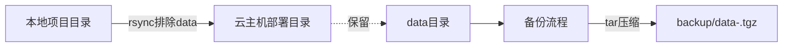

# DESIGN｜云主机代码更新

## 架构图

## 分层与组件
- 部署脚本：`scripts/deploy_cloud.sh`
- 配置示例：`.env.deploy.example`
- 忽略规则：`.gitignore` 增加 `.env.deploy`

## 接口契约
- 输入：环境变量或 `.env.deploy`
  - `SSH_HOST`、`SSH_USER`、`SSH_PORT`
  - `REMOTE_DIR`、`REMOTE_DATA_DIR`、`BACKUP_DIR`
  - `EXCLUDES`、`DRY_RUN`
- 输出：
  - 成功日志；备份文件 `data-<timestamp>.tgz` 位于 `BACKUP_DIR`
  - 远程代码目录更新完成（不含 data）

## 数据流向
1. 从本地读取 `.env.deploy` 加载配置。
2. SSH 在远程创建 `BACKUP_DIR` 并备份 `REMOTE_DATA_DIR`。
3. rsync 同步本地代码到 `REMOTE_DIR`，排除 `data/`。

## 异常处理策略
- 缺少必填变量：脚本立即退出并提示缺项。
- 远程无 `REMOTE_DATA_DIR`：给出警告并跳过备份。
- DRY_RUN 支持：预演同步，不改变远程。