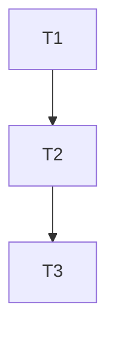

# TASK｜云主机代码更新

## 原子任务清单

### T1: 部署脚本实现
- 输入契约：rsync/ssh/tar 可用；提供 `.env.deploy` 或环境变量。
- 输出契约：`scripts/deploy_cloud.sh` 完成；本地可运行并含 DRY_RUN。
- 实现约束：POSIX shell；不上传 `data/`；备份含时间戳。
- 依赖关系：无。

### T2: 部署配置示例与忽略规则
- 输入契约：无。
- 输出契约：`.env.deploy.example`；`.gitignore` 忽略 `.env.deploy`。
- 实现约束：不提交敏感配置。
- 依赖关系：T1。

### T3: 文档与指引
- 输入契约：已完成 T1/T2。
- 输出契约：6A 文档与 README 指引更新。
- 实现约束：中文、清晰可执行。
- 依赖关系：T1、T2。

## 任务依赖图
