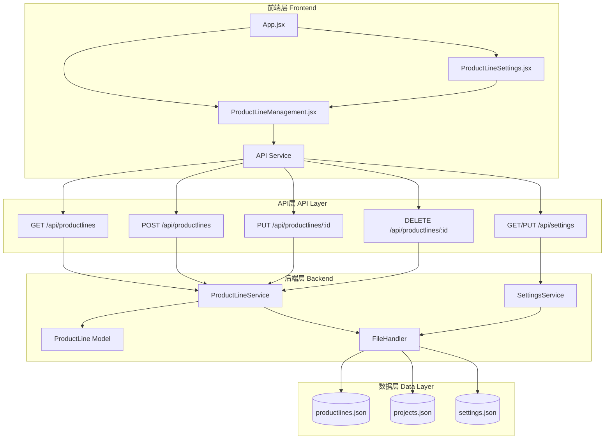
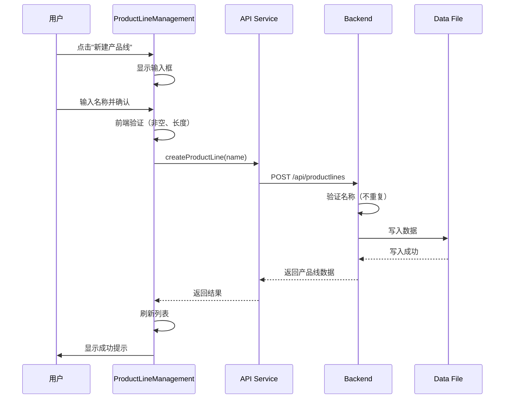
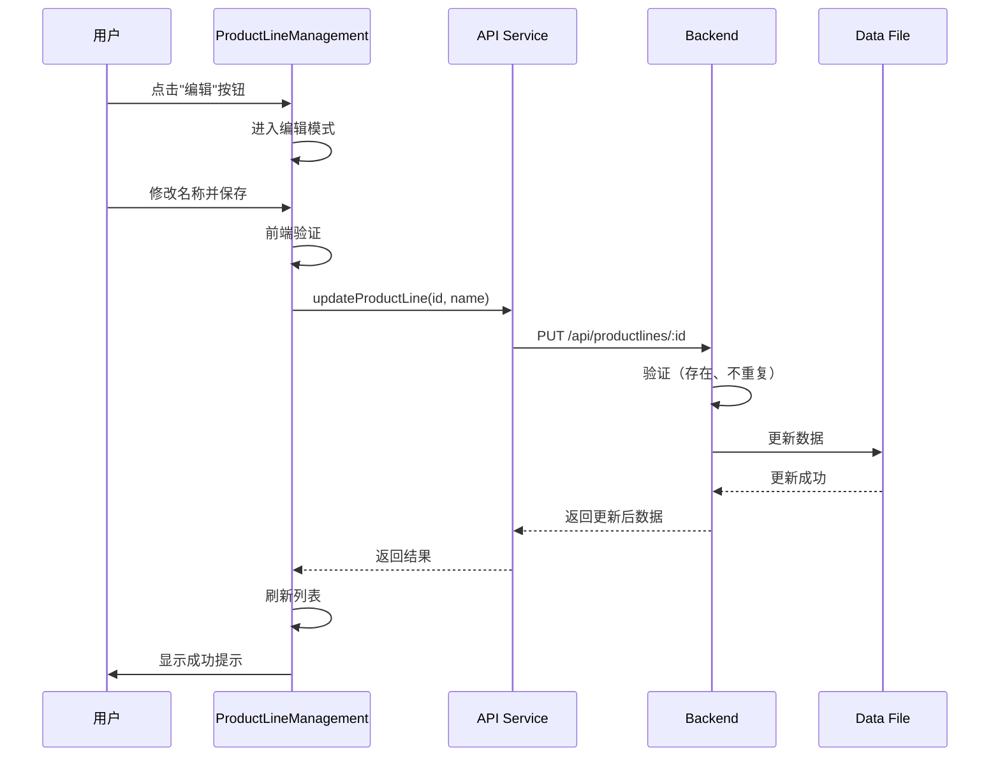
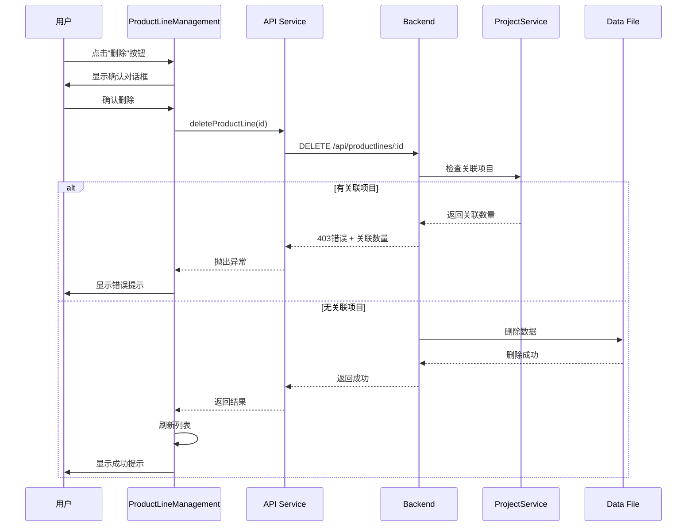
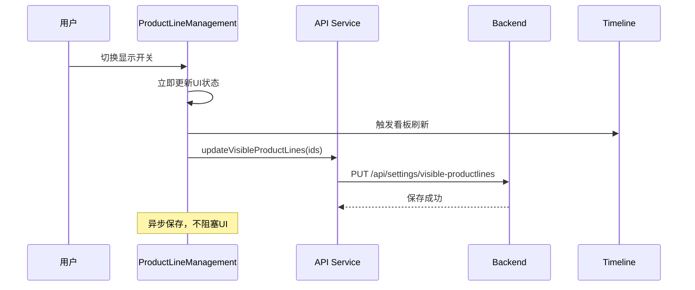

# 产品线管理功能 - 系统架构设计文档

## 一、系统架构概览

### 1.1 整体架构图



### 1.2 分层设计

#### 表现层（Presentation Layer）
- **组件**: ProductLineManagement.jsx, ProductLineSettings.jsx
- **职责**: UI渲染、用户交互、状态管理
- **技术**: React 18.2.0, Ant Design 5.12.0

#### 服务层（Service Layer）
- **模块**: api.js
- **职责**: API调用封装、请求/响应处理
- **技术**: Fetch API, Promise

#### 接口层（API Layer）
- **路由**: productlines.py, settings.py
- **职责**: 请求路由、参数验证、响应格式化
- **技术**: Flask Blueprint

#### 业务层（Business Layer）
- **服务**: ProductLineService, SettingsService, ProjectService
- **职责**: 业务逻辑、数据验证、关联检查
- **技术**: Python类

#### 数据层（Data Layer）
- **处理器**: FileHandler
- **职责**: 文件读写、数据持久化、并发控制
- **技术**: JSON文件、文件锁

## 二、核心模块设计

### 2.1 后端模块设计

#### 2.1.1 ProductLineService 增强

**新增方法**:

```python
def update(self, productline_id, name):
    """
    更新产品线名称
    
    Args:
        productline_id: 产品线ID
        name: 新的产品线名称
        
    Returns:
        dict: 更新后的产品线数据
        
    Raises:
        ValueError: 数据验证失败或名称重复
    """
    # 1. 验证产品线是否存在
    # 2. 验证新名称（不为空、不超长）
    # 3. 检查名称是否与其他产品线重复
    # 4. 更新数据
    # 5. 保存到文件
    # 6. 返回更新后的数据
```

```python
def delete_with_check(self, productline_id):
    """
    删除产品线（带关联检查）
    
    Args:
        productline_id: 产品线ID
        
    Returns:
        dict: 包含成功状态和消息
        
    Raises:
        ValueError: 产品线不存在或有关联项目
    """
    # 1. 验证产品线是否存在
    # 2. 检查是否有项目关联
    # 3. 如果有关联，抛出异常并返回关联项目数
    # 4. 如果无关联，执行删除
    # 5. 保存到文件
    # 6. 返回成功消息
```

```python
def get_related_projects_count(self, productline_id):
    """
    获取产品线关联的项目数量
    
    Args:
        productline_id: 产品线ID
        
    Returns:
        int: 关联的项目数量
    """
    # 1. 读取项目数据
    # 2. 统计productLineId等于指定ID的项目数量
    # 3. 返回数量
```

#### 2.1.2 路由层增强

**新增路由**:

```python
@productlines_bp.route('/api/productlines/<productline_id>', methods=['PUT'])
@handle_errors
def update_productline(productline_id):
    """
    更新产品线
    
    Args:
        productline_id: 产品线ID（路径参数）
        
    Request Body:
        {
            "name": "新产品线名称"
        }
    
    Returns:
        JSON响应，包含更新后的产品线数据
    """
    # 1. 获取请求数据
    # 2. 验证必需字段
    # 3. 调用service.update()
    # 4. 返回成功响应
    # 5. 异常处理（404/400）
```

```python
@productlines_bp.route('/api/productlines/<productline_id>', methods=['DELETE'])
@handle_errors
def delete_productline(productline_id):
    """
    删除产品线
    
    Args:
        productline_id: 产品线ID（路径参数）
    
    Returns:
        JSON响应，包含删除结果
    """
    # 1. 调用service.delete_with_check()
    # 2. 返回成功响应
    # 3. 异常处理（404/403）
```

### 2.2 前端模块设计

#### 2.2.1 ProductLineManagement 组件

**组件结构**:

```jsx
ProductLineManagement
├── Drawer (抽屉容器)
│   ├── Header
│   │   ├── 标题: "产品线管理"
│   │   └── [新建产品线] 按钮
│   ├── Body
│   │   ├── 新建表单区域 (可折叠)
│   │   └── 产品线列表表格
│   │       ├── 列: 名称 (可编辑)
│   │       ├── 列: 创建时间
│   │       ├── 列: 关联项目数
│   │       ├── 列: 显示状态 (Switch)
│   │       └── 列: 操作 (编辑/删除按钮)
│   └── Footer
│       └── [关闭] 按钮
```

**Props接口**:

```typescript
interface ProductLineManagementProps {
  visible: boolean;                    // 抽屉是否可见
  onClose: () => void;                 // 关闭回调
  productLines: ProductLine[];         // 产品线列表
  projects: Project[];                 // 项目列表（用于统计关联数）
  selectedProductLines: string[];      // 选中的产品线ID列表
  onRefresh: () => void;               // 刷新数据回调
  onVisibilityChange: (ids: string[]) => void; // 显示状态变化回调
}
```

**State管理**:

```typescript
interface ComponentState {
  loading: boolean;                    // 加载状态
  editingId: string | null;            // 正在编辑的产品线ID
  editingName: string;                 // 编辑中的名称
  isCreating: boolean;                 // 是否正在创建
  newProductLineName: string;          // 新建产品线名称
}
```

**核心方法**:

```typescript
// 计算关联项目数
const getRelatedProjectsCount = (productLineId: string): number => {
  return projects.filter(p => p.productLineId === productLineId).length;
}

// 处理新建
const handleCreate = async () => {
  // 1. 验证名称
  // 2. 调用API创建
  // 3. 显示成功/失败提示
  // 4. 刷新数据
  // 5. 清空表单
}

// 处理编辑
const handleEdit = (productLine: ProductLine) => {
  // 1. 设置编辑状态
  // 2. 填充编辑表单
}

// 处理保存编辑
const handleSaveEdit = async (productLineId: string) => {
  // 1. 验证名称
  // 2. 调用API更新
  // 3. 显示成功/失败提示
  // 4. 刷新数据
  // 5. 退出编辑模式
}

// 处理删除
const handleDelete = (productLine: ProductLine) => {
  // 1. 显示确认对话框
  // 2. 用户确认后调用API删除
  // 3. 处理成功/失败（特别是403错误）
  // 4. 刷新数据
}

// 处理显示/隐藏切换
const handleVisibilityToggle = (productLineId: string, visible: boolean) => {
  // 1. 更新本地状态
  // 2. 调用父组件回调
  // 3. 异步保存到后端
}
```

#### 2.2.2 ProductLineSettings 组件修改

**新增内容**:

```jsx
// 在组件顶部增加管理按钮
<Button 
  type="primary" 
  icon={<SettingOutlined />}
  onClick={onOpenManagement}
  style={{ width: '100%', marginBottom: '16px' }}
>
  管理产品线
</Button>
```

**新增Props**:

```typescript
interface ProductLineSettingsProps {
  // ... 现有props
  onOpenManagement: () => void;  // 打开管理界面回调
}
```

#### 2.2.3 App.jsx 集成

**新增State**:

```typescript
const [managementVisible, setManagementVisible] = useState(false);
```

**新增方法**:

```typescript
const handleOpenManagement = () => {
  setManagementVisible(true);
}

const handleCloseManagement = () => {
  setManagementVisible(false);
}

const handleManagementRefresh = () => {
  loadData(); // 重新加载所有数据
}
```

**组件集成**:

```jsx
<ProductLineSettings
  // ... 现有props
  onOpenManagement={handleOpenManagement}
/>

<ProductLineManagement
  visible={managementVisible}
  onClose={handleCloseManagement}
  productLines={productLines}
  projects={projects}
  selectedProductLines={selectedProductLines}
  onRefresh={handleManagementRefresh}
  onVisibilityChange={handleProductLineSelectionChange}
/>
```

### 2.3 API服务层设计

**新增API方法**:

```javascript
/**
 * 更新产品线
 * @param {string} id - 产品线ID
 * @param {string} name - 新名称
 * @returns {Promise<Object>} 更新后的产品线数据
 */
export const updateProductLine = async (id, name) => {
  const response = await fetch(`${API_BASE_URL}/productlines/${id}`, {
    method: 'PUT',
    headers: {
      'Content-Type': 'application/json',
    },
    body: JSON.stringify({ name }),
  });
  
  const data = await response.json();
  
  if (!response.ok) {
    throw new Error(data.error || '更新产品线失败');
  }
  
  return data.data;
}

/**
 * 删除产品线
 * @param {string} id - 产品线ID
 * @returns {Promise<Object>} 删除结果
 */
export const deleteProductLine = async (id) => {
  const response = await fetch(`${API_BASE_URL}/productlines/${id}`, {
    method: 'DELETE',
  });
  
  const data = await response.json();
  
  if (!response.ok) {
    // 特殊处理403错误（有关联项目）
    if (response.status === 403) {
      throw new Error(data.error || '该产品线有关联项目，无法删除');
    }
    throw new Error(data.error || '删除产品线失败');
  }
  
  return data;
}
```

## 三、数据模型设计

### 3.1 产品线数据模型

```json
{
  "id": "pl-uuid-001",
  "name": "核心业务线",
  "createdAt": 1704067200000
}
```

**字段说明**:
- `id`: 产品线唯一标识符（UUID格式，带pl-前缀）
- `name`: 产品线名称（字符串，1-100字符）
- `createdAt`: 创建时间戳（毫秒）

### 3.2 设置数据模型

```json
{
  "visibleProductLines": ["pl-uuid-001", "pl-uuid-002"]
}
```

**字段说明**:
- `visibleProductLines`: 可见的产品线ID数组

### 3.3 项目数据模型（关联字段）

```json
{
  "id": "proj-uuid-001",
  "name": "项目名称",
  "productLineId": "pl-uuid-001",  // 关联产品线
  // ... 其他字段
}
```

## 四、接口规范

### 4.1 更新产品线接口

**请求**:
```http
PUT /api/productlines/:id
Content-Type: application/json

{
  "name": "新产品线名称"
}
```

**成功响应** (200):
```json
{
  "success": true,
  "data": {
    "id": "pl-uuid-001",
    "name": "新产品线名称",
    "createdAt": 1704067200000
  }
}
```

**失败响应** (400 - 名称重复):
```json
{
  "success": false,
  "error": "产品线名称已存在: 新产品线名称"
}
```

**失败响应** (404 - 不存在):
```json
{
  "success": false,
  "error": "产品线不存在"
}
```

### 4.2 删除产品线接口

**请求**:
```http
DELETE /api/productlines/:id
```

**成功响应** (200):
```json
{
  "success": true,
  "message": "产品线删除成功"
}
```

**失败响应** (403 - 有关联项目):
```json
{
  "success": false,
  "error": "该产品线有3个关联项目，请先删除或迁移这些项目",
  "relatedProjectsCount": 3
}
```

**失败响应** (404 - 不存在):
```json
{
  "success": false,
  "error": "产品线不存在"
}
```

## 五、交互流程设计

### 5.1 新建产品线流程



### 5.2 编辑产品线流程



### 5.3 删除产品线流程



### 5.4 显示/隐藏切换流程



## 六、异常处理设计

### 6.1 后端异常处理

**异常类型**:
1. **数据验证异常** (400)
   - 名称为空
   - 名称过长
   - 名称重复

2. **资源不存在异常** (404)
   - 产品线ID不存在

3. **业务逻辑异常** (403)
   - 删除时有关联项目

4. **系统异常** (500)
   - 文件读写失败
   - 数据格式错误

**处理策略**:
```python
@handle_errors
def route_handler():
    try:
        # 业务逻辑
        pass
    except ValueError as e:
        # 数据验证异常
        return jsonify({'success': False, 'error': str(e)}), 400
    except FileNotFoundError:
        # 资源不存在
        return jsonify({'success': False, 'error': '产品线不存在'}), 404
    except PermissionError as e:
        # 业务逻辑异常
        return jsonify({'success': False, 'error': str(e)}), 403
    except Exception as e:
        # 系统异常
        return jsonify({'success': False, 'error': '服务器内部错误'}), 500
```

### 6.2 前端异常处理

**异常类型**:
1. **网络异常**
   - 请求超时
   - 网络断开

2. **API异常**
   - 400/403/404/500错误

3. **数据异常**
   - 响应格式错误
   - 数据不完整

**处理策略**:
```javascript
try {
  const result = await apiCall();
  // 成功处理
  message.success('操作成功');
} catch (error) {
  // 根据错误类型显示不同提示
  if (error.message.includes('关联项目')) {
    message.error(error.message);
  } else if (error.message.includes('已存在')) {
    message.warning(error.message);
  } else {
    message.error('操作失败: ' + error.message);
  }
}
```

## 七、性能优化设计

### 7.1 前端优化

1. **列表渲染优化**
   - 使用虚拟滚动（如果产品线数量很大）
   - 使用React.memo避免不必要的重渲染

2. **状态管理优化**
   - 使用useCallback缓存回调函数
   - 使用useMemo缓存计算结果

3. **网络请求优化**
   - 防抖处理（编辑时）
   - 乐观更新（显示/隐藏切换）
   - 请求合并（批量操作）

### 7.2 后端优化

1. **文件读写优化**
   - 使用文件锁避免并发冲突
   - 缓存文件内容（如果需要）

2. **关联检查优化**
   - 只统计数量，不加载完整项目数据
   - 使用索引加速查询（如果数据量大）

## 八、安全性设计

### 8.1 输入验证

**前端验证**:
- 名称长度限制（1-100字符）
- 名称格式验证（非空白字符）

**后端验证**:
- 重复所有前端验证
- 名称唯一性检查
- ID格式验证

### 8.2 数据完整性

1. **删除保护**
   - 检查关联项目
   - 禁止删除有依赖的产品线

2. **并发控制**
   - 使用文件锁
   - 原子性操作

3. **数据备份**
   - 保留data_backup目录
   - 定期备份（如果需要）

## 九、测试策略

### 9.1 单元测试

**后端测试**:
- ProductLineService.update() 测试
- ProductLineService.delete_with_check() 测试
- ProductLineService.get_related_projects_count() 测试

**前端测试**:
- 组件渲染测试
- 用户交互测试
- API调用测试

### 9.2 集成测试

1. **API集成测试**
   - 测试完整的请求-响应流程
   - 测试错误处理

2. **端到端测试**
   - 测试完整的用户操作流程
   - 测试数据一致性

### 9.3 边界测试

1. **数据边界**
   - 空产品线列表
   - 大量产品线（100+）
   - 特殊字符名称

2. **操作边界**
   - 并发操作
   - 快速连续操作
   - 网络异常情况

## 十、部署说明

### 10.1 部署步骤

1. **后端部署**
   - 更新backend/services/productline_service.py
   - 更新backend/routes/productlines.py
   - 重启Flask服务

2. **前端部署**
   - 创建frontend/src/components/ProductLineManagement.jsx
   - 更新frontend/src/components/ProductLineSettings.jsx
   - 更新frontend/src/App.jsx
   - 更新frontend/src/services/api.js
   - 重新构建前端

3. **数据迁移**
   - 无需数据迁移（向后兼容）

### 10.2 回滚方案

如果出现问题，可以：
1. 回滚代码到上一版本
2. 重启服务
3. 数据文件无需回滚（格式未变）

---

**文档版本**: v1.0  
**创建时间**: 2025-10-16  
**状态**: ✅ 设计完成，可以进入任务拆分阶段
