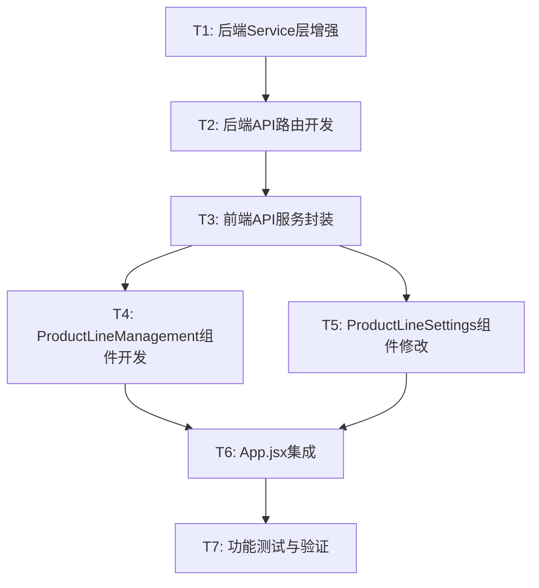

# 产品线管理功能 - 任务拆分文档

## 一、任务概览

### 1.1 任务依赖关系图

### 1.2 任务列表

| 任务ID | 任务名称 | 预计时间 | 依赖任务 | 优先级 |
|--------|----------|----------|----------|--------|
| T1 | 后端Service层增强 | 1小时 | 无 | P0 |
| T2 | 后端API路由开发 | 0.5小时 | T1 | P0 |
| T3 | 前端API服务封装 | 0.5小时 | T2 | P0 |
| T4 | ProductLineManagement组件开发 | 2小时 | T3 | P0 |
| T5 | ProductLineSettings组件修改 | 0.5小时 | T3 | P0 |
| T6 | App.jsx集成 | 0.5小时 | T4, T5 | P0 |
| T7 | 功能测试与验证 | 1小时 | T6 | P0 |

**总预计时间**: 6小时

## 二、原子任务详细说明

### T1: 后端Service层增强

#### 输入契约
- **前置依赖**: 无
- **输入数据**: 现有ProductLineService代码
- **环境依赖**: Python 3.8+, Flask 3.0.0

#### 输出契约
- **输出数据**: 增强后的ProductLineService类
- **交付物**: 
  - `backend/services/productline_service.py` (修改)
- **验收标准**:
  - ✅ 新增update()方法，支持更新产品线名称
  - ✅ 新增delete_with_check()方法，支持带关联检查的删除
  - ✅ 新增get_related_projects_count()方法，统计关联项目数
  - ✅ 所有方法包含完整注释
  - ✅ 异常处理完整
  - ✅ 数据验证逻辑正确

#### 实现约束
- **技术栈**: Python 3.8+
- **接口规范**: 
  - update(productline_id, name) -> dict
  - delete_with_check(productline_id) -> dict
  - get_related_projects_count(productline_id) -> int
- **质量要求**: 
  - 完整的中文注释
  - 异常处理（ValueError, FileNotFoundError）
  - 使用现有的FileHandler和文件锁机制

#### 实现步骤
1. 在ProductLineService类中添加update()方法
   - 验证产品线是否存在
   - 验证新名称（非空、长度、不重复）
   - 更新数据并保存
2. 在ProductLineService类中添加delete_with_check()方法
   - 验证产品线是否存在
   - 调用get_related_projects_count()检查关联
   - 如有关联抛出PermissionError
   - 无关联则执行删除
3. 在ProductLineService类中添加get_related_projects_count()方法
   - 读取projects.json
   - 统计productLineId匹配的项目数量
4. 编写完整的中文注释

---

### T2: 后端API路由开发

#### 输入契约
- **前置依赖**: T1完成
- **输入数据**: 增强后的ProductLineService
- **环境依赖**: Flask 3.0.0

#### 输出契约
- **输出数据**: 新增的API路由
- **交付物**: 
  - `backend/routes/productlines.py` (修改)
- **验收标准**:
  - ✅ 新增PUT /api/productlines/:id路由
  - ✅ 新增DELETE /api/productlines/:id路由
  - ✅ 返回统一格式的JSON响应
  - ✅ 正确处理400/403/404错误
  - ✅ 所有路由包含完整注释

#### 实现约束
- **技术栈**: Flask Blueprint
- **接口规范**: RESTful API
- **质量要求**: 
  - 使用@handle_errors装饰器
  - 统一的响应格式
  - 完整的错误处理

#### 实现步骤
1. 添加update_productline路由
   - 获取路径参数productline_id
   - 获取请求体中的name
   - 验证必需字段
   - 调用service.update()
   - 返回成功响应或错误响应
2. 添加delete_productline路由
   - 获取路径参数productline_id
   - 调用service.delete_with_check()
   - 处理PermissionError返回403
   - 返回成功响应或错误响应
3. 编写完整的中文注释

---

### T3: 前端API服务封装

#### 输入契约
- **前置依赖**: T2完成
- **输入数据**: 后端API接口
- **环境依赖**: Node.js 16+

#### 输出契约
- **输出数据**: 新增的API方法
- **交付物**: 
  - `frontend/src/services/api.js` (修改)
- **验收标准**:
  - ✅ 新增updateProductLine()方法
  - ✅ 新增deleteProductLine()方法
  - ✅ 正确处理HTTP错误
  - ✅ 返回Promise
  - ✅ 所有方法包含完整注释

#### 实现约束
- **技术栈**: Fetch API, Promise
- **接口规范**: 
  - updateProductLine(id, name) -> Promise<Object>
  - deleteProductLine(id) -> Promise<Object>
- **质量要求**: 
  - 完整的中文注释
  - 统一的错误处理
  - 特殊处理403错误

#### 实现步骤
1. 添加updateProductLine方法
   - 构造PUT请求
   - 设置Content-Type
   - 发送请求并处理响应
   - 错误处理
2. 添加deleteProductLine方法
   - 构造DELETE请求
   - 发送请求并处理响应
   - 特殊处理403错误（关联项目）
   - 错误处理
3. 编写完整的中文注释

---

### T4: ProductLineManagement组件开发

#### 输入契约
- **前置依赖**: T3完成
- **输入数据**: API服务方法
- **环境依赖**: React 18.2.0, Ant Design 5.12.0

#### 输出契约
- **输出数据**: ProductLineManagement组件
- **交付物**: 
  - `frontend/src/components/ProductLineManagement.jsx` (新建)
- **验收标准**:
  - ✅ 使用Drawer组件展示
  - ✅ 包含产品线列表表格
  - ✅ 支持新建产品线
  - ✅ 支持编辑产品线名称
  - ✅ 支持删除产品线（带确认）
  - ✅ 支持显示/隐藏切换
  - ✅ 显示关联项目数
  - ✅ 所有操作有明确反馈
  - ✅ 所有代码包含完整注释

#### 实现约束
- **技术栈**: React Hooks, Ant Design
- **组件规范**: 
  - 使用函数组件
  - 使用useState管理状态
  - 使用useCallback优化性能
- **质量要求**: 
  - 完整的中文注释
  - 响应式布局
  - 用户体验友好

#### 实现步骤
1. 创建组件基本结构
   - 定义Props接口
   - 定义State
   - 创建Drawer容器
2. 实现产品线列表表格
   - 定义表格列（名称、创建时间、关联数、显示状态、操作）
   - 实现getRelatedProjectsCount辅助函数
   - 格式化创建时间显示
3. 实现新建功能
   - 添加新建按钮和表单
   - 实现handleCreate方法
   - 表单验证和提交
4. 实现编辑功能
   - 添加编辑按钮
   - 实现行内编辑或模态框编辑
   - 实现handleEdit和handleSaveEdit方法
5. 实现删除功能
   - 添加删除按钮
   - 实现确认对话框
   - 实现handleDelete方法
   - 特殊处理403错误
6. 实现显示/隐藏切换
   - 添加Switch组件
   - 实现handleVisibilityToggle方法
7. 编写完整的中文注释

---

### T5: ProductLineSettings组件修改

#### 输入契约
- **前置依赖**: T3完成
- **输入数据**: 现有ProductLineSettings组件
- **环境依赖**: React 18.2.0, Ant Design 5.12.0

#### 输出契约
- **输出数据**: 修改后的ProductLineSettings组件
- **交付物**: 
  - `frontend/src/components/ProductLineSettings.jsx` (修改)
- **验收标准**:
  - ✅ 顶部增加"管理产品线"按钮
  - ✅ 按钮样式美观
  - ✅ 点击触发onOpenManagement回调
  - ✅ 保持现有功能不变

#### 实现约束
- **技术栈**: React, Ant Design
- **组件规范**: 保持与现有代码风格一致
- **质量要求**: 
  - 完整的中文注释
  - 不破坏现有功能

#### 实现步骤
1. 在Props中添加onOpenManagement
2. 在组件顶部添加"管理产品线"按钮
   - 使用Button组件
   - 添加SettingOutlined图标
   - 设置样式（width: 100%, marginBottom: 16px）
3. 绑定onClick事件到onOpenManagement
4. 更新注释

---

### T6: App.jsx集成

#### 输入契约
- **前置依赖**: T4, T5完成
- **输入数据**: ProductLineManagement和修改后的ProductLineSettings
- **环境依赖**: React 18.2.0

#### 输出契约
- **输出数据**: 集成后的App.jsx
- **交付物**: 
  - `frontend/src/App.jsx` (修改)
- **验收标准**:
  - ✅ 导入ProductLineManagement组件
  - ✅ 添加managementVisible状态
  - ✅ 实现打开/关闭管理界面的方法
  - ✅ 传递正确的props
  - ✅ 数据刷新逻辑正确

#### 实现约束
- **技术栈**: React Hooks
- **组件规范**: 保持与现有代码风格一致
- **质量要求**: 
  - 完整的中文注释
  - 不破坏现有功能

#### 实现步骤
1. 导入ProductLineManagement组件
2. 添加managementVisible状态
3. 实现handleOpenManagement方法
4. 实现handleCloseManagement方法
5. 实现handleManagementRefresh方法
6. 修改ProductLineSettings组件，传递onOpenManagement
7. 添加ProductLineManagement组件，传递所有必需props
8. 更新注释

---

### T7: 功能测试与验证

#### 输入契约
- **前置依赖**: T6完成
- **输入数据**: 完整的功能实现
- **环境依赖**: 运行中的前后端服务

#### 输出契约
- **输出数据**: 测试报告
- **交付物**: 
  - 测试结果文档
  - Bug修复（如有）
- **验收标准**:
  - ✅ 所有功能正常工作
  - ✅ 所有边界情况已测试
  - ✅ 所有错误提示清晰
  - ✅ 用户体验流畅

#### 实现约束
- **测试范围**: 
  - 功能测试
  - 边界测试
  - 错误处理测试
  - 用户体验测试
- **质量要求**: 
  - 覆盖所有验收标准
  - 记录测试结果

#### 测试步骤

**1. 新建产品线测试**
- [ ] 打开管理界面
- [ ] 点击"新建产品线"
- [ ] 输入有效名称，创建成功
- [ ] 输入空名称，显示错误
- [ ] 输入重复名称，显示错误
- [ ] 输入超长名称（>100字符），显示错误
- [ ] 创建后列表自动刷新

**2. 编辑产品线测试**
- [ ] 点击"编辑"按钮
- [ ] 修改名称为有效值，保存成功
- [ ] 修改名称为空，显示错误
- [ ] 修改名称为重复值，显示错误
- [ ] 取消编辑，数据不变
- [ ] 编辑后列表自动刷新

**3. 删除产品线测试**
- [ ] 点击"删除"按钮，显示确认对话框
- [ ] 取消删除，数据不变
- [ ] 删除无关联项目的产品线，成功
- [ ] 删除有关联项目的产品线，显示错误提示
- [ ] 错误提示包含关联项目数量
- [ ] 删除后列表自动刷新
- [ ] 删除后看板自动更新

**4. 显示/隐藏切换测试**
- [ ] 切换显示开关，UI立即更新
- [ ] 看板实时更新（隐藏/显示泳道）
- [ ] 设置自动保存到后端
- [ ] 刷新页面后设置保持
- [ ] 隐藏的产品线在项目创建时仍可选择

**5. 关联项目数测试**
- [ ] 显示正确的关联项目数
- [ ] 创建项目后数量自动更新
- [ ] 删除项目后数量自动更新

**6. 边界情况测试**
- [ ] 空产品线列表显示正常
- [ ] 大量产品线（50+）显示正常
- [ ] 特殊字符名称处理正确
- [ ] 快速连续操作不出错
- [ ] 网络异常时显示友好提示

**7. 用户体验测试**
- [ ] 抽屉打开/关闭动画流畅
- [ ] 所有操作有明确反馈
- [ ] 错误提示清晰易懂
- [ ] 确认对话框提示明确
- [ ] 响应式布局适配良好
- [ ] 表格数据展示清晰

**8. 数据完整性测试**
- [ ] 删除操作不导致数据不一致
- [ ] 编辑操作正确更新数据
- [ ] 文件锁机制正常工作
- [ ] 并发操作不导致数据损坏

## 三、任务执行顺序

### 阶段1: 后端开发（T1-T2）
**预计时间**: 1.5小时

1. T1: 后端Service层增强
2. T2: 后端API路由开发

**里程碑**: 后端API可用

### 阶段2: 前端开发（T3-T6）
**预计时间**: 3.5小时

1. T3: 前端API服务封装
2. T4: ProductLineManagement组件开发（并行）
3. T5: ProductLineSettings组件修改（并行）
4. T6: App.jsx集成

**里程碑**: 前端功能完整

### 阶段3: 测试验证（T7）
**预计时间**: 1小时

1. T7: 功能测试与验证

**里程碑**: 功能交付

## 四、风险与应对

### 风险1: 关联检查性能问题
**概率**: 低  
**影响**: 中  
**应对**: 
- 优化查询逻辑，只统计数量
- 如果项目数量很大，考虑添加索引

### 风险2: 前端状态同步问题
**概率**: 中  
**影响**: 中  
**应对**: 
- 使用统一的数据刷新策略
- 所有操作成功后重新加载数据

### 风险3: 用户误操作
**概率**: 中  
**影响**: 高  
**应对**: 
- 删除前显示确认对话框
- 提供清晰的错误提示
- 禁止删除有关联的产品线

## 五、质量检查清单

### 代码质量
- [ ] 所有代码包含完整的中文注释
- [ ] 代码风格与现有项目一致
- [ ] 复用现有组件和工具函数
- [ ] 无console.log等调试代码
- [ ] 变量命名清晰

### 功能完整性
- [ ] 所有需求功能已实现
- [ ] 所有验收标准已满足
- [ ] 所有边界情况已处理
- [ ] 所有错误情况已处理

### 用户体验
- [ ] 操作流程顺畅
- [ ] 错误提示清晰
- [ ] 确认对话框明确
- [ ] 响应式布局良好
- [ ] 动画效果流畅

### 数据完整性
- [ ] 删除操作安全
- [ ] 编辑操作正确
- [ ] 文件锁正常工作
- [ ] 并发操作安全

## 六、交付标准

### 必须交付
- ✅ 所有7个任务完成
- ✅ 所有验收标准满足
- ✅ 所有测试通过
- ✅ 代码质量达标

### 文档交付
- ✅ ACCEPTANCE文档（记录完成情况）
- ✅ FINAL文档（项目总结）
- ✅ TODO文档（待办事项，如有）

---

**文档版本**: v1.0  
**创建时间**: 2025-10-16  
**状态**: ✅ 任务拆分完成，可以进入审批阶段
