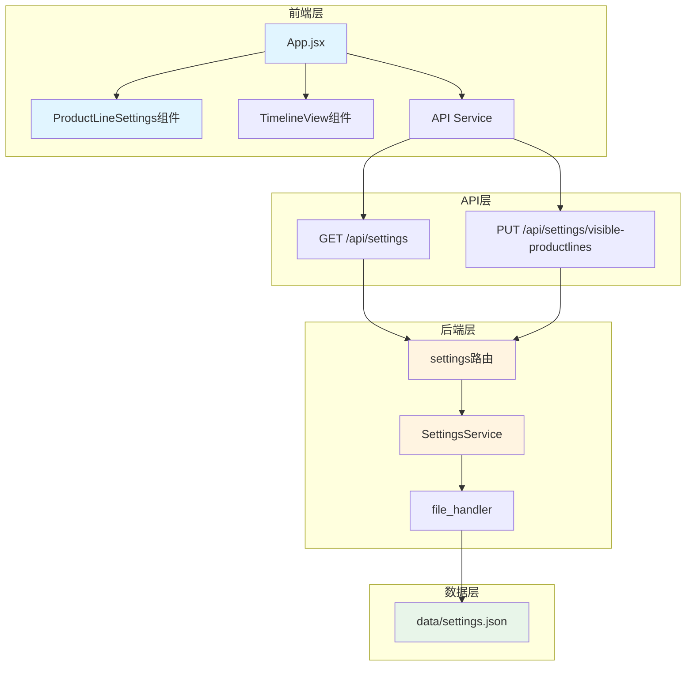
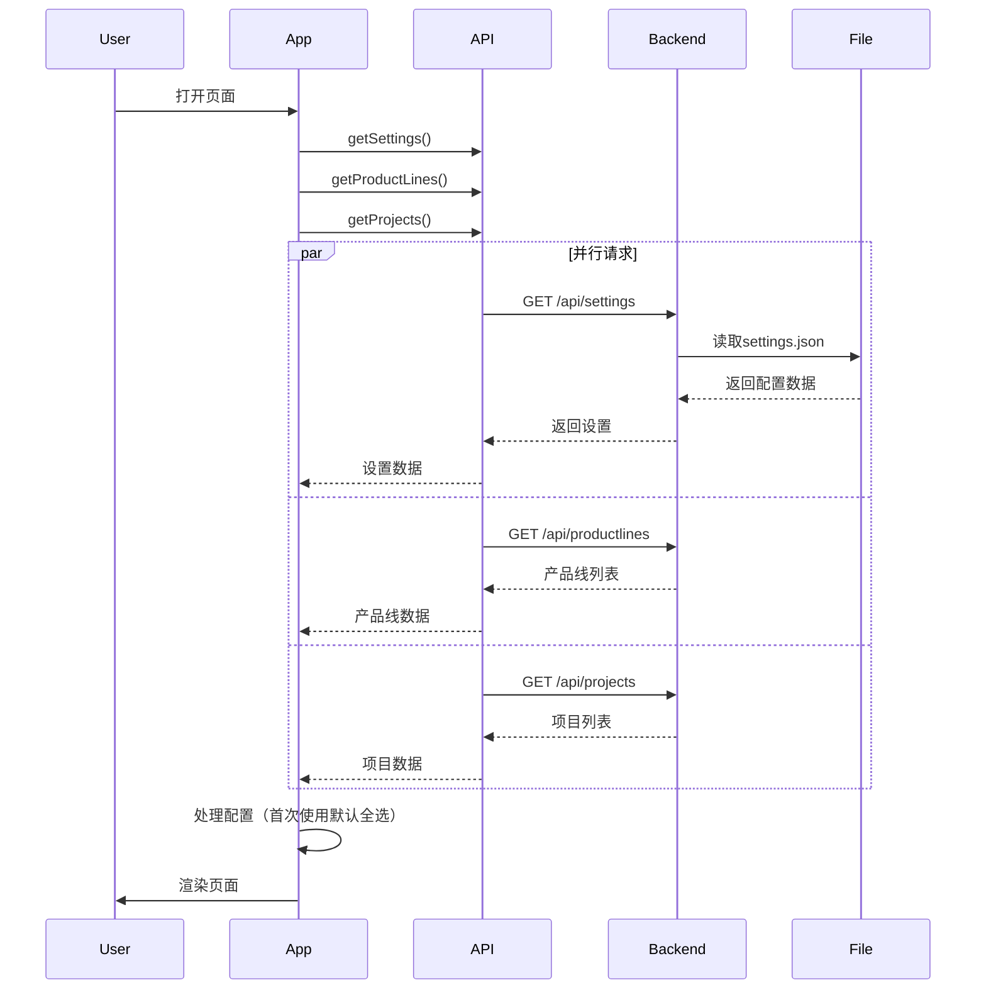
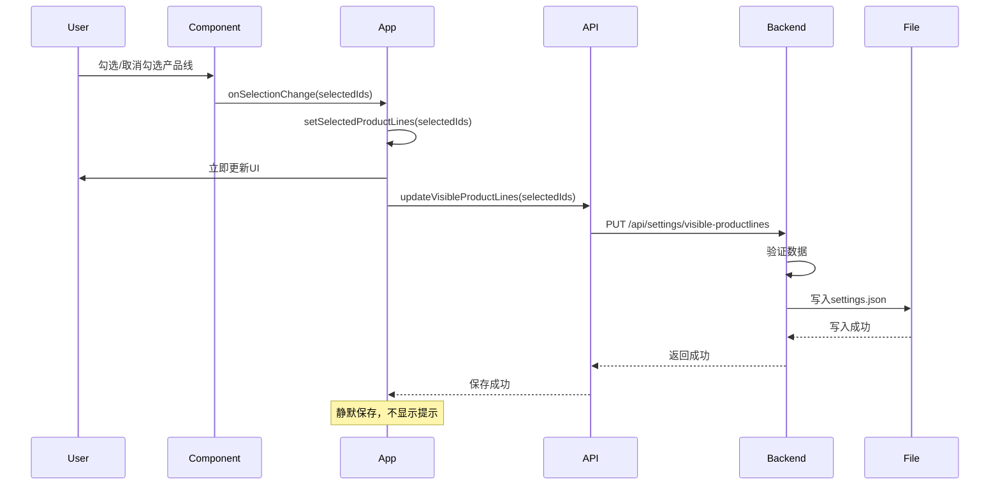

# 产品线设置功能 - 设计文档

## 一、系统架构设计

### 1.1 整体架构图



### 1.2 分层设计

#### 1.2.1 数据层
- **settings.json**: 存储用户配置
- **file_handler**: 统一的文件读写工具

#### 1.2.2 服务层
- **SettingsService**: 处理配置的业务逻辑
- **Settings Model**: 配置数据模型

#### 1.2.3 路由层
- **settings路由**: 提供RESTful API接口

#### 1.2.4 前端服务层
- **API Service**: 封装HTTP请求

#### 1.2.5 前端组件层
- **App.jsx**: 主应用，管理全局状态
- **ProductLineSettings**: 配置UI组件

## 二、核心组件设计

### 2.1 后端Settings模型

```python
# backend/models/settings.py
"""
用户设置数据模型
"""

class Settings:
    """
    用户设置类
    管理用户的各项配置
    """
    
    def __init__(self, visibleProductLines=None):
        """
        初始化设置对象
        
        Args:
            visibleProductLines: 可见产品线ID列表
        """
        self.visibleProductLines = visibleProductLines or []
    
    def to_dict(self):
        """
        转换为字典格式
        
        Returns:
            dict: 设置数据字典
        """
        return {
            'visibleProductLines': self.visibleProductLines
        }
    
    @classmethod
    def from_dict(cls, data):
        """
        从字典创建设置对象
        
        Args:
            data: 设置数据字典
            
        Returns:
            Settings: 设置对象
        """
        return cls(
            visibleProductLines=data.get('visibleProductLines', [])
        )
    
    def validate(self):
        """
        验证设置数据的有效性
        
        Raises:
            ValueError: 数据验证失败
        """
        if not isinstance(self.visibleProductLines, list):
            raise ValueError('visibleProductLines必须是列表类型')
        
        for pl_id in self.visibleProductLines:
            if not isinstance(pl_id, str):
                raise ValueError('产品线ID必须是字符串类型')
```

### 2.2 后端SettingsService

```python
# backend/services/settings_service.py
"""
设置服务层
处理用户设置相关的业务逻辑
"""
from models.settings import Settings
from utils.file_handler import read_json_file, write_json_file, get_data_file_path
import os

class SettingsService:
    """
    设置服务类
    提供设置的读取和更新操作
    """
    
    def __init__(self):
        """初始化服务，设置数据文件路径"""
        self.data_file = get_data_file_path('settings.json')
    
    def get_settings(self):
        """
        获取用户设置
        如果文件不存在，返回默认设置
        
        Returns:
            dict: 设置数据
        """
        # 如果文件不存在，返回默认设置
        if not os.path.exists(self.data_file):
            return Settings().to_dict()
        
        try:
            data = read_json_file(self.data_file)
            settings = Settings.from_dict(data)
            return settings.to_dict()
        except Exception as e:
            # 文件损坏时返回默认设置
            print(f"读取设置文件失败: {e}")
            return Settings().to_dict()
    
    def update_visible_productlines(self, productline_ids):
        """
        更新可见产品线配置
        
        Args:
            productline_ids: 产品线ID列表
            
        Returns:
            dict: 更新后的设置数据
            
        Raises:
            ValueError: 数据验证失败
        """
        # 创建设置对象并验证
        settings = Settings(visibleProductLines=productline_ids)
        settings.validate()
        
        # 保存到文件
        write_json_file(self.data_file, settings.to_dict())
        
        return settings.to_dict()
    
    def reset_settings(self):
        """
        重置设置为默认值
        
        Returns:
            dict: 默认设置数据
        """
        settings = Settings()
        write_json_file(self.data_file, settings.to_dict())
        return settings.to_dict()
```

### 2.3 后端settings路由

```python
# backend/routes/settings.py
"""
设置相关的API路由
"""
from flask import Blueprint, jsonify, request
from services.settings_service import SettingsService
from utils.decorators import handle_errors

bp = Blueprint('settings', __name__, url_prefix='/api/settings')
settings_service = SettingsService()

@bp.route('', methods=['GET'])
@handle_errors
def get_settings():
    """
    获取用户设置
    
    Returns:
        JSON响应，包含设置数据
    """
    settings = settings_service.get_settings()
    return jsonify({
        'success': True,
        'data': settings
    })

@bp.route('/visible-productlines', methods=['PUT'])
@handle_errors
def update_visible_productlines():
    """
    更新可见产品线配置
    
    Request Body:
        {
            "productLineIds": ["id1", "id2", ...]
        }
    
    Returns:
        JSON响应，包含更新后的设置数据
    """
    data = request.get_json()
    productline_ids = data.get('productLineIds', [])
    
    if not isinstance(productline_ids, list):
        return jsonify({
            'success': False,
            'error': 'productLineIds必须是数组类型'
        }), 400
    
    settings = settings_service.update_visible_productlines(productline_ids)
    
    return jsonify({
        'success': True,
        'data': settings,
        'message': '设置已保存'
    })

@bp.route('/reset', methods=['POST'])
@handle_errors
def reset_settings():
    """
    重置设置为默认值
    
    Returns:
        JSON响应，包含默认设置数据
    """
    settings = settings_service.reset_settings()
    return jsonify({
        'success': True,
        'data': settings,
        'message': '设置已重置'
    })
```

### 2.4 前端API服务扩展

```javascript
// frontend/src/services/api.js (新增部分)

// ==================== 设置API ====================

/**
 * 获取用户设置
 * @returns {Promise<Object>} 设置对象
 */
export async function getSettings() {
  const data = await fetchWithErrorHandling(`${API_BASE_URL}/settings`)
  return data.data
}

/**
 * 更新可见产品线配置
 * @param {Array<string>} productLineIds - 产品线ID列表
 * @returns {Promise<Object>} 更新后的设置对象
 */
export async function updateVisibleProductLines(productLineIds) {
  const data = await fetchWithErrorHandling(`${API_BASE_URL}/settings/visible-productlines`, {
    method: 'PUT',
    body: JSON.stringify({ productLineIds }),
  })
  return data.data
}

/**
 * 重置设置为默认值
 * @returns {Promise<Object>} 默认设置对象
 */
export async function resetSettings() {
  const data = await fetchWithErrorHandling(`${API_BASE_URL}/settings/reset`, {
    method: 'POST',
  })
  return data.data
}
```

### 2.5 前端ProductLineSettings组件

```javascript
// frontend/src/components/ProductLineSettings.jsx
import { Checkbox, Card, Tag, Space } from 'antd'
import { STATUS_COLORS, PROJECT_STATUSES } from '../utils/constants'

/**
 * 产品线显示设置组件
 * @param {array} productLines - 产品线列表
 * @param {array} selectedProductLines - 选中的产品线ID列表
 * @param {function} onSelectionChange - 选择变化回调
 */
function ProductLineSettings({ productLines, selectedProductLines, onSelectionChange }) {
  /**
   * 处理全选/取消全选
   */
  const handleSelectAll = (e) => {
    if (e.target.checked) {
      // 全选
      const allIds = productLines.map(pl => pl.id)
      onSelectionChange(allIds)
    } else {
      // 取消全选
      onSelectionChange([])
    }
  }

  /**
   * 处理单个产品线选择
   */
  const handleProductLineChange = (checkedValues) => {
    onSelectionChange(checkedValues)
  }

  // 是否全选
  const isAllSelected = selectedProductLines.length === productLines.length && productLines.length > 0
  // 是否部分选中
  const isIndeterminate = selectedProductLines.length > 0 && selectedProductLines.length < productLines.length

  return (
    <div style={{ marginBottom: '16px' }}>
      <Card 
        size="small" 
        title="显示设置"
        style={{ marginBottom: '16px' }}
      >
        {/* 产品线显示设置 */}
        <div style={{ marginBottom: '16px' }}>
          <div style={{ marginBottom: '8px', fontWeight: 500 }}>
            产品线显示设置
          </div>
          
          {productLines.length > 0 ? (
            <>
              <Checkbox
                indeterminate={isIndeterminate}
                checked={isAllSelected}
                onChange={handleSelectAll}
                style={{ marginBottom: '8px' }}
              >
                全选 ({selectedProductLines.length}/{productLines.length})
              </Checkbox>
              
              <Checkbox.Group
                value={selectedProductLines}
                onChange={handleProductLineChange}
                style={{ width: '100%' }}
              >
                <Space direction="vertical" style={{ width: '100%' }}>
                  {productLines.map(pl => (
                    <Checkbox key={pl.id} value={pl.id}>
                      {pl.name}
                    </Checkbox>
                  ))}
                </Space>
              </Checkbox.Group>
            </>
          ) : (
            <div style={{ color: '#8c8c8c', fontSize: '14px' }}>
              暂无产品线，请先创建项目
            </div>
          )}
        </div>

        {/* 状态图例 */}
        <div>
          <div style={{ marginBottom: '8px', fontWeight: 500 }}>
            状态图例
          </div>
          <Space wrap>
            {PROJECT_STATUSES.map(status => (
              <Tag
                key={status}
                color={STATUS_COLORS[status]}
                style={{
                  borderStyle: status === '暂停' ? 'dashed' : 'solid',
                  borderWidth: '2px'
                }}
              >
                {status}
              </Tag>
            ))}
          </Space>
        </div>
      </Card>
    </div>
  )
}

export default ProductLineSettings
```

### 2.6 前端App.jsx改造

```javascript
// frontend/src/App.jsx (关键改动部分)

import ProductLineSettings from './components/ProductLineSettings'
import { getProjects, getProductLines, getSettings, updateVisibleProductLines } from './services/api'

function App() {
  // ... 其他状态保持不变
  
  useEffect(() => {
    loadData()
  }, [])

  /**
   * 加载项目、产品线和设置数据
   */
  const loadData = async () => {
    try {
      setLoading(true)
      
      // 并行加载所有数据
      const [projectsData, productLinesData, settingsData] = await Promise.all([
        getProjects(),
        getProductLines(),
        getSettings()
      ])
      
      setProjects(projectsData)
      setProductLines(productLinesData)
      
      // 处理设置数据
      const visibleProductLines = settingsData.visibleProductLines || []
      
      // 如果配置为空（首次使用），默认显示所有产品线
      if (visibleProductLines.length === 0 && productLinesData.length > 0) {
        const allIds = productLinesData.map(pl => pl.id)
        setSelectedProductLines(allIds)
        // 保存默认配置
        await updateVisibleProductLines(allIds).catch(err => {
          console.error('保存默认配置失败:', err)
        })
      } else {
        setSelectedProductLines(visibleProductLines)
      }
      
      message.success('数据加载成功')
    } catch (error) {
      message.error('数据加载失败: ' + error.message)
      // 降级方案：显示所有产品线
      if (productLines.length > 0) {
        const allIds = productLines.map(pl => pl.id)
        setSelectedProductLines(allIds)
      }
    } finally {
      setLoading(false)
    }
  }

  /**
   * 处理产品线选择变化
   * 自动保存配置
   */
  const handleProductLineSelectionChange = async (selectedIds) => {
    // 立即更新UI
    setSelectedProductLines(selectedIds)
    
    // 异步保存配置
    try {
      await updateVisibleProductLines(selectedIds)
      // 静默保存，不显示成功提示
    } catch (error) {
      message.error('保存设置失败: ' + error.message)
    }
  }

  return (
    <Layout style={{ minHeight: '100vh' }}>
      {/* ... Header保持不变 */}
      <Content style={{ padding: '24px', background: '#f0f2f5' }}>
        <Row gutter={16}>
          {/* 左侧设置面板 */}
          <Col xs={24} sm={24} md={6} lg={5} xl={4}>
            <ProductLineSettings
              productLines={productLines}
              selectedProductLines={selectedProductLines}
              onSelectionChange={handleProductLineSelectionChange}
            />
          </Col>

          {/* 右侧时间轴 */}
          <Col xs={24} sm={24} md={18} lg={19} xl={20}>
            {/* ... TimelineView保持不变 */}
          </Col>
        </Row>
      </Content>
      {/* ... Modal保持不变 */}
    </Layout>
  )
}
```

## 三、接口规范

### 3.1 API接口定义

#### 3.1.1 获取设置
```
GET /api/settings

Response:
{
  "success": true,
  "data": {
    "visibleProductLines": ["id1", "id2", "id3"]
  }
}
```

#### 3.1.2 更新可见产品线
```
PUT /api/settings/visible-productlines

Request Body:
{
  "productLineIds": ["id1", "id2", "id3"]
}

Response:
{
  "success": true,
  "data": {
    "visibleProductLines": ["id1", "id2", "id3"]
  },
  "message": "设置已保存"
}
```

#### 3.1.3 重置设置
```
POST /api/settings/reset

Response:
{
  "success": true,
  "data": {
    "visibleProductLines": []
  },
  "message": "设置已重置"
}
```

### 3.2 数据结构定义

#### 3.2.1 settings.json文件格式
```json
{
  "visibleProductLines": ["id1", "id2", "id3"]
}
```

## 四、数据流图

### 4.1 初始化流程



### 4.2 配置更新流程



## 五、异常处理策略

### 5.1 配置加载失败
```javascript
// 降级方案
try {
  const settings = await getSettings()
  // 使用配置
} catch (error) {
  console.error('加载配置失败:', error)
  // 降级：显示所有产品线
  const allIds = productLines.map(pl => pl.id)
  setSelectedProductLines(allIds)
  message.warning('加载配置失败，已显示所有产品线')
}
```

### 5.2 配置保存失败
```javascript
// 用户体验优先
try {
  // 先更新UI
  setSelectedProductLines(selectedIds)
  // 再保存
  await updateVisibleProductLines(selectedIds)
} catch (error) {
  console.error('保存配置失败:', error)
  message.error('保存设置失败，下次刷新将恢复之前的配置')
  // 不回滚UI，保持当前会话可用
}
```

### 5.3 配置文件损坏
```python
# 后端降级处理
def get_settings(self):
    try:
        data = read_json_file(self.data_file)
        return Settings.from_dict(data).to_dict()
    except Exception as e:
        # 返回默认配置
        return Settings().to_dict()
```

## 六、性能优化

### 6.1 并行加载
- 使用Promise.all并行加载设置、产品线、项目数据
- 减少总加载时间

### 6.2 静默保存
- 配置保存成功不显示提示
- 减少用户干扰

### 6.3 UI优先
- 先更新UI，再异步保存
- 保证交互流畅性

## 七、安全考虑

### 7.1 数据验证
- 后端验证productLineIds必须是数组
- 验证每个ID必须是字符串
- 防止注入攻击

### 7.2 错误处理
- 所有API使用@handle_errors装饰器
- 统一的错误响应格式
- 避免敏感信息泄露

## 八、测试要点

### 8.1 单元测试
- SettingsService的读写逻辑
- Settings模型的验证逻辑
- API路由的参数验证

### 8.2 集成测试
- 完整的配置保存和加载流程
- 首次使用的默认配置
- 错误场景的降级处理

### 8.3 手动测试
- 首次使用场景
- 配置更新场景
- 页面刷新场景
- 浏览器关闭重开场景
- 配置文件损坏场景
