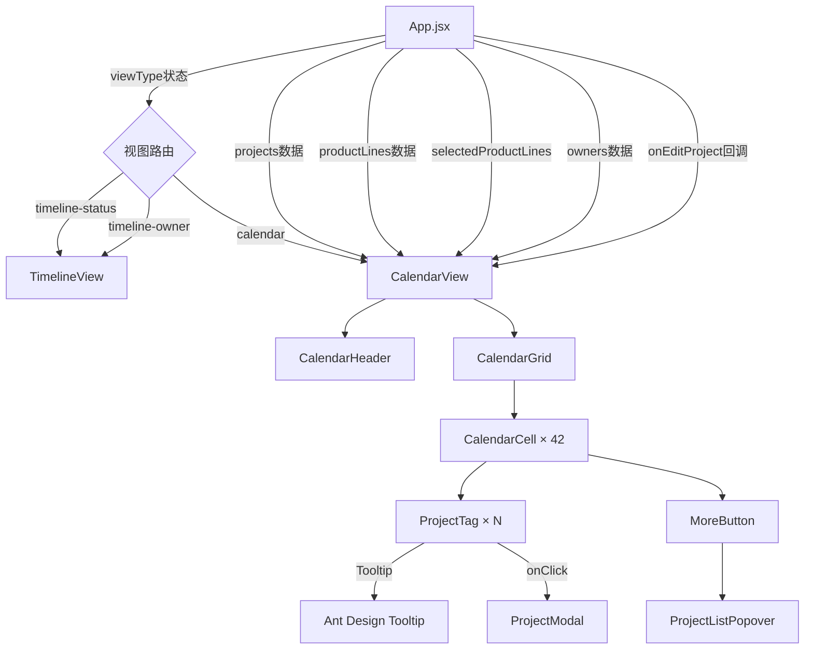
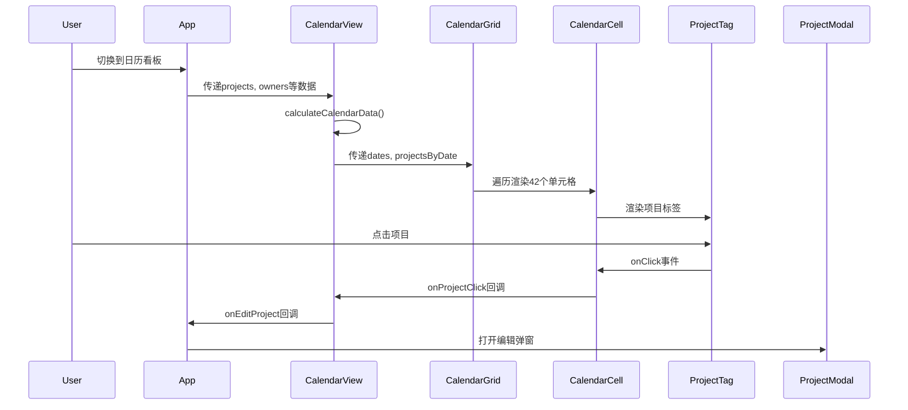

# 日历看板功能 - 架构设计文档

## 一、系统架构概览

### 1.1 整体架构图



### 1.2 组件层级结构

```
App.jsx
└── CalendarView.jsx (日历视图主组件)
    ├── CalendarHeader.jsx (日历头部)
    │   ├── 年月标题
    │   └── 切换按钮组
    │       ├── 上一月按钮
    │       ├── 今天按钮
    │       └── 下一月按钮
    │
    └── CalendarGrid.jsx (日历网格)
        ├── 周标题行 (周日~周六)
        └── CalendarCell.jsx × 42 (日历单元格)
            ├── 日期数字
            ├── ProjectTag.jsx × N (项目标签)
            │   └── Tooltip (完整项目名)
            └── MoreButton ("+N更多"按钮)
                └── ProjectListPopover (项目列表弹出层)
```

## 二、核心组件设计

### 2.1 CalendarView.jsx (日历视图主组件)

**职责**：
- 管理日历状态（当前月份）
- 计算日历数据（日期数组、项目分组）
- 应用产品线筛选
- 协调子组件交互

**Props接口**：
```typescript
interface CalendarViewProps {
  projects: Project[]                    // 项目列表
  productLines: ProductLine[]            // 产品线列表
  selectedProductLines: string[]         // 选中的产品线ID列表
  onEditProject: (project: Project) => void  // 编辑项目回调
  owners: Owner[]                        // 人员列表
}
```

**State状态**：
```typescript
interface CalendarViewState {
  currentMonth: Dayjs                    // 当前显示的月份
  calendarData: {
    dates: Dayjs[]                       // 日期数组（42个）
    projectsByDate: {                    // 按日期分组的项目
      [dateKey: string]: Project[]
    }
    firstDay: Dayjs                      // 月份第一天
    lastDay: Dayjs                       // 月份最后一天
  } | null
}
```

**核心方法**：
```javascript
// 计算日历数据
const calculateCalendarData = useCallback((month, projects, selectedProductLines) => {
  // 实现见算法章节
}, [])

// 月份切换处理
const handlePrevMonth = () => {
  setCurrentMonth(prev => prev.subtract(1, 'month'))
}

const handleNextMonth = () => {
  setCurrentMonth(prev => prev.add(1, 'month'))
}

const handleToday = () => {
  setCurrentMonth(dayjs())
}

// 项目点击处理
const handleProjectClick = (project) => {
  onEditProject(project)
}
```

**组件结构**：
```jsx
function CalendarView({ projects, productLines, selectedProductLines, onEditProject, owners }) {
  const [currentMonth, setCurrentMonth] = useState(dayjs())
  const [calendarData, setCalendarData] = useState(null)

  // 计算日历数据
  useEffect(() => {
    const data = calculateCalendarData(currentMonth, projects, selectedProductLines)
    setCalendarData(data)
  }, [currentMonth, projects, selectedProductLines])

  if (!calendarData) {
    return <Spin />
  }

  return (
    <div className="calendar-view">
      <CalendarHeader
        currentMonth={currentMonth}
        onPrevMonth={handlePrevMonth}
        onNextMonth={handleNextMonth}
        onToday={handleToday}
      />
      <CalendarGrid
        dates={calendarData.dates}
        projectsByDate={calendarData.projectsByDate}
        currentMonth={currentMonth}
        onProjectClick={handleProjectClick}
        owners={owners}
      />
    </div>
  )
}
```

### 2.2 CalendarHeader.jsx (日历头部)

**职责**：
- 显示年月标题
- 提供月份切换按钮

**Props接口**：
```typescript
interface CalendarHeaderProps {
  currentMonth: Dayjs                    // 当前月份
  onPrevMonth: () => void                // 上一月回调
  onNextMonth: () => void                // 下一月回调
  onToday: () => void                    // 今天回调
}
```

**组件结构**：
```jsx
function CalendarHeader({ currentMonth, onPrevMonth, onNextMonth, onToday }) {
  return (
    <div className="calendar-header">
      <div className="calendar-title">
        {currentMonth.format('YYYY年MM月')}
      </div>
      <div className="calendar-controls">
        <Button icon={<LeftOutlined />} onClick={onPrevMonth} />
        <Button onClick={onToday}>今天</Button>
        <Button icon={<RightOutlined />} onClick={onNextMonth} />
      </div>
    </div>
  )
}
```

### 2.3 CalendarGrid.jsx (日历网格)

**职责**：
- 渲染7×6的日历网格
- 渲染周标题行
- 遍历渲染日历单元格

**Props接口**：
```typescript
interface CalendarGridProps {
  dates: Dayjs[]                         // 日期数组（42个）
  projectsByDate: {                      // 按日期分组的项目
    [dateKey: string]: Project[]
  }
  currentMonth: Dayjs                    // 当前月份（用于判断是否当月）
  onProjectClick: (project: Project) => void  // 项目点击回调
  owners: Owner[]                        // 人员列表
}
```

**组件结构**：
```jsx
function CalendarGrid({ dates, projectsByDate, currentMonth, onProjectClick, owners }) {
  const weekDays = ['周日', '周一', '周二', '周三', '周四', '周五', '周六']
  
  return (
    <div className="calendar-grid-container">
      {/* 周标题行 */}
      <div className="calendar-week-header">
        {weekDays.map(day => (
          <div key={day} className="calendar-week-day">{day}</div>
        ))}
      </div>
      
      {/* 日历网格 */}
      <div className="calendar-grid">
        {dates.map(date => {
          const dateKey = date.format('YYYY-MM-DD')
          const projects = projectsByDate[dateKey] || []
          const isToday = date.isSame(dayjs(), 'day')
          const isCurrentMonth = date.isSame(currentMonth, 'month')
          
          return (
            <CalendarCell
              key={dateKey}
              date={date}
              projects={projects}
              isToday={isToday}
              isCurrentMonth={isCurrentMonth}
              onProjectClick={onProjectClick}
              owners={owners}
            />
          )
        })}
      </div>
    </div>
  )
}
```

### 2.4 CalendarCell.jsx (日历单元格)

**职责**：
- 显示日期数字
- 渲染项目标签列表（最多5个）
- 处理今天高亮
- 显示"+N更多"按钮

**Props接口**：
```typescript
interface CalendarCellProps {
  date: Dayjs                            // 日期
  projects: Project[]                    // 该日期的项目列表
  isToday: boolean                       // 是否今天
  isCurrentMonth: boolean                // 是否当前月
  onProjectClick: (project: Project) => void  // 项目点击回调
  owners: Owner[]                        // 人员列表
}
```

**组件结构**：
```jsx
function CalendarCell({ date, projects, isToday, isCurrentMonth, onProjectClick, owners }) {
  const MAX_VISIBLE_PROJECTS = 5
  const visibleProjects = projects.slice(0, MAX_VISIBLE_PROJECTS)
  const hiddenCount = Math.max(0, projects.length - MAX_VISIBLE_PROJECTS)
  
  const cellClassName = classNames('calendar-cell', {
    'today': isToday,
    'other-month': !isCurrentMonth
  })
  
  return (
    <div className={cellClassName}>
      {/* 日期数字 */}
      <div className="calendar-cell-date">
        {date.format('D')}
      </div>
      
      {/* 项目列表 */}
      <div className="calendar-cell-projects">
        {visibleProjects.map(project => (
          <ProjectTag
            key={project.id}
            project={project}
            owners={owners}
            onClick={() => onProjectClick(project)}
          />
        ))}
        
        {/* 更多按钮 */}
        {hiddenCount > 0 && (
          <ProjectListPopover
            projects={projects.slice(MAX_VISIBLE_PROJECTS)}
            owners={owners}
            onProjectClick={onProjectClick}
          >
            <div className="more-projects">
              +{hiddenCount}更多
            </div>
          </ProjectListPopover>
        )}
      </div>
    </div>
  )
}
```

### 2.5 ProjectTag.jsx (项目标签)

**职责**：
- 渲染项目标签
- 显示项目名称
- 应用负责人颜色
- 提供Tooltip

**Props接口**：
```typescript
interface ProjectTagProps {
  project: Project                       // 项目对象
  owners: Owner[]                        // 人员列表
  onClick: () => void                    // 点击回调
}
```

**组件结构**：
```jsx
function ProjectTag({ project, owners, onClick }) {
  // 获取负责人颜色
  const owner = owners.find(o => o.id === project.ownerId)
  const color = owner?.color || '#999999'
  
  // 截断项目名称
  const displayName = project.name.length > 10 
    ? project.name.substring(0, 10) + '...' 
    : project.name
  
  return (
    <Tooltip title={project.name}>
      <div
        className="project-tag"
        style={{ backgroundColor: color }}
        onClick={onClick}
      >
        {displayName}
      </div>
    </Tooltip>
  )
}
```

### 2.6 ProjectListPopover.jsx (项目列表弹出层)

**职责**：
- 弹出层显示所有项目
- 用于"+N更多"功能

**Props接口**：
```typescript
interface ProjectListPopoverProps {
  projects: Project[]                    // 项目列表
  owners: Owner[]                        // 人员列表
  onProjectClick: (project: Project) => void  // 项目点击回调
  children: ReactNode                    // 触发元素
}
```

**组件结构**：
```jsx
function ProjectListPopover({ projects, owners, onProjectClick, children }) {
  const content = (
    <div className="project-list-popover">
      {projects.map(project => (
        <ProjectTag
          key={project.id}
          project={project}
          owners={owners}
          onClick={() => onProjectClick(project)}
        />
      ))}
    </div>
  )
  
  return (
    <Popover content={content} trigger="click" placement="bottom">
      {children}
    </Popover>
  )
}
```

## 三、核心算法设计

### 3.1 日历数据计算算法

```javascript
/**
 * 计算日历数据
 * @param {Dayjs} month - 当前月份
 * @param {Project[]} projects - 项目列表
 * @param {string[]} selectedProductLines - 选中的产品线ID列表
 * @returns {CalendarData} 日历数据
 */
function calculateCalendarData(month, projects, selectedProductLines) {
  // 步骤1: 计算月份边界
  const firstDay = month.startOf('month')  // 月份第一天
  const lastDay = month.endOf('month')     // 月份最后一天
  
  // 步骤2: 计算日历显示范围（包含上月末尾和下月开头）
  const startDate = firstDay.startOf('week')  // 第一周的周日
  const endDate = lastDay.endOf('week')       // 最后一周的周六
  
  // 步骤3: 生成日期数组（42个格子，6周）
  const dates = []
  let current = startDate
  while (current.isBefore(endDate) || current.isSame(endDate, 'day')) {
    dates.push(current)
    current = current.add(1, 'day')
  }
  
  // 步骤4: 筛选项目
  const filteredProjects = projects.filter(project => {
    // 4.1 产品线筛选
    if (!selectedProductLines.includes(project.productLineId)) {
      return false
    }
    
    // 4.2 月份筛选（endDate在当前月）
    const endDate = dayjs(project.endDate)
    return endDate.isSame(month, 'month')
  })
  
  // 步骤5: 按日期分组项目
  const projectsByDate = {}
  filteredProjects.forEach(project => {
    const dateKey = dayjs(project.endDate).format('YYYY-MM-DD')
    if (!projectsByDate[dateKey]) {
      projectsByDate[dateKey] = []
    }
    projectsByDate[dateKey].push(project)
  })
  
  // 步骤6: 对每个日期的项目按创建时间排序
  Object.keys(projectsByDate).forEach(dateKey => {
    projectsByDate[dateKey].sort((a, b) => a.createdAt - b.createdAt)
  })
  
  // 步骤7: 返回计算结果
  return {
    dates,              // 日期数组（42个Dayjs对象）
    projectsByDate,     // 项目分组 { 'YYYY-MM-DD': Project[] }
    firstDay,           // 月份第一天
    lastDay             // 月份最后一天
  }
}
```

**算法复杂度分析**：
- 时间复杂度：O(n)，其中n为项目数量
- 空间复杂度：O(n)，存储筛选后的项目

**边界情况处理**：
1. 跨月显示：正确处理上月末尾和下月开头的日期
2. 空项目：projectsByDate中不存在的日期返回空数组
3. 大量项目：通过MAX_VISIBLE_PROJECTS限制显示数量

### 3.2 负责人颜色获取算法

```javascript
/**
 * 获取项目的负责人颜色
 * @param {Project} project - 项目对象
 * @param {Owner[]} owners - 人员列表
 * @returns {string} 颜色值（十六进制）
 */
function getProjectOwnerColor(project, owners) {
  // 查找负责人
  const owner = owners.find(o => o.id === project.ownerId)
  
  // 返回颜色，如果找不到负责人则返回默认灰色
  return owner?.color || '#999999'
}
```

**容错处理**：
- 负责人不存在：返回默认灰色 #999999
- 负责人颜色为空：返回默认灰色 #999999

## 四、数据流设计

### 4.1 数据流向图



### 4.2 状态管理

**全局状态（App.jsx）**：
```javascript
{
  viewType: 'calendar',                  // 视图类型
  projects: Project[],                   // 项目列表
  productLines: ProductLine[],           // 产品线列表
  selectedProductLines: string[],        // 选中的产品线
  owners: Owner[]                        // 人员列表
}
```

**局部状态（CalendarView.jsx）**：
```javascript
{
  currentMonth: Dayjs,                   // 当前月份
  calendarData: {                        // 计算后的日历数据
    dates: Dayjs[],
    projectsByDate: { [key: string]: Project[] },
    firstDay: Dayjs,
    lastDay: Dayjs
  }
}
```

### 4.3 事件流

**月份切换事件流**：
```
User点击"上一月" 
  → CalendarHeader.onPrevMonth() 
  → CalendarView.handlePrevMonth() 
  → setCurrentMonth(prev => prev.subtract(1, 'month'))
  → useEffect触发
  → calculateCalendarData()
  → setCalendarData()
  → 重新渲染
```

**项目点击事件流**：
```
User点击项目标签
  → ProjectTag.onClick()
  → CalendarCell.onProjectClick()
  → CalendarView.handleProjectClick()
  → App.handleEditProject()
  → ProjectModal打开
```

## 五、样式设计

### 5.1 CSS类名规范

```css
/* 日历视图容器 */
.calendar-view {
  width: 100%;
  height: 100%;
  display: flex;
  flex-direction: column;
}

/* 日历头部 */
.calendar-header {
  display: flex;
  justify-content: space-between;
  align-items: center;
  padding: 16px;
  border-bottom: 1px solid #e0e0e0;
}

.calendar-title {
  font-size: 18px;
  font-weight: bold;
  color: #333;
}

.calendar-controls {
  display: flex;
  gap: 8px;
}

/* 日历网格容器 */
.calendar-grid-container {
  flex: 1;
  display: flex;
  flex-direction: column;
  overflow: hidden;
}

/* 周标题行 */
.calendar-week-header {
  display: grid;
  grid-template-columns: repeat(7, 1fr);
  background-color: #fafafa;
  border-bottom: 1px solid #e0e0e0;
}

.calendar-week-day {
  padding: 12px;
  text-align: center;
  font-weight: 500;
  color: #666;
}

/* 日历网格 */
.calendar-grid {
  flex: 1;
  display: grid;
  grid-template-columns: repeat(7, 1fr);
  grid-template-rows: repeat(6, 1fr);
  gap: 1px;
  background-color: #e0e0e0;
  border: 1px solid #e0e0e0;
}

/* 日历单元格 */
.calendar-cell {
  background-color: white;
  padding: 8px;
  position: relative;
  overflow: hidden;
  display: flex;
  flex-direction: column;
}

.calendar-cell.today {
  background-color: #e6f7ff;
}

.calendar-cell.other-month {
  background-color: #fafafa;
}

.calendar-cell.other-month .calendar-cell-date {
  color: #ccc;
}

/* 日期数字 */
.calendar-cell-date {
  position: absolute;
  top: 8px;
  right: 8px;
  font-size: 14px;
  color: #999;
  font-weight: 500;
}

.calendar-cell.today .calendar-cell-date {
  color: #1890ff;
  font-weight: bold;
}

/* 项目列表区域 */
.calendar-cell-projects {
  margin-top: 24px;
  display: flex;
  flex-direction: column;
  gap: 4px;
  flex: 1;
  overflow: hidden;
}

/* 项目标签 */
.project-tag {
  padding: 4px 8px;
  border-radius: 4px;
  font-size: 12px;
  color: white;
  cursor: pointer;
  white-space: nowrap;
  overflow: hidden;
  text-overflow: ellipsis;
  transition: opacity 0.2s;
  flex-shrink: 0;
}

.project-tag:hover {
  opacity: 0.8;
}

/* 更多按钮 */
.more-projects {
  padding: 4px 8px;
  border-radius: 4px;
  font-size: 12px;
  color: #1890ff;
  background-color: #f0f0f0;
  cursor: pointer;
  text-align: center;
  flex-shrink: 0;
}

.more-projects:hover {
  background-color: #e6e6e6;
}

/* 项目列表弹出层 */
.project-list-popover {
  max-height: 300px;
  overflow-y: auto;
  display: flex;
  flex-direction: column;
  gap: 4px;
  padding: 4px;
}
```

### 5.2 响应式设计

```css
/* 大屏幕（>1200px） */
@media (min-width: 1200px) {
  .calendar-cell {
    min-height: 120px;
  }
}

/* 中等屏幕（768px-1200px） */
@media (min-width: 768px) and (max-width: 1199px) {
  .calendar-cell {
    min-height: 100px;
  }
  
  .project-tag {
    font-size: 11px;
    padding: 3px 6px;
  }
}

/* 小屏幕（<768px） */
@media (max-width: 767px) {
  .calendar-cell {
    min-height: 80px;
    padding: 4px;
  }
  
  .calendar-cell-date {
    font-size: 12px;
  }
  
  .project-tag {
    font-size: 10px;
    padding: 2px 4px;
  }
  
  .calendar-week-day {
    padding: 8px;
    font-size: 12px;
  }
}
```

## 六、集成方案

### 6.1 App.jsx修改方案

**修改点1：新增viewType状态**
```javascript
// 视图类型状态（扩展为三种）
const [viewType, setViewType] = useState(() => {
  return localStorage.getItem('viewType') || 'timeline-status'
})

// 保存viewType到localStorage
useEffect(() => {
  localStorage.setItem('viewType', viewType)
}, [viewType])
```

**修改点2：修改Segmented组件**
```javascript
<Segmented
  value={viewType}
  onChange={setViewType}
  options={[
    { label: '进度看板', value: 'timeline-status' },
    { label: '人员看板', value: 'timeline-owner' },
    { label: '日历看板', value: 'calendar' }
  ]}
/>
```

**修改点3：条件渲染视图**
```javascript
{viewType === 'calendar' ? (
  <CalendarView
    projects={projects}
    productLines={productLines}
    selectedProductLines={selectedProductLines}
    onEditProject={handleEditProject}
    owners={owners}
  />
) : (
  <TimelineView
    projects={projects}
    productLines={productLines}
    selectedProductLines={selectedProductLines}
    onEditProject={handleEditProject}
    customTimelineRange={timelineRange}
    visibleMonths={visibleMonths}
    owners={owners}
    boardType={viewType === 'timeline-status' ? BOARD_TYPES.STATUS : BOARD_TYPES.OWNER}
    onBoardTypeChange={(type) => {
      setViewType(type === BOARD_TYPES.STATUS ? 'timeline-status' : 'timeline-owner')
    }}
  />
)}
```

### 6.2 文件结构

```
frontend/src/
├── components/
│   ├── Calendar/                      # 新增日历组件目录
│   │   ├── CalendarView.jsx          # 日历视图主组件
│   │   ├── CalendarHeader.jsx        # 日历头部
│   │   ├── CalendarGrid.jsx          # 日历网格
│   │   ├── CalendarCell.jsx          # 日历单元格
│   │   ├── ProjectTag.jsx            # 项目标签
│   │   └── ProjectListPopover.jsx    # 项目列表弹出层
│   └── ...
├── styles/
│   ├── calendar.css                   # 新增日历样式文件
│   └── ...
└── ...
```

## 七、性能优化策略

### 7.1 渲染优化

**1. 使用React.memo优化子组件**
```javascript
const CalendarCell = React.memo(({ date, projects, isToday, isCurrentMonth, onProjectClick, owners }) => {
  // 组件实现
}, (prevProps, nextProps) => {
  // 自定义比较函数
  return (
    prevProps.date.isSame(nextProps.date) &&
    prevProps.projects === nextProps.projects &&
    prevProps.isToday === nextProps.isToday &&
    prevProps.isCurrentMonth === nextProps.isCurrentMonth
  )
})
```

**2. 使用useCallback缓存回调函数**
```javascript
const handleProjectClick = useCallback((project) => {
  onEditProject(project)
}, [onEditProject])

const calculateCalendarData = useCallback((month, projects, selectedProductLines) => {
  // 计算逻辑
}, [])
```

**3. 使用useMemo缓存计算结果**
```javascript
const calendarData = useMemo(() => {
  return calculateCalendarData(currentMonth, projects, selectedProductLines)
}, [currentMonth, projects, selectedProductLines])
```

### 7.2 大数据量优化

**1. 限制显示数量**
- 每个日期最多显示5个项目
- 超出部分通过Popover展示

**2. 虚拟滚动（如需要）**
- 如果项目数量超过1000个，考虑实现虚拟滚动
- 只渲染可见区域的项目

### 7.3 交互优化

**1. 防抖处理**
```javascript
const debouncedCalculate = useMemo(
  () => debounce(calculateCalendarData, 100),
  []
)
```

**2. 加载状态**
```javascript
const [loading, setLoading] = useState(false)

useEffect(() => {
  setLoading(true)
  const data = calculateCalendarData(currentMonth, projects, selectedProductLines)
  setCalendarData(data)
  setLoading(false)
}, [currentMonth, projects, selectedProductLines])
```

## 八、测试策略

### 8.1 单元测试

**测试用例**：
1. calculateCalendarData函数测试
   - 正确生成42个日期
   - 正确筛选项目
   - 正确分组项目
   - 边界情况（跨月、跨年）

2. getProjectOwnerColor函数测试
   - 正确返回负责人颜色
   - 负责人不存在时返回默认颜色

3. 组件渲染测试
   - CalendarView正确渲染
   - CalendarCell正确显示项目
   - 今天日期正确高亮

### 8.2 集成测试

**测试场景**：
1. 月份切换功能
2. 项目点击编辑
3. 产品线筛选联动
4. "+N更多"展开功能

### 8.3 性能测试

**测试指标**：
- 日历渲染时间 < 100ms
- 月
