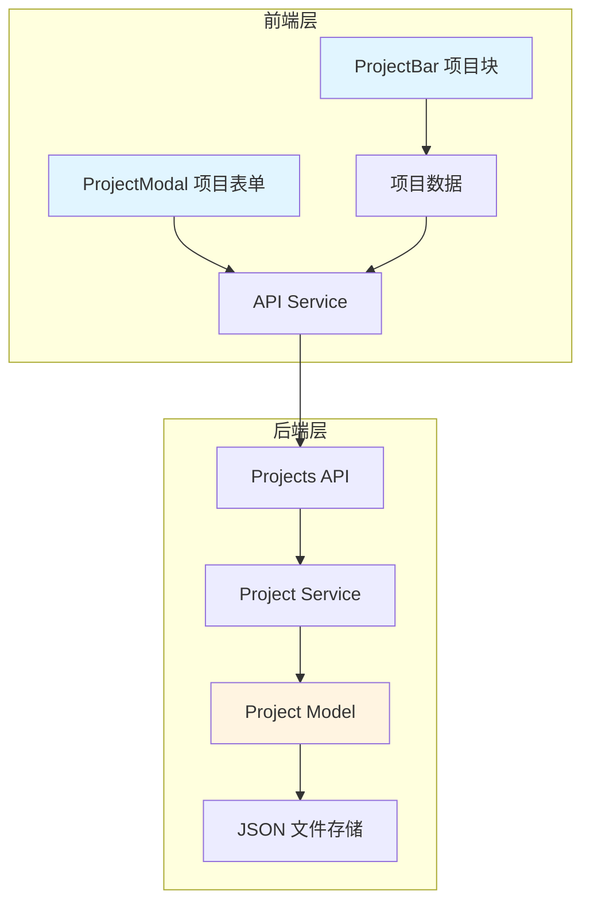
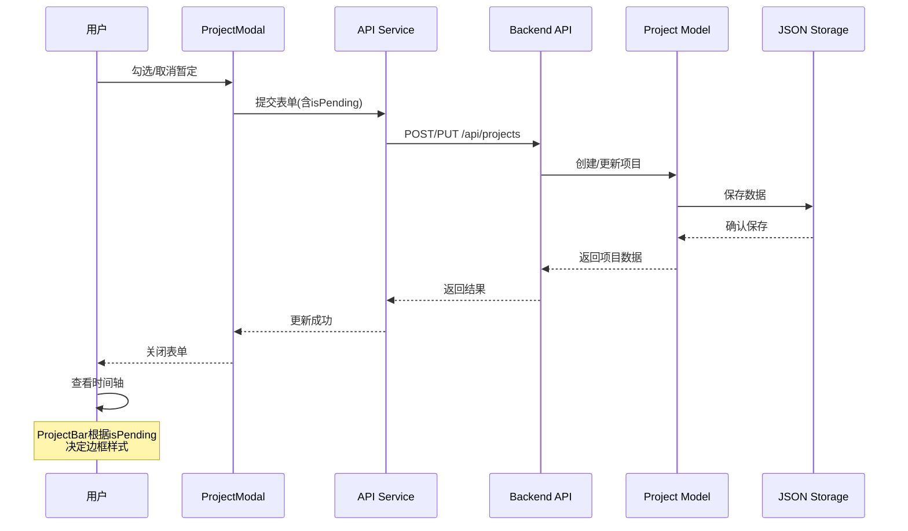

# 暂定项目功能 - 系统设计文档

## 一、系统架构概览

### 1.1 架构图



### 1.2 数据流向



## 二、模块设计

### 2.1 后端模块：Project Model

#### 文件路径
`backend/models/project.py`

#### 类设计
```python
class Project:
    """项目数据模型类"""
    
    # 属性
    id: str                 # 项目ID
    name: str              # 项目名称
    productLineId: str     # 产品线ID
    ownerId: str           # 负责人ID
    startDate: str         # 开始日期
    endDate: str           # 结束日期
    status: str            # 项目状态
    isPending: bool        # 是否暂定 ← 新增
    createdAt: int         # 创建时间
    updatedAt: int         # 更新时间
```

#### 方法修改

**1. `__init__` 方法**
```python
def __init__(self, name, productLineId, startDate, endDate, status,
             ownerId=None, isPending=False, id=None, createdAt=None, updatedAt=None):
    """
    初始化项目对象
    
    Args:
        ...
        isPending: 是否暂定（可选，默认False）
        ...
    """
    self.isPending = isPending  # 新增
```

**2. `to_dict` 方法**
```python
def to_dict(self):
    """将项目对象转换为字典"""
    return {
        'id': self.id,
        'name': self.name,
        'productLineId': self.productLineId,
        'ownerId': self.ownerId,
        'startDate': self.startDate,
        'endDate': self.endDate,
        'status': self.status,
        'isPending': self.isPending,  # 新增
        'createdAt': self.createdAt,
        'updatedAt': self.updatedAt
    }
```

**3. `from_dict` 方法**
```python
@classmethod
def from_dict(cls, data):
    """从字典创建项目对象"""
    return cls(
        name=data['name'],
        productLineId=data['productLineId'],
        startDate=data['startDate'],
        endDate=data['endDate'],
        status=data['status'],
        ownerId=data.get('ownerId'),
        isPending=data.get('isPending', False),  # 新增，默认False
        id=data.get('id'),
        createdAt=data.get('createdAt'),
        updatedAt=data.get('updatedAt')
    )
```

**4. `update` 方法**
```python
def update(self, **kwargs):
    """更新项目属性"""
    allowed_fields = [
        'name', 'productLineId', 'ownerId', 
        'startDate', 'endDate', 'status', 
        'isPending'  # 新增
    ]
    
    for key, value in kwargs.items():
        if key in allowed_fields:
            setattr(self, key, value)
    
    self.updatedAt = self._get_current_timestamp()
    self.validate()
```

### 2.2 前端模块：ProjectModal

#### 文件路径
`frontend/src/components/ProjectModal.jsx`

#### 组件结构
```jsx
<Form>
  <Form.Item name="name">项目名称</Form.Item>
  <Form.Item name="productLineId">产品线</Form.Item>
  <Form.Item name="ownerId">项目负责人</Form.Item>
  <Form.Item name="startDate">开始日期</Form.Item>
  <Form.Item name="endDate">结束日期</Form.Item>
  <Form.Item name="status">项目状态</Form.Item>
  <Form.Item name="isPending" valuePropName="checked">  {/* 新增 */}
    暂定
  </Form.Item>
</Form>
```

#### 表单字段配置
```javascript
{
  name: 'isPending',
  label: '暂定',
  component: Checkbox,
  valuePropName: 'checked',  // 重要：Checkbox使用checked属性
  initialValue: false,
  rules: []  // 无需验证
}
```

#### 数据处理逻辑

**1. 编辑模式回显**
```javascript
useEffect(() => {
  if (visible && editingProject) {
    form.setFieldsValue({
      name: editingProject.name,
      productLineId: editingProject.productLineId,
      ownerId: editingProject.ownerId,
      startDate: dayjs(editingProject.startDate),
      endDate: dayjs(editingProject.endDate),
      status: editingProject.status,
      isPending: editingProject.isPending || false  // 新增
    })
  }
}, [visible, editingProject, form])
```

**2. 表单提交**
```javascript
const handleSubmit = async () => {
  const values = await form.validateFields()
  
  const projectData = {
    name: values.name.trim(),
    productLineId: values.productLineId,
    ownerId: values.ownerId,
    startDate: values.startDate.format('YYYY-MM-DD'),
    endDate: values.endDate.format('YYYY-MM-DD'),
    status: values.status,
    isPending: values.isPending || false  // 新增
  }
  
  // 调用API...
}
```

### 2.3 前端模块：ProjectBar

#### 文件路径
`frontend/src/components/Timeline/ProjectBar.jsx`

#### 组件逻辑

**边框样式决策**
```javascript
function ProjectBar({ project, timelineParams, row, onEdit, boardType, owners }) {
  // 计算位置和颜色（保持不变）
  const { left, width } = calculateProjectBarPosition(project, timelineParams)
  
  let color
  if (boardType === BOARD_TYPES.OWNER) {
    const owner = owners.find(o => o.id === project.ownerId)
    color = owner?.color || '#999'
  } else {
    color = STATUS_COLORS[project.status] || '#999'
  }
  
  // 边框样式：暂定项目使用虚线（修改）
  const isPending = project.isPending || false
  const borderStyle = isPending ? 'dashed' : 'solid'
  
  // 填充颜色：暂停状态特殊处理（保持不变）
  const isPaused = project.status === '暂停'
  const backgroundColor = isPaused ? '#f5f5f5' : color
  
  return (
    <div
      className="project-bar"
      style={{
        left: `${left}px`,
        width: `${width}px`,
        top: `${top}px`,
        backgroundColor: backgroundColor,
        borderColor: color,
        borderStyle: borderStyle  // 使用新逻辑
      }}
      onClick={() => onEdit(project)}
    >
      {/* 内容 */}
    </div>
  )
}
```

#### 样式说明
```css
.project-bar {
  position: absolute;
  height: 32px;
  border-width: 2px;
  border-radius: 4px;
  /* borderStyle 由 inline style 动态设置 */
}
```

## 三、接口设计

### 3.1 数据模型接口

#### 项目对象结构
```typescript
interface Project {
  id: string              // 项目ID
  name: string           // 项目名称
  productLineId: string  // 产品线ID
  ownerId: string        // 负责人ID
  startDate: string      // 开始日期 YYYY-MM-DD
  endDate: string        // 结束日期 YYYY-MM-DD
  status: string         // 项目状态
  isPending: boolean     // 是否暂定 ← 新增
  createdAt: number      // 创建时间戳
  updatedAt: number      // 更新时间戳
}
```

### 3.2 API接口（无需修改）

现有API已支持动态字段，无需修改：

**创建项目**
```http
POST /api/projects
Content-Type: application/json

{
  "name": "示例项目",
  "productLineId": "pl-xxx",
  "ownerId": "owner-xxx",
  "startDate": "2025-01-01",
  "endDate": "2025-03-31",
  "status": "开发",
  "isPending": true  ← 新增字段
}
```

**更新项目**
```http
PUT /api/projects/:id
Content-Type: application/json

{
  "isPending": true  ← 可单独更新
}
```

## 四、核心算法

### 4.1 边框样式决策算法

```javascript
/**
 * 决定项目块的边框样式
 * @param {object} project - 项目对象
 * @returns {string} 'dashed' | 'solid'
 */
function getBorderStyle(project) {
  // 规则：暂定项目使用虚线，其他使用实线
  return project.isPending ? 'dashed' : 'solid'
}
```

### 4.2 填充颜色决策算法（保持不变）

```javascript
/**
 * 决定项目块的填充颜色
 * @param {object} project - 项目对象
 * @param {string} boardType - 看板类型
 * @param {array} owners - 人员列表
 * @returns {object} { color, backgroundColor }
 */
function getProjectColors(project, boardType, owners) {
  // 1. 确定边框颜色
  let color
  if (boardType === BOARD_TYPES.OWNER) {
    const owner = owners.find(o => o.id === project.ownerId)
    color = owner?.color || '#999'
  } else {
    color = STATUS_COLORS[project.status] || '#999'
  }
  
  // 2. 确定填充颜色
  let backgroundColor
  if (project.status === '暂停') {
    backgroundColor = '#f5f5f5'  // 暂停状态：浅灰色
  } else {
    backgroundColor = color      // 其他状态：使用边框颜色
  }
  
  return { color, backgroundColor }
}
```

## 五、异常处理

### 5.1 数据兼容性处理

**场景1：旧数据没有isPending字段**
```javascript
// 前端读取
const isPending = project.isPending || false

// 后端读取
isPending = data.get('isPending', False)
```

**场景2：isPending字段类型错误**
```javascript
// 前端容错
const isPending = Boolean(project.isPending)

// 后端验证（可选）
if not isinstance(isPending, bool):
    isPending = False
```

### 5.2 表单验证

暂定字段无需验证，因为：
- 类型：布尔值，不会有格式错误
- 必填：否，可以为空（默认false）
- 范围：只有true/false两个值

## 六、测试策略

### 6.1 单元测试场景

#### 后端测试
1. 创建项目时设置isPending=True
2. 创建项目时不设置isPending（默认False）
3. 更新项目的isPending字段
4. 读取旧数据（无isPending字段）

#### 前端测试
1. 新建项目表单默认不勾选
2. 勾选暂定后提交
3. 编辑暂定项目正确回显
4. 取消暂定后提交

### 6.2 集成测试场景

1. **场景A：新建暂定项目**
   - 操作：新建项目，勾选暂定
   - 预期：项目块显示虚线边框

2. **场景B：编辑为暂定**
   - 操作：编辑现有项目，勾选暂定
   - 预期：项目块变为虚线边框

3. **场景C：取消暂定**
   - 操作：编辑暂定项目，取消勾选
   - 预期：项目块变为实线边框

4. **场景D：暂定+开发状态**
   - 操作：暂定项目，状态为开发
   - 预期：虚线边框 + 橙色填充

5. **场景E：暂定+暂停状态**
   - 操作：暂定项目，状态为暂停
   - 预期：虚线边框 + 灰色填充

6. **场景F：非暂定+暂停状态**
   - 操作：非暂定项目，状态为暂停
   - 预期：实线边框 + 灰色填充

7. **场景G：人员看板显示**
   - 操作：切换到人员看板
   - 预期：暂定项目显示虚线边框 + 人员颜色

8. **场景H：旧数据兼容**
   - 操作：查看现有项目
   - 预期：显示实线边框（默认不暂定）

## 七、部署说明

### 7.1 部署步骤

1. 备份数据文件
2. 更新后端代码
3. 更新前端代码
4. 重启服务
5. 验证功能

### 7.2 回滚方案

如果出现问题：
1. 恢复代码到上一版本
2. 恢复数据文件（如有必要）
3. 重启服务

数据兼容性保证：
- 新代码可以读取旧数据（默认isPending=false）
- 旧代码可以读取新数据（忽略isPending字段）

## 八、性能考虑

### 8.1 性能影响分析

- **数据存储**：增加1个布尔字段，影响极小
- **网络传输**：增加约10字节，影响可忽略
- **渲染性能**：增加1个条件判断，影响可忽略

### 8.2 优化建议

无需优化，性能影响可忽略。

## 九、安全考虑

### 9.1 数据验证

- 后端：布尔值类型，无需特殊验证
- 前端：Checkbox组件保证类型正确

### 9.2 权限控制

继承现有权限控制，无需额外处理。

## 十、文档版本

- **创建时间**：2025-10-20
- **创建人**：Cline AI
- **版本**：v1.0
- **状态**：待审核
- **依赖文档**：
  - ALIGNMENT_暂定项目功能.md
  - CONSENSUS_暂定项目功能.md
