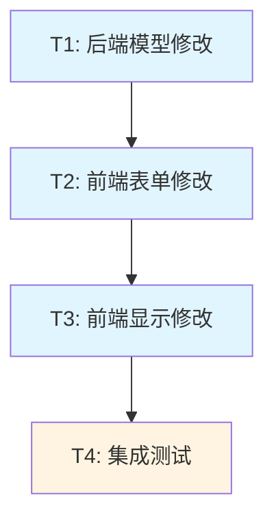

# 暂定项目功能 - 任务拆分文档

## 一、任务概览

### 1.1 任务依赖图



### 1.2 任务列表

| 任务ID | 任务名称 | 优先级 | 预计复杂度 | 依赖任务 |
|--------|---------|--------|-----------|---------|
| T1 | 后端模型修改 | P0 | 低 | 无 |
| T2 | 前端表单修改 | P0 | 低 | T1 |
| T3 | 前端显示修改 | P0 | 低 | T2 |
| T4 | 集成测试 | P0 | 中 | T3 |

## 二、任务详细说明

### T1: 后端模型修改

#### 输入契约
- **前置依赖**：无
- **输入数据**：现有项目模型代码
- **环境依赖**：Python 3.8+

#### 输出契约
- **输出数据**：修改后的项目模型
- **交付物**：
  - `backend/models/project.py`（已修改）
- **验收标准**：
  1. ✅ `__init__` 方法包含 `isPending` 参数，默认值 `False`
  2. ✅ `to_dict` 方法输出 `isPending` 字段
  3. ✅ `from_dict` 方法读取 `isPending` 字段，默认 `False`
  4. ✅ `update` 方法的 `allowed_fields` 包含 `isPending`
  5. ✅ 代码包含完整注释
  6. ✅ 旧数据兼容性测试通过

#### 实现约束
- **技术栈**：Python
- **代码规范**：遵循现有代码风格
- **质量要求**：
  - 所有方法添加注释
  - 兼容旧数据（无 `isPending` 字段）

#### 实现步骤
1. 修改 `__init__` 方法，增加 `isPending` 参数
2. 在 `__init__` 方法中设置 `self.isPending = isPending`
3. 修改 `to_dict` 方法，增加 `'isPending': self.isPending`
4. 修改 `from_dict` 方法，增加 `isPending=data.get('isPending', False)`
5. 修改 `update` 方法，在 `allowed_fields` 中增加 `'isPending'`
6. 添加注释说明新字段

#### 测试用例
```python
# 测试1：创建项目时设置isPending
project = Project(
    name="测试项目",
    productLineId="pl-001",
    ownerId="owner-001",
    startDate="2025-01-01",
    endDate="2025-03-31",
    status="开发",
    isPending=True
)
assert project.isPending == True

# 测试2：创建项目时不设置isPending
project = Project(
    name="测试项目",
    productLineId="pl-001",
    ownerId="owner-001",
    startDate="2025-01-01",
    endDate="2025-03-31",
    status="开发"
)
assert project.isPending == False

# 测试3：from_dict读取旧数据
data = {
    'name': '测试项目',
    'productLineId': 'pl-001',
    'ownerId': 'owner-001',
    'startDate': '2025-01-01',
    'endDate': '2025-03-31',
    'status': '开发'
    # 注意：没有isPending字段
}
project = Project.from_dict(data)
assert project.isPending == False

# 测试4：update方法更新isPending
project.update(isPending=True)
assert project.isPending == True
```

---

### T2: 前端表单修改

#### 输入契约
- **前置依赖**：T1完成
- **输入数据**：现有项目表单代码
- **环境依赖**：Node.js 16+, React 18

#### 输出契约
- **输出数据**：修改后的项目表单
- **交付物**：
  - `frontend/src/components/ProjectModal.jsx`（已修改）
- **验收标准**：
  1. ✅ 表单包含暂定复选框
  2. ✅ 复选框位置在项目状态字段之后
  3. ✅ 复选框标签为「暂定」
  4. ✅ 新建模式默认不勾选
  5. ✅ 编辑模式正确回显
  6. ✅ 提交时包含 `isPending` 字段
  7. ✅ 代码包含完整注释

#### 实现约束
- **技术栈**：React, Ant Design
- **组件**：Ant Design Checkbox
- **代码规范**：遵循现有代码风格
- **质量要求**：
  - 添加注释说明新字段
  - 使用 `valuePropName="checked"`

#### 实现步骤
1. 导入 Checkbox 组件（如果未导入）
2. 在项目状态字段后添加暂定字段
3. 配置 Form.Item：
   - name: "isPending"
   - label: "暂定"
   - valuePropName: "checked"
4. 修改编辑模式回显逻辑，增加 `isPending` 字段
5. 修改提交逻辑，增加 `isPending` 字段
6. 添加注释

#### 代码示例
```jsx
import { Checkbox } from 'antd'

// 在表单中添加
<Form.Item
  label="暂定"
  name="isPending"
  valuePropName="checked"
  tooltip="勾选表示项目计划尚未确定"
>
  <Checkbox>项目计划暂未确定</Checkbox>
</Form.Item>

// 编辑模式回显
form.setFieldsValue({
  // ... 其他字段
  isPending: editingProject.isPending || false
})

// 提交数据
const projectData = {
  // ... 其他字段
  isPending: values.isPending || false
}
```

#### 测试用例
1. 新建项目，验证复选框默认不勾选
2. 勾选复选框，提交表单，验证数据包含 `isPending: true`
3. 编辑暂定项目，验证复选框正确勾选
4. 编辑非暂定项目，验证复选框不勾选
5. 取消勾选，提交表单，验证数据包含 `isPending: false`

---

### T3: 前端显示修改

#### 输入契约
- **前置依赖**：T2完成
- **输入数据**：现有项目块渲染代码
- **环境依赖**：Node.js 16+, React 18

#### 输出契约
- **输出数据**：修改后的项目块组件
- **交付物**：
  - `frontend/src/components/Timeline/ProjectBar.jsx`（已修改）
- **验收标准**：
  1. ✅ 暂定项目显示虚线边框
  2. ✅ 非暂定项目显示实线边框
  3. ✅ 暂停状态项目显示实线边框（不再是虚线）
  4. ✅ 填充颜色逻辑保持不变
  5. ✅ 进度看板和人员看板都正确显示
  6. ✅ 代码包含完整注释

#### 实现约束
- **技术栈**：React
- **代码规范**：遵循现有代码风格
- **质量要求**：
  - 添加注释说明逻辑变更
  - 保持填充颜色逻辑不变

#### 实现步骤
1. 移除原有的 `isPaused` 虚线逻辑
2. 添加 `isPending` 虚线逻辑
3. 保持填充颜色逻辑不变
4. 更新注释
5. 移除不再使用的 CSS 类（如 `project-bar-paused`）

#### 代码示例
```jsx
function ProjectBar({ project, timelineParams, row, onEdit, boardType, owners }) {
  // 计算位置和颜色（保持不变）
  const { left, width } = calculateProjectBarPosition(project, timelineParams)
  
  let color
  if (boardType === BOARD_TYPES.OWNER) {
    const owner = owners.find(o => o.id === project.ownerId)
    color = owner?.color || '#999'
  } else {
    color = STATUS_COLORS[project.status] || '#999'
  }
  
  // 边框样式：暂定项目使用虚线
  const isPending = project.isPending || false
  const borderStyle = isPending ? 'dashed' : 'solid'
  
  // 填充颜色：暂停状态特殊处理
  const isPaused = project.status === '暂停'
  const backgroundColor = isPaused ? '#f5f5f5' : color
  
  const top = PROJECT_BAR_MARGIN + row * (PROJECT_BAR_HEIGHT + PROJECT_BAR_MARGIN)

  return (
    <div
      className="project-bar"
      style={{
        left: `${left}px`,
        width: `${width}px`,
        top: `${top}px`,
        backgroundColor: backgroundColor,
        borderColor: color,
        borderStyle: borderStyle
      }}
      onClick={() => onEdit(project)}
      title={`${project.name}\n${project.startDate} ~ ${project.endDate}\n状态: ${project.status}${isPending ? '\n(暂定)' : ''}`}
    >
      <div className="project-bar-content">
        <span className="project-name">{project.name}</span>
        <span className="project-dates">
          {project.startDate} ~ {project.endDate}
        </span>
      </div>
    </div>
  )
}
```

#### 测试用例
1. 创建暂定项目（状态：开发），验证虚线边框 + 橙色填充
2. 创建暂定项目（状态：暂停），验证虚线边框 + 灰色填充
3. 创建非暂定项目（状态：暂停），验证实线边框 + 灰色填充
4. 创建非暂定项目（状态：开发），验证实线边框 + 橙色填充
5. 在人员看板查看暂定项目，验证虚线边框 + 人员颜色
6. 编辑项目设置为暂定，验证边框变为虚线
7. 编辑项目取消暂定，验证边框变为实线

---

### T4: 集成测试

#### 输入契约
- **前置依赖**：T1, T2, T3完成
- **输入数据**：完整的功能实现
- **环境依赖**：完整的开发环境

#### 输出契约
- **输出数据**：测试报告
- **交付物**：
  - 测试报告文档
  - 截图（如需要）
- **验收标准**：
  1. ✅ 所有测试场景通过
  2. ✅ 旧数据兼容性验证通过
  3. ✅ 两种看板都正确显示
  4. ✅ 无回归问题

#### 实现约束
- **测试方法**：手动测试
- **测试工具**：浏览器开发者工具
- **质量要求**：
  - 覆盖所有测试场景
  - 记录测试结果

#### 测试场景清单

**场景1：新建暂定项目**
- 操作：新建项目，勾选暂定，状态选择"开发"
- 预期：项目块显示虚线边框 + 橙色填充
- 结果：[ ] 通过 / [ ] 失败

**场景2：编辑为暂定**
- 操作：编辑现有项目，勾选暂定
- 预期：项目块变为虚线边框
- 结果：[ ] 通过 / [ ] 失败

**场景3：取消暂定**
- 操作：编辑暂定项目，取消勾选
- 预期：项目块变为实线边框
- 结果：[ ] 通过 / [ ] 失败

**场景4：暂定+开发状态**
- 操作：暂定项目，状态为开发
- 预期：虚线边框 + 橙色填充
- 结果：[ ] 通过 / [ ] 失败

**场景5：暂定+暂停状态**
- 操作：暂定项目，状态为暂停
- 预期：虚线边框 + 灰色填充
- 结果：[ ] 通过 / [ ] 失败

**场景6：非暂定+暂停状态**
- 操作：非暂定项目，状态为暂停
- 预期：实线边框 + 灰色填充
- 结果：[ ] 通过 / [ ] 失败

**场景7：人员看板显示**
- 操作：切换到人员看板，查看暂定项目
- 预期：虚线边框 + 人员颜色
- 结果：[ ] 通过 / [ ] 失败

**场景8：旧数据兼容**
- 操作：查看现有项目（无isPending字段）
- 预期：显示实线边框（默认不暂定）
- 结果：[ ] 通过 / [ ] 失败

**场景9：表单回显**
- 操作：编辑暂定项目
- 预期：复选框正确勾选
- 结果：[ ] 通过 / [ ] 失败

**场景10：表单默认值**
- 操作：新建项目
- 预期：复选框默认不勾选
- 结果：[ ] 通过 / [ ] 失败

#### 回归测试清单

**功能回归**
- [ ] 项目创建功能正常
- [ ] 项目编辑功能正常
- [ ] 项目删除功能正常
- [ ] 产品线筛选功能正常
- [ ] 时间轴显示功能正常
- [ ] 人员看板功能正常

**性能回归**
- [ ] 页面加载速度正常
- [ ] 项目块渲染流畅
- [ ] 表单操作响应及时

## 三、实施顺序

### 3.1 开发阶段
1. **第一步**：执行 T1（后端模型修改）
2. **第二步**：执行 T2（前端表单修改）
3. **第三步**：执行 T3（前端显示修改）
4. **第四步**：执行 T4（集成测试）

### 3.2 验证阶段
1. 每完成一个任务，立即验证该任务的验收标准
2. 所有任务完成后，执行完整的集成测试
3. 记录测试结果

## 四、风险控制

### 4.1 技术风险
- **风险**：旧数据兼容性问题
- **缓解**：使用默认值处理，充分测试

### 4.2 进度风险
- **风险**：任务依赖导致阻塞
- **缓解**：按顺序执行，及时沟通

## 五、交付清单

### 5.1 代码交付
- [ ] `backend/models/project.py`（已修改）
- [ ] `frontend/src/components/ProjectModal.jsx`（已修改）
- [ ] `frontend/src/components/Timeline/ProjectBar.jsx`（已修改）

### 5.2 文档交付
- [ ] ACCEPTANCE 文档（验收记录）
- [ ] 测试报告（如需要）
- [ ] FINAL 文档（最终报告）

## 六、文档版本

- **创建时间**：2025-10-20
- **创建人**：Cline AI
- **版本**：v1.0
- **状态**：待审核
- **依赖文档**：
  - ALIGNMENT_暂定项目功能.md
  - CONSENSUS_暂定项目功能.md
  - DESIGN_暂定项目功能.md
