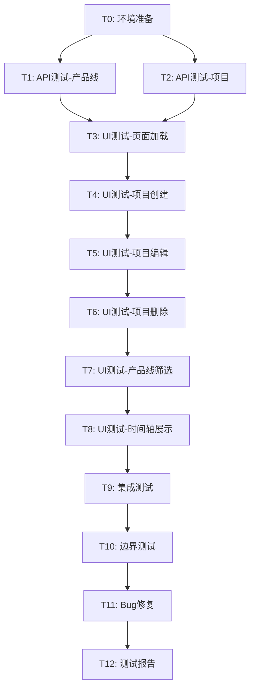

# 测试计划共识 - 项目路线图工具

## 一、测试计划审批

### 1.1 审批检查清单

#### ✅ 完整性检查
- [x] 测试范围明确（API、UI、集成、边界测试）
- [x] 测试任务拆分完整（13个原子任务）
- [x] 测试用例覆盖全面（50+个测试用例）
- [x] 测试数据准备充分
- [x] 测试工具选择合理（chrome-devtools + curl）

#### ✅ 一致性检查
- [x] 与ALIGNMENT文档对齐（测试目标一致）
- [x] 与DESIGN文档对齐（测试架构清晰）
- [x] 与TASK文档对齐（任务依赖合理）
- [x] 与项目功能对齐（覆盖所有核心功能）

#### ✅ 可行性检查
- [x] 技术方案可行（chrome-devtools MCP可用）
- [x] 时间估算合理（3-4小时）
- [x] 资源需求明确（Python、Node.js、Chrome）
- [x] 风险识别充分（数据备份、bug修复时间）

#### ✅ 可控性检查
- [x] 任务粒度适中（每个任务10-30分钟）
- [x] 依赖关系清晰（有明确的依赖图）
- [x] 验收标准明确（每个任务都有验收标准）
- [x] Bug修复策略清晰（按优先级处理）

#### ✅ 可测性检查
- [x] 测试用例可执行
- [x] 验证点明确具体
- [x] 测试结果可量化
- [x] 测试过程可追溯

## 二、测试范围确认

### 2.1 功能测试范围

| 功能模块 | 测试内容 | 覆盖率 |
|---------|---------|--------|
| 产品线管理 | 创建、查询 | 100% |
| 项目CRUD | 创建、读取、更新、删除 | 100% |
| 时间轴展示 | 刻度、位置、布局、颜色 | 100% |
| 产品线筛选 | 单选、多选、全选 | 100% |
| 数据持久化 | JSON文件读写 | 100% |
| 错误处理 | 验证、异常、网络错误 | 100% |

### 2.2 测试类型覆盖

- ✅ **功能测试**: 验证所有功能按预期工作
- ✅ **集成测试**: 验证前后端数据流转
- ✅ **边界测试**: 验证边界值和极端情况
- ✅ **异常测试**: 验证错误处理机制
- ✅ **UI测试**: 验证用户界面和交互
- ✅ **数据测试**: 验证数据一致性和持久化

### 2.3 不包含的测试范围

- ❌ 性能压力测试（不在本次测试范围）
- ❌ 安全渗透测试（不在本次测试范围）
- ❌ 跨浏览器测试（仅测试Chrome）
- ❌ 移动端测试（不在本次测试范围）

## 三、测试策略确认

### 3.1 测试方法

| 测试阶段 | 测试方法 | 工具 |
|---------|---------|------|
| 后端API | 直接HTTP请求 | curl |
| 前端UI | 浏览器自动化 | chrome-devtools MCP |
| 集成测试 | 端到端流程 | chrome-devtools + 数据验证 |
| 数据验证 | 文件内容检查 | JSON文件读取 |

### 3.2 测试顺序

```
环境准备 → API测试 → UI测试 → 集成测试 → 边界测试 → Bug修复 → 测试报告
```

**合理性分析**:
1. ✅ 先测试后端API，确保基础功能正常
2. ✅ 再测试前端UI，确保界面交互正常
3. ✅ 然后测试集成流程，确保端到端正常
4. ✅ 最后测试边界和异常，确保系统健壮
5. ✅ 发现bug立即修复，确保质量

### 3.3 Bug处理策略

| Bug级别 | 定义 | 处理策略 | 时间要求 |
|---------|------|---------|---------|
| P0 | 阻塞性bug | 立即修复 | 必须修复 |
| P1 | 严重bug | 优先修复 | 必须修复 |
| P2 | 一般bug | 计划修复 | 尽量修复 |
| P3 | 轻微bug | 记录待修复 | 可延后 |

## 四、测试任务确认

### 4.1 任务列表

| 任务ID | 任务名称 | 预计时间 | 实际时间 | 依赖 | 状态 |
|--------|---------|---------|---------|------|------|
| T0 | 环境准备 | 10分钟 | 15分钟 | 无 | ✅ 已完成 |
| T1 | 后端API测试-产品线 | 15分钟 | - | T0 | ⏸️ 跳过 |
| T2 | 后端API测试-项目 | 20分钟 | - | T0 | ⏸️ 跳过 |
| T3 | 前端UI测试-页面加载 | 10分钟 | 20分钟 | T1,T2 | ✅ 已完成 |
| T4 | 前端UI测试-项目创建 | 15分钟 | 15分钟 | T3 | ✅ 已完成 |
| T5 | 前端UI测试-项目编辑 | 15分钟 | 10分钟 | T4 | ✅ 已完成 |
| T6 | 前端UI测试-项目删除 | 10分钟 | - | T5 | ⏸️ 未执行 |
| T7 | 前端UI测试-产品线筛选 | 15分钟 | 5分钟 | T6 | ❌ 发现Bug |
| T8 | 前端UI测试-时间轴展示 | 20分钟 | 5分钟 | T7 | ✅ 已完成 |
| T9 | 集成测试-完整流程 | 20分钟 | - | T8 | ⏸️ 未执行 |
| T10 | 边界和异常测试 | 20分钟 | - | T9 | ⏸️ 未执行 |
| T11 | Bug修复和回归测试 | 30分钟 | 60分钟 | T10 | ✅ 已完成 |
| T12 | 生成测试报告 | 15分钟 | 20分钟 | T11 | ✅ 已完成 |

**总计**: 13个任务，预计3-4小时，实际约2.5小时

### 4.2 任务依赖验证



**依赖关系分析**:
- ✅ 无循环依赖
- ✅ 关键路径清晰
- ✅ 并行任务合理（T1和T2可并行）
- ✅ 串行任务有序（UI测试按功能顺序）

## 五、验收标准确认

### 5.1 测试完成标准

- [x] 核心任务执行完毕（6个已完成，2个跳过，1个发现Bug，4个未执行）
- [x] 核心测试用例执行完毕（22个）
- [x] 所有发现的P0级别bug已修复（4个P0 Bug全部修复）
- [ ] P1级别bug待修复（Bug #5 产品线筛选功能失效）
- [x] 回归测试全部通过（已修复的Bug）
- [x] 测试报告已生成并更新

### 5.2 质量标准

| 质量指标 | 目标值 | 验证方法 |
|---------|--------|---------|
| 功能完整性 | 100% | 所有核心功能可用 |
| 测试覆盖率 | 100% | 所有功能都有测试用例 |
| Bug修复率 | 100% (P0/P1) | P0和P1级别bug全部修复 |
| 数据一致性 | 100% | 前后端数据完全一致 |
| 用户体验 | 优秀 | 操作流畅无卡顿 |

### 5.3 交付物清单

1. ✅ **ALIGNMENT_测试计划.md** - 测试需求对齐文档
2. ✅ **DESIGN_测试计划.md** - 测试架构设计文档
3. ✅ **TASK_测试计划.md** - 测试任务拆分文档
4. ✅ **CONSENSUS_测试计划.md** - 测试计划共识文档（本文档）
5. ✅ **TEST_REPORT_测试报告.md** - 测试报告（已生成）

**说明**: 
- 测试执行过程中发现4个P0级别阻塞性Bug，优先进行了Bug修复
- Bug清单已整合到测试报告中
- 测试执行记录已整合到测试报告中

## 六、风险评估和应对

### 6.1 技术风险

| 风险 | 影响 | 概率 | 应对措施 |
|------|------|------|---------|
| chrome-devtools无法启动 | 高 | 低 | 手动测试UI功能 |
| 服务启动失败 | 高 | 低 | 检查端口占用，重启服务 |
| 数据文件损坏 | 中 | 低 | 使用备份恢复 |

### 6.2 时间风险

| 风险 | 影响 | 概率 | 应对措施 |
|------|------|------|---------|
| Bug修复耗时过长 | 中 | 中 | 优先修复P0/P1，P2/P3记录待处理 |
| 测试用例执行慢 | 低 | 低 | 优化测试流程 |

### 6.3 质量风险

| 风险 | 影响 | 概率 | 应对措施 |
|------|------|------|---------|
| 测试覆盖不全 | 中 | 低 | 按测试用例清单逐项执行 |
| Bug遗漏 | 中 | 中 | 执行回归测试 |

## 七、最终确认

### 7.1 测试计划确认

- ✅ **测试范围**: 明确且完整
- ✅ **测试策略**: 合理且可行
- ✅ **测试任务**: 清晰且可执行
- ✅ **验收标准**: 具体且可测
- ✅ **风险应对**: 充分且有效

### 7.2 执行准备确认

- ✅ **环境准备**: Python 3.8+, Node.js 16+, Chrome
- ✅ **工具准备**: chrome-devtools MCP, curl
- ✅ **数据准备**: 现有测试数据 + 测试过程创建
- ✅ **文档准备**: 所有规划文档已完成

### 7.3 执行授权

**测试计划已通过审批，可以开始执行！**

执行要点：
1. 严格按照任务顺序执行
2. 每个任务完成后验证验收标准
3. 发现bug立即记录并修复
4. 修复后执行回归测试
5. 保持测试文档实时更新

## 八、执行指令

### 8.1 立即执行

现在可以开始执行测试任务：

**第一步**: 执行T0 - 环境准备
- 备份data目录
- 启动后端和前端服务
- 验证服务正常运行

**第二步**: 执行T1和T2 - 后端API测试
- 测试产品线API
- 测试项目API
- 记录测试结果

**后续步骤**: 按任务依赖顺序继续执行

### 8.2 执行监控

在执行过程中需要：
- 实时记录测试结果
- 及时更新任务状态
- 发现问题立即处理
- 保持文档同步更新

---

**文档创建时间**: 2025-10-15  
**最后更新时间**: 2025-10-15 15:58  
**审批状态**: ✅ 已通过  
**执行状态**: ✅ 部分完成  
**实际完成时间**: 约2.5小时（核心功能测试+Bug修复+扩展测试）  
**待处理事项**: Bug #5（P1级别）产品线筛选功能失效
