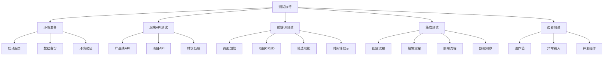
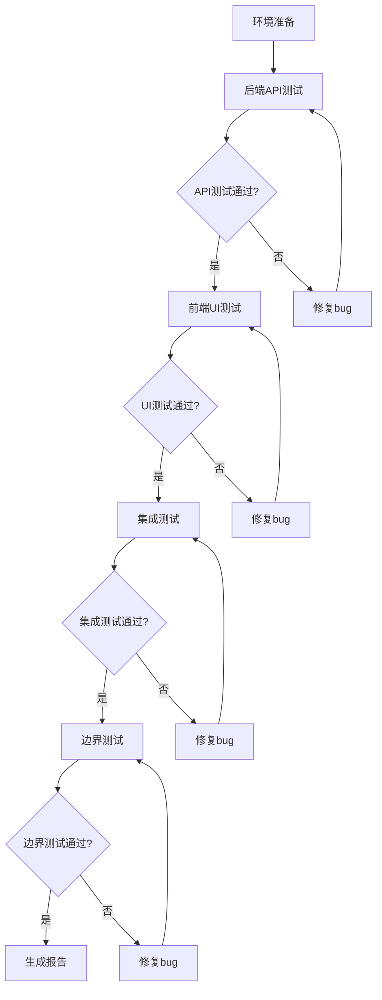
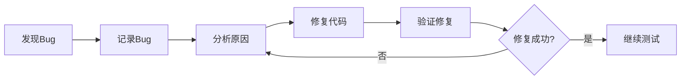

# 测试设计 - 项目路线图工具

## 一、测试架构设计

### 1.1 整体测试架构



### 1.2 测试分层

```
┌─────────────────────────────────────┐
│      UI层测试 (Chrome DevTools)      │
│  - 页面交互                          │
│  - 组件渲染                          │
│  - 用户体验                          │
└─────────────────────────────────────┘
                 ↓
┌─────────────────────────────────────┐
│      集成层测试                      │
│  - 前后端数据流                      │
│  - API调用                           │
│  - 状态同步                          │
└─────────────────────────────────────┘
                 ↓
┌─────────────────────────────────────┐
│      API层测试 (curl/直接访问)       │
│  - 接口功能                          │
│  - 数据验证                          │
│  - 错误处理                          │
└─────────────────────────────────────┘
                 ↓
┌─────────────────────────────────────┐
│      数据层测试                      │
│  - 文件读写                          │
│  - 数据持久化                        │
│  - 并发控制                          │
└─────────────────────────────────────┘
```

## 二、测试模块设计

### 2.1 后端API测试模块

#### 2.1.1 产品线API测试

**测试接口**:
- GET /api/productlines - 获取所有产品线
- POST /api/productlines - 创建产品线

**测试用例**:
1. 获取产品线列表（空数据）
2. 创建新产品线（正常）
3. 创建产品线（缺少name字段）
4. 创建产品线（name为空字符串）
5. 创建产品线（name超长）
6. 获取产品线列表（有数据）

#### 2.1.2 项目API测试

**测试接口**:
- GET /api/projects - 获取所有项目
- GET /api/projects/:id - 获取单个项目
- POST /api/projects - 创建项目
- PUT /api/projects/:id - 更新项目
- DELETE /api/projects/:id - 删除项目

**测试用例**:
1. 获取项目列表（空数据）
2. 创建项目（正常）
3. 创建项目（各字段边界值）
4. 创建项目（缺少必填字段）
5. 创建项目（日期范围错误）
6. 获取单个项目（存在）
7. 获取单个项目（不存在）
8. 更新项目（正常）
9. 更新项目（不存在的ID）
10. 删除项目（存在）
11. 删除项目（不存在）

### 2.2 前端UI测试模块

#### 2.2.1 页面加载测试

**测试场景**:
1. 首次加载页面
2. 页面元素完整性检查
3. 初始数据加载

**验证点**:
- 页面标题正确
- 主要组件渲染
- 数据正确显示

#### 2.2.2 项目创建测试

**测试场景**:
1. 点击"新建项目"按钮
2. 填写表单（正常数据）
3. 提交表单
4. 验证项目出现在时间轴

**验证点**:
- 模态框正确打开
- 表单验证生效
- 数据提交成功
- UI更新正确

#### 2.2.3 项目编辑测试

**测试场景**:
1. 点击时间轴上的项目块
2. 修改项目信息
3. 保存修改
4. 验证更新生效

**验证点**:
- 编辑模态框正确打开
- 原数据正确回填
- 修改保存成功
- UI更新正确

#### 2.2.4 项目删除测试

**测试场景**:
1. 打开项目编辑
2. 点击删除按钮
3. 确认删除
4. 验证项目消失

**验证点**:
- 删除确认提示
- 删除操作成功
- UI更新正确

#### 2.2.5 产品线筛选测试

**测试场景**:
1. 点击产品线筛选器
2. 选择/取消选择产品线
3. 验证时间轴更新

**验证点**:
- 筛选器交互正常
- 时间轴正确过滤
- 全选/取消全选功能

#### 2.2.6 时间轴展示测试

**测试场景**:
1. 验证时间轴刻度正确
2. 验证项目块位置正确
3. 验证重叠项目排列
4. 验证状态颜色映射

**验证点**:
- 月份刻度准确
- 项目块宽度和位置
- 多行排列正确
- 颜色符合状态

### 2.3 集成测试模块

#### 2.3.1 完整创建流程

**测试步骤**:
1. 前端点击新建
2. 填写表单
3. 提交到后端
4. 后端保存数据
5. 前端刷新显示

**验证点**:
- 端到端流程顺畅
- 数据一致性
- 错误处理正确

#### 2.3.2 完整编辑流程

**测试步骤**:
1. 前端点击项目
2. 修改数据
3. 提交到后端
4. 后端更新数据
5. 前端刷新显示

**验证点**:
- 数据正确传递
- 更新操作成功
- UI同步更新

#### 2.3.3 完整删除流程

**测试步骤**:
1. 前端点击删除
2. 确认操作
3. 后端删除数据
4. 前端移除显示

**验证点**:
- 删除操作成功
- 数据文件更新
- UI正确响应

### 2.4 边界和异常测试模块

#### 2.4.1 边界值测试

**测试场景**:
1. 项目名称长度边界（0, 1, 100, 101字符）
2. 日期范围边界（同一天、跨年、超长时间）
3. 空数据场景
4. 大量数据场景

#### 2.4.2 异常输入测试

**测试场景**:
1. 特殊字符输入
2. SQL注入尝试
3. XSS攻击尝试
4. 无效日期格式

#### 2.4.3 网络异常测试

**测试场景**:
1. 后端服务未启动
2. API请求超时
3. 网络中断

## 三、测试数据设计

### 3.1 测试数据集

#### 产品线测试数据
```json
{
  "valid": [
    {"name": "测试产品线A"},
    {"name": "测试产品线B"},
    {"name": "测试产品线C"}
  ],
  "invalid": [
    {"name": ""},
    {"name": "a".repeat(101)},
    {}
  ]
}
```

#### 项目测试数据
```json
{
  "valid": [
    {
      "name": "测试项目1",
      "productLineId": "pl-test-001",
      "startDate": "2025-01-01",
      "endDate": "2025-03-31",
      "status": "开发"
    }
  ],
  "boundary": [
    {
      "name": "a",
      "startDate": "2025-01-01",
      "endDate": "2025-01-01"
    },
    {
      "name": "a".repeat(100),
      "startDate": "2025-01-01",
      "endDate": "2026-12-31"
    }
  ],
  "invalid": [
    {
      "name": "",
      "startDate": "2025-01-01",
      "endDate": "2024-12-31"
    }
  ]
}
```

### 3.2 测试环境数据

**初始状态**:
- 2个产品线
- 3个项目
- 覆盖不同状态
- 覆盖时间重叠场景

## 四、测试工具和方法

### 4.1 工具选择

| 测试类型 | 工具 | 用途 |
|---------|------|------|
| API测试 | curl | 直接测试后端接口 |
| UI测试 | chrome-devtools MCP | 浏览器自动化测试 |
| 数据验证 | JSON文件检查 | 验证数据持久化 |
| 日志分析 | 控制台输出 | 错误追踪 |

### 4.2 测试方法

#### API测试方法
```bash
# 示例：测试获取产品线
curl -X GET http://localhost:5000/api/productlines

# 示例：测试创建项目
curl -X POST http://localhost:5000/api/projects \
  -H "Content-Type: application/json" \
  -d '{"name":"测试项目","productLineId":"pl-001","startDate":"2025-01-01","endDate":"2025-03-31","status":"开发"}'
```

#### UI测试方法
```javascript
// 使用chrome-devtools MCP
1. launch - 启动浏览器
2. take_snapshot - 获取页面快照
3. click - 点击元素
4. fill - 填写表单
5. take_screenshot - 截图验证
6. list_console_messages - 检查错误
```

## 五、测试执行流程

### 5.1 测试前准备


### 5.2 测试执行顺序



### 5.3 Bug修复流程



## 六、测试验收标准

### 6.1 功能验收标准

| 功能模块 | 验收标准 |
|---------|---------|
| 产品线管理 | 创建、查询功能正常 |
| 项目CRUD | 增删改查全部正常 |
| 时间轴展示 | 显示准确、布局正确 |
| 产品线筛选 | 筛选功能正常 |
| 数据持久化 | 数据正确保存到文件 |

### 6.2 质量验收标准

- **功能完整性**: 100%核心功能可用
- **数据一致性**: 前后端数据完全一致
- **错误处理**: 所有异常都有友好提示
- **用户体验**: 操作流畅无卡顿

### 6.3 Bug严重级别

| 级别 | 定义 | 处理策略 |
|-----|------|---------|
| P0 | 阻塞性bug，核心功能不可用 | 立即修复 |
| P1 | 严重bug，影响主要功能 | 优先修复 |
| P2 | 一般bug，影响次要功能 | 计划修复 |
| P3 | 轻微bug，不影响使用 | 记录待修复 |

## 七、测试输出

### 7.1 测试文档

1. **TASK_测试计划.md** - 测试任务拆分
2. **EXECUTION_测试计划.md** - 测试执行记录
3. **BUGS_测试计划.md** - Bug清单
4. **REPORT_测试计划.md** - 测试报告

### 7.2 测试数据

1. 测试前数据备份
2. 测试过程数据快照
3. 测试后数据状态

### 7.3 测试截图

1. 关键功能截图
2. Bug复现截图
3. 修复后验证截图

---

**文档创建时间**: 2025-10-15  
**设计版本**: v1.0  
**测试工具**: chrome-devtools MCP + curl
