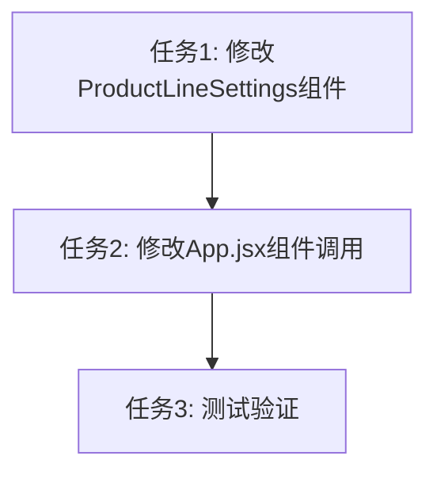

# 阶段3: Atomize - 任务拆分

## 任务概述
将移除产品线显示设置筛选项的工作拆分为可独立执行和验证的原子任务。

## 任务依赖关系图

## 原子任务列表

### 任务1: 修改ProductLineSettings组件

#### 输入契约
- **前置依赖**: 无
- **输入数据**: 
  - 现有的ProductLineSettings.jsx文件
  - STATUS_COLORS和PROJECT_STATUSES常量
- **环境依赖**: 
  - React开发环境
  - Ant Design组件库

#### 实现内容
1. **简化Props定义**
   - 移除`productLines` prop
   - 移除`selectedProductLines` prop
   - 移除`onSelectionChange` prop
   - 保留`onOpenManagement` prop

2. **移除未使用的函数**
   - 移除`handleSelectAll`函数
   - 移除`handleProductLineChange`函数

3. **移除未使用的变量**
   - 移除`isAllSelected`变量
   - 移除`isIndeterminate`变量

4. **简化JSX结构**
   - 保留"管理产品线"按钮
   - 移除"产品线显示设置"区域（包含全选和复选框列表）
   - 保留Card容器和"状态图例"

5. **更新组件注释**
   - 更新组件顶部的JSDoc注释
   - 移除已删除功能的注释

#### 输出契约
- **输出数据**: 简化后的ProductLineSettings组件
- **交付物**: 
  - 修改后的ProductLineSettings.jsx文件
- **验收标准**:
  - ✅ 组件仅接收onOpenManagement prop
  - ✅ 组件仅显示"管理产品线"按钮和"状态图例"
  - ✅ 无未使用的代码和变量
  - ✅ 组件注释准确反映新功能
  - ✅ 代码格式符合项目规范

#### 实现约束
- **技术栈**: React + Ant Design
- **代码规范**: 遵循项目现有代码风格
- **质量要求**: 
  - 无ESLint警告
  - 代码简洁易读
  - 注释完整准确

#### 依赖关系
- **前置任务**: 无
- **后置任务**: 任务2（修改App.jsx）
- **并行任务**: 无

---

### 任务2: 修改App.jsx组件调用

#### 输入契约
- **前置依赖**: 任务1完成（ProductLineSettings组件已修改）
- **输入数据**: 
  - 现有的App.jsx文件
  - 修改后的ProductLineSettings组件
- **环境依赖**: 
  - React开发环境

#### 实现内容
1. **更新ProductLineSettings组件调用**
   - 移除`productLines`属性传递
   - 移除`selectedProductLines`属性传递
   - 移除`onSelectionChange`属性传递
   - 保留`onOpenManagement`属性传递

2. **保持其他代码不变**
   - 不修改状态定义
   - 不修改其他组件调用
   - 不修改事件处理函数

#### 输出契约
- **输出数据**: 更新后的App.jsx文件
- **交付物**: 
  - 修改后的App.jsx文件
- **验收标准**:
  - ✅ ProductLineSettings组件调用仅传递onOpenManagement prop
  - ✅ 其他代码保持不变
  - ✅ 无控制台警告或错误
  - ✅ 代码格式符合项目规范

#### 实现约束
- **技术栈**: React
- **代码规范**: 遵循项目现有代码风格
- **质量要求**: 
  - 无ESLint警告
  - 不影响其他功能

#### 依赖关系
- **前置任务**: 任务1（修改ProductLineSettings组件）
- **后置任务**: 任务3（测试验证）
- **并行任务**: 无

---

### 任务3: 测试验证

#### 输入契约
- **前置依赖**: 
  - 任务1完成（ProductLineSettings组件已修改）
  - 任务2完成（App.jsx已更新）
- **输入数据**: 
  - 修改后的所有文件
  - 现有的项目数据
- **环境依赖**: 
  - 开发服务器运行环境
  - 浏览器

#### 实现内容
1. **功能测试**
   - 验证"管理产品线"按钮显示和功能
   - 验证"状态图例"显示正确
   - 验证ProductLineManagement中的显示/隐藏功能
   - 验证时间轴根据设置正确显示产品线

2. **界面测试**
   - 验证左侧设置面板布局
   - 验证组件间距和样式
   - 验证无多余空白区域

3. **代码质量检查**
   - 检查控制台无错误或警告
   - 检查代码格式符合规范
   - 检查注释完整准确

#### 输出契约
- **输出数据**: 测试结果报告
- **交付物**: 
  - 功能验证确认
  - 界面验证确认
  - 代码质量确认
- **验收标准**:
  - ✅ 所有功能测试通过
  - ✅ 所有界面测试通过
  - ✅ 所有代码质量检查通过
  - ✅ 无遗留问题

#### 实现约束
- **测试方法**: 手动测试
- **测试环境**: 本地开发环境
- **质量要求**: 
  - 全面覆盖所有验收标准
  - 发现问题立即修复

#### 依赖关系
- **前置任务**: 任务1、任务2
- **后置任务**: 无
- **并行任务**: 无

---

## 任务执行顺序

1. **第一步**: 执行任务1 - 修改ProductLineSettings组件
2. **第二步**: 执行任务2 - 修改App.jsx组件调用
3. **第三步**: 执行任务3 - 测试验证

## 复杂度评估

| 任务 | 复杂度 | 预计时间 | 风险等级 |
|------|--------|----------|----------|
| 任务1 | 低 | 20分钟 | 低 |
| 任务2 | 低 | 5分钟 | 低 |
| 任务3 | 低 | 15分钟 | 低 |
| **总计** | **低** | **40分钟** | **低** |

## 质量保证

### 每个任务的质量门控
1. **任务1**: 
   - 组件代码无语法错误
   - Props定义正确
   - JSX结构简洁清晰

2. **任务2**: 
   - 组件调用正确
   - 无控制台警告

3. **任务3**: 
   - 所有验收标准通过
   - 无遗留问题

### 整体质量要求
- 代码符合项目规范
- 功能完整正确
- 界面美观合理
- 无技术债务

## 风险控制

### 任务1风险
- **风险**: Props定义错误
- **缓解**: 仔细检查Props定义和使用

### 任务2风险
- **风险**: 组件调用错误
- **缓解**: 对照任务1的Props定义进行修改

### 任务3风险
- **风险**: 测试不全面
- **缓解**: 按照验收标准逐项测试

## 总结
任务拆分清晰，每个任务都有明确的输入输出契约和验收标准。任务之间依赖关系简单，按顺序执行即可。整体复杂度低，风险可控，预计40分钟内完成。
