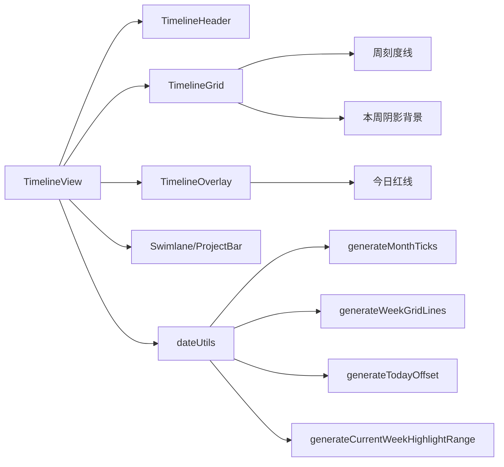
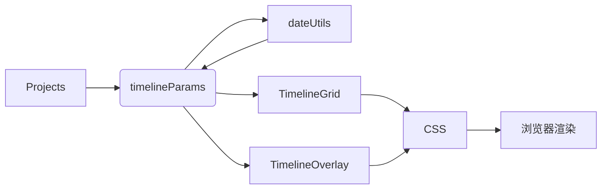

# 设计阶段（DESIGN）- 项目与人员看板定位增强

## 整体架构图

## 分层设计与核心组件
- TimelineView：容器，负责时间轴参数计算与滚动同步。
- TimelineGrid：背景层，渲染周刻度线与本周阴影。
- TimelineOverlay：叠加层，渲染今日红线，保证可见性。
- dateUtils：提供位置与范围计算，保证纯函数、可测试性。

## 模块依赖关系
- TimelineView 依赖 dateUtils 生成基础参数。
- TimelineGrid/Overlay 依赖 dateUtils 生成具体渲染位置。
- 样式 `timeline.css` 定义图层与颜色。

## 接口契约定义
- `generateTodayOffset(timelineParams)` -> `number|null`
- `generateCurrentWeekHighlightRange(timelineParams)` -> `{left:number, width:number}|null`

## 数据流向图

## 异常处理策略
- 今天/本周超出时间范围：返回 `null`，组件不渲染。
- 像素边界：对阴影进行边界裁剪避免越界。