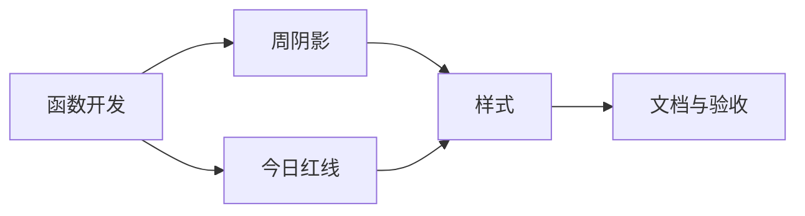

# 原子化阶段（TASK）- 项目与人员看板定位增强

## 原子任务拆分

### 任务1：新增日期工具函数
- 输入契约：`timelineParams` 包含 `minDate,maxDate,pixelsPerDay,totalWidth`
- 输出契约：`generateTodayOffset`、`generateCurrentWeekHighlightRange`
- 实现约束：纯函数、边界裁剪、中文函数注释
- 依赖关系：后置任务2/3

### 任务2：实现本周阴影背景
- 输入契约：函数返回 `{left,width}` 或 `null`
- 输出契约：在 `TimelineGrid` 渲染半透明阴影
- 实现约束：样式 `week-highlight`，不影响交互
- 依赖关系：前置任务1；并行任务3

### 任务3：实现今日红色指示线
- 输入契约：函数返回今日像素偏移或 `null`
- 输出契约：在 `TimelineOverlay` 渲染 `today-line`
- 实现约束：位于项目块之上；pointer-events: none
- 依赖关系：前置任务1；并行任务2

### 任务4：样式更新
- 输入契约：`timeline.css`
- 输出契约：新增 `.week-highlight`、`.timeline-overlay`、`.today-line`
- 实现约束：图层顺序正确，颜色按约定
- 依赖关系：任务2/3

### 任务5：文档与验收
- 输入契约：README 与 6A 文档模板
- 输出契约：更新记录、验收步骤与结果
- 实现约束：中文文档、结构完整
- 依赖关系：任务2/3/4

## 任务依赖图
