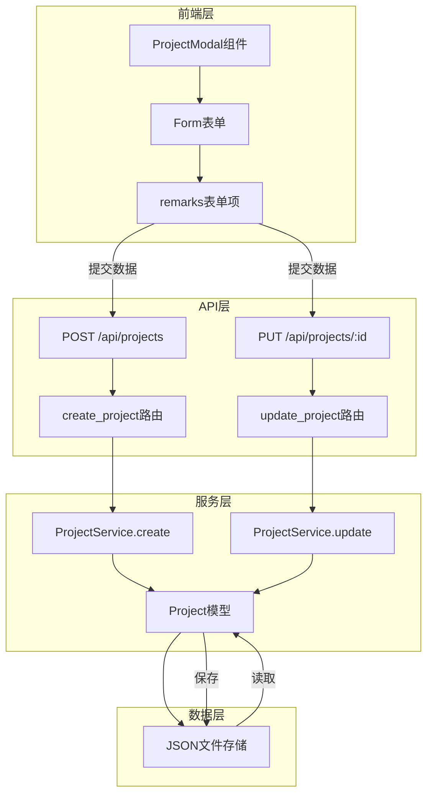
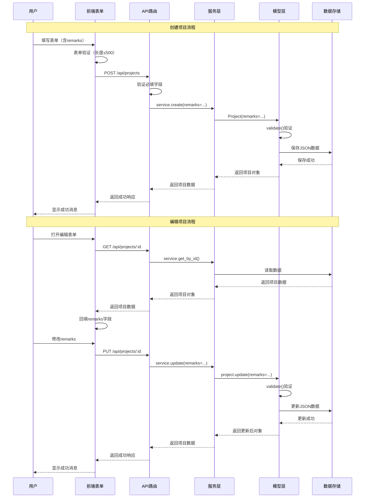
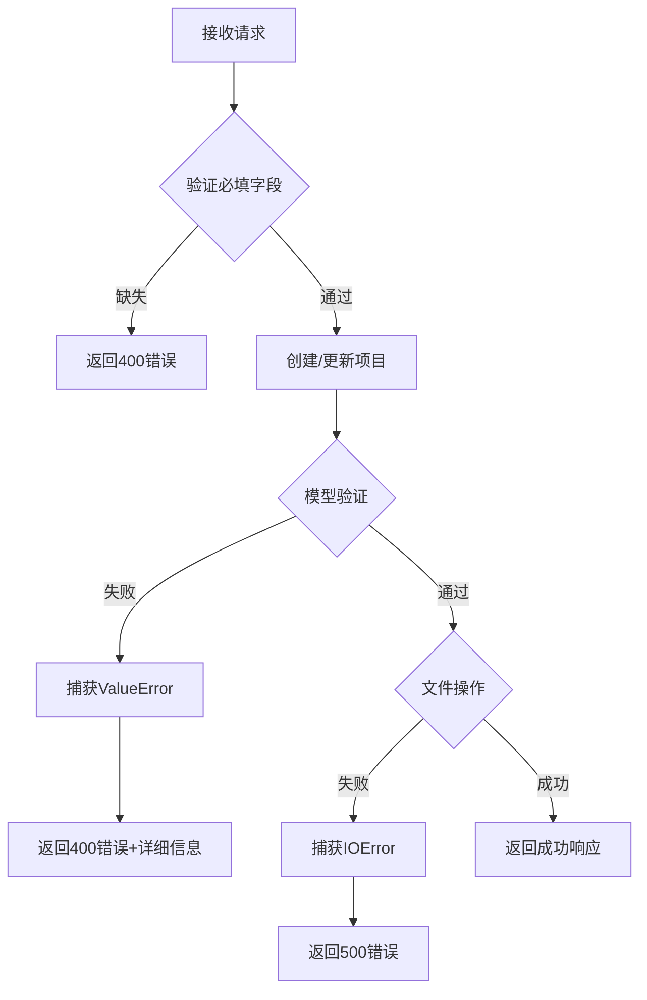

# 项目备注字段 - 设计文档

## 一、整体架构

### 1.1 架构图



### 1.2 数据流向



## 二、模块设计

### 2.1 后端模型层设计

#### 2.1.1 Project类结构

```python
class Project:
    """项目数据模型类"""
    
    # 类属性
    VALID_STATUSES = ['规划', '方案', '设计', '开发', '测试', '已上', '暂停']
    
    # 实例属性
    def __init__(self, name, productLineId, startDate, endDate, status,
                 ownerId=None, isPending=False, remarks='',  # 新增remarks
                 id=None, createdAt=None, updatedAt=None):
        self.id = id or self._generate_id()
        self.name = name
        self.productLineId = productLineId
        self.ownerId = ownerId
        self.isPending = isPending
        self.remarks = remarks  # 新增字段
        self.startDate = startDate
        self.endDate = endDate
        self.status = status
        self.createdAt = createdAt or self._get_current_timestamp()
        self.updatedAt = updatedAt or self._get_current_timestamp()
        self.validate()
```

#### 2.1.2 验证逻辑设计

```python
def validate(self):
    """验证项目数据的有效性"""
    
    # ... 现有验证逻辑
    
    # 新增：验证备注字段
    if self.remarks is not None and not isinstance(self.remarks, str):
        raise ValueError("备注必须是字符串类型")
    
    if self.remarks and len(self.remarks) > 500:
        raise ValueError("备注长度不能超过500个字符")
```

**验证规则表**：

| 字段 | 验证规则 | 错误信息 |
|------|---------|---------|
| 类型检查 | 必须是str类型 | "备注必须是字符串类型" |
| 长度检查 | 最大500字符 | "备注长度不能超过500个字符" |
| 非必填 | 可以为空字符串 | - |

#### 2.1.3 数据转换设计

```python
def to_dict(self):
    """将项目对象转换为字典"""
    return {
        'id': self.id,
        'name': self.name,
        'productLineId': self.productLineId,
        'ownerId': self.ownerId,
        'isPending': self.isPending,
        'remarks': self.remarks,  # 新增字段
        'startDate': self.startDate,
        'endDate': self.endDate,
        'status': self.status,
        'createdAt': self.createdAt,
        'updatedAt': self.updatedAt
    }

@classmethod
def from_dict(cls, data):
    """从字典创建项目对象"""
    return cls(
        name=data['name'],
        productLineId=data['productLineId'],
        startDate=data['startDate'],
        endDate=data['endDate'],
        status=data['status'],
        ownerId=data.get('ownerId'),
        isPending=data.get('isPending', False),
        remarks=data.get('remarks', ''),  # 新增，使用get兼容旧数据
        id=data.get('id'),
        createdAt=data.get('createdAt'),
        updatedAt=data.get('updatedAt')
    )
```

### 2.2 后端服务层设计

#### 2.2.1 ProjectService类修改

```python
class ProjectService:
    """项目服务类"""
    
    def create(self, name, productLineId, ownerId, startDate, endDate, 
               status, isPending=False, remarks=''):
        """
        创建新项目
        
        Args:
            name: 项目名称
            productLineId: 产品线ID
            ownerId: 负责人ID
            startDate: 开始日期
            endDate: 结束日期
            status: 项目状态
            isPending: 是否暂定（默认False）
            remarks: 备注（默认空字符串）  # 新增参数
            
        Returns:
            dict: 创建的项目数据
        """
        project = Project(
            name=name,
            productLineId=productLineId,
            ownerId=ownerId,
            startDate=startDate,
            endDate=endDate,
            status=status,
            isPending=isPending,
            remarks=remarks  # 新增参数传递
        )
        
        # ... 保存逻辑
        
        return project.to_dict()
```

### 2.3 后端路由层设计

#### 2.3.1 API接口规范

**创建项目接口**：

```
POST /api/projects
Content-Type: application/json

Request Body:
{
  "name": "项目名称",
  "productLineId": "pl-xxx",
  "ownerId": "owner-xxx",
  "startDate": "2025-01-01",
  "endDate": "2025-12-31",
  "status": "开发",
  "isPending": false,
  "remarks": "这是项目备注"  // 可选字段
}

Response (201):
{
  "success": true,
  "data": {
    "id": "proj-xxx",
    "name": "项目名称",
    // ... 其他字段
    "remarks": "这是项目备注"
  }
}
```

**更新项目接口**：

```
PUT /api/projects/:id
Content-Type: application/json

Request Body:
{
  "remarks": "更新后的备注"  // 仅更新remarks字段
}

Response (200):
{
  "success": true,
  "data": {
    "id": "proj-xxx",
    // ... 所有字段
    "remarks": "更新后的备注"
  }
}
```

#### 2.3.2 路由处理逻辑

```python
@projects_bp.route('/api/projects', methods=['POST'])
@handle_errors
def create_project():
    """创建新项目"""
    data = request.get_json()
    
    # 验证必需字段（remarks不在此列）
    required_fields = ['name', 'productLineId', 'ownerId', 
                       'startDate', 'endDate', 'status']
    for field in required_fields:
        if not data or field not in data:
            return jsonify({
                'success': False,
                'error': f'缺少必需字段: {field}'
            }), 400
    
    # 创建项目（remarks使用get方法，默认空字符串）
    project = service.create(
        name=data['name'],
        productLineId=data['productLineId'],
        ownerId=data['ownerId'],
        startDate=data['startDate'],
        endDate=data['endDate'],
        status=data['status'],
        isPending=data.get('isPending', False),
        remarks=data.get('remarks', '')  # 新增参数
    )
    
    return jsonify({
        'success': True,
        'data': project
    }), 201
```

### 2.4 前端组件设计

#### 2.4.1 组件结构

```javascript
function ProjectModal({ visible, onClose, onSuccess, editingProject, productLines }) {
  // 状态管理
  const [form] = Form.useForm()
  const [loading, setLoading] = useState(false)
  
  // 编辑模式判断
  const isEditMode = !!editingProject
  
  // 表单回填效果
  useEffect(() => {
    if (visible && editingProject) {
      form.setFieldsValue({
        // ... 其他字段
        remarks: editingProject.remarks || ''  // 新增字段回填
      })
    } else if (visible) {
      form.resetFields()
    }
  }, [visible, editingProject, form])
  
  // ... 其他逻辑
}
```

#### 2.4.2 表单项设计

```javascript
{/* 备注表单项 */}
<Form.Item
  label="备注"
  name="remarks"
  rules={[
    { max: 500, message: '备注不能超过500个字符' }
  ]}
>
  <Input.TextArea 
    placeholder="请输入项目备注（可选）" 
    rows={4}
    maxLength={500}
    showCount
    style={{ resize: 'vertical' }}
  />
</Form.Item>
```

**表单项配置**：

| 属性 | 值 | 说明 |
|------|-----|------|
| label | "备注" | 表单标签 |
| name | "remarks" | 字段名 |
| rules | [{ max: 500 }] | 验证规则 |
| rows | 4 | 显示行数 |
| maxLength | 500 | 最大长度 |
| showCount | true | 显示字符计数 |
| placeholder | "请输入项目备注（可选）" | 占位文本 |

#### 2.4.3 表单提交逻辑

```javascript
const handleSubmit = async () => {
  try {
    // 验证表单
    const values = await form.validateFields()
    
    setLoading(true)

    // 构建项目数据
    const projectData = {
      name: values.name.trim(),
      productLineId: values.productLineId,
      ownerId: values.ownerId,
      startDate: values.startDate.format('YYYY-MM-DD'),
      endDate: values.endDate.format('YYYY-MM-DD'),
      status: values.status,
      isPending: values.isPending || false,
      remarks: values.remarks || ''  // 新增字段，空值转为空字符串
    }

    // 调用API
    if (isEditMode) {
      await updateProject(editingProject.id, projectData)
      message.success('项目更新成功')
    } else {
      await createProject(projectData)
      message.success('项目创建成功')
    }

    onSuccess()
    handleClose()
  } catch (error) {
    // 错误处理
  } finally {
    setLoading(false)
  }
}
```

## 三、接口契约

### 3.1 后端接口契约

#### Project模型接口

```python
class Project:
    """
    项目模型接口定义
    
    输入契约：
        - name: str (必填，1-200字符)
        - productLineId: str (必填)
        - ownerId: str (必填)
        - startDate: str (必填，YYYY-MM-DD格式)
        - endDate: str (必填，YYYY-MM-DD格式，需≥startDate)
        - status: str (必填，枚举值)
        - isPending: bool (可选，默认False)
        - remarks: str (可选，默认''，最大500字符)  # 新增
        
    输出契约：
        - to_dict(): 返回包含所有字段的字典
        - 所有字段通过验证
        
    异常契约：
        - ValueError: 字段验证失败
    """
```

#### ProjectService接口

```python
class ProjectService:
    """
    项目服务接口定义
    
    create方法：
        输入契约：
            - 必填：name, productLineId, ownerId, startDate, endDate, status
            - 可选：isPending, remarks
        输出契约：
            - 返回创建的项目字典数据
        异常契约：
            - ValueError: 验证失败
            - IOError: 文件操作失败
            
    update方法：
        输入契约：
            - project_id: str (必填)
            - kwargs: 要更新的字段（可包含remarks）
        输出契约：
            - 返回更新后的项目字典数据
            - 如果项目不存在返回None
        异常契约：
            - ValueError: 验证失败
            - IOError: 文件操作失败
    """
```

### 3.2 API接口契约

#### POST /api/projects

```yaml
契约定义:
  输入契约:
    - Content-Type: application/json
    - 必填字段: name, productLineId, ownerId, startDate, endDate, status
    - 可选字段: isPending, remarks
    - remarks验证: 字符串类型，最大500字符
  
  输出契约:
    - 成功: 201 Created
      - success: true
      - data: 完整的项目对象（含remarks）
    - 失败: 400 Bad Request
      - success: false
      - error: 错误描述
  
  副作用:
    - 在data/projects.json中创建新项目记录
```

#### PUT /api/projects/:id

```yaml
契约定义:
  输入契约:
    - Content-Type: application/json
    - 路径参数: project_id
    - 可选字段: name, productLineId, ownerId, startDate, endDate, 
                status, isPending, remarks
    - remarks验证: 字符串类型，最大500字符
  
  输出契约:
    - 成功: 200 OK
      - success: true
      - data: 更新后的完整项目对象
    - 失败: 404 Not Found
      - success: false
      - error: "项目不存在"
  
  副作用:
    - 更新data/projects.json中的项目记录
    - 更新updatedAt时间戳
```

### 3.3 前端组件契约

```typescript
interface ProjectModalProps {
  visible: boolean;           // 是否显示弹窗
  onClose: () => void;        // 关闭回调
  onSuccess: () => void;      // 成功回调
  editingProject?: {          // 编辑的项目（可选）
    id: string;
    name: string;
    // ... 其他字段
    remarks?: string;         // 新增字段（可选）
  };
  productLines: Array<ProductLine>;
}

interface FormValues {
  name: string;
  productLineId: string;
  ownerId: string;
  startDate: Dayjs;
  endDate: Dayjs;
  status: string;
  isPending: boolean;
  remarks?: string;           // 新增字段（可选）
}
```

## 四、异常处理策略

### 4.1 后端异常处理



### 4.2 前端异常处理

```javascript
// 表单验证错误
try {
  const values = await form.validateFields()
} catch (error) {
  if (error.errorFields) {
    // 表单验证失败
    message.warning('请检查表单填写')
    return
  }
}

// API调用错误
try {
  await createProject(projectData)
} catch (error) {
  message.error(`项目创建失败: ${error.message}`)
}
```

### 4.3 兼容性异常处理

```javascript
// 旧数据兼容 - 前端
const remarks = editingProject.remarks || ''  // undefined转为空字符串

// 旧数据兼容 - 后端
remarks = data.get('remarks', '')  # None转为空字符串
```

## 五、数据库设计（JSON存储）

### 5.1 数据结构

```json
{
  "projects": [
    {
      "id": "proj-uuid",
      "name": "项目名称",
      "productLineId": "pl-uuid",
      "ownerId": "owner-uuid",
      "isPending": false,
      "remarks": "项目备注信息，最长500字符",
      "startDate": "2025-01-01",
      "endDate": "2025-12-31",
      "status": "开发",
      "createdAt": 1234567890000,
      "updatedAt": 1234567890000
    }
  ]
}
```

### 5.2 数据迁移策略

- **无需主动迁移**：remarks是非必填字段
- **自动兼容**：旧数据读取时自动补充remarks=''
- **自然迁移**：旧项目在编辑保存时自动添加remarks字段

## 六、性能考虑

### 6.1 前端性能

- TextArea组件按需渲染
- 字符计数实时更新（Ant Design内置优化）
- 表单验证防抖处理（Ant Design内置）

### 6.2 后端性能

- remarks验证轻量级（仅类型和长度检查）
- JSON读写操作不受影响（单个字段增加）
- 内存占用增加可忽略（单字段最大500字符）

## 七、安全考虑

### 7.1 输入验证

- 前端：长度限制（500字符）
- 后端：类型检查 + 长度验证
- XSS防护：由React自动处理

### 7.2 数据存储

- 统一使用UTF-8编码
- 特殊字符正确处理
- JSON序列化安全

## 八、测试设计

### 8.1 单元测试用例

**后端测试**：
1. 测试创建项目（含remarks）
2. 测试创建项目（不含remarks）
3. 测试remarks长度验证（501字符）
4. 测试remarks类型验证（非字符串）
5. 测试from_dict兼容性（旧数据无remarks）

**前端测试**：
1. 测试表单渲染（含remarks字段）
2. 测试表单回填（editingProject含remarks）
3. 测试表单回填（editingProject无remarks）
4. 测试字符计数显示
5. 测试长度验证提示

### 8.2 集成测试用例

1. 端到端创建流程（含remarks）
2. 端到端编辑流程（修改remarks）
3. 旧数据编辑兼容性
4. 边界值测试（500字符）

## 九、部署考虑

### 9.1 部署顺序

1. 部署后端代码（向后兼容）
2. 部署前端代码（使用新字段）
3. 验证功能正常

### 9.2 回滚策略

- 前端回滚：移除remarks表单项
- 后端回滚：从allowed_fields移除remarks
- 数据无需回滚（已存储的remarks保留不影响）
