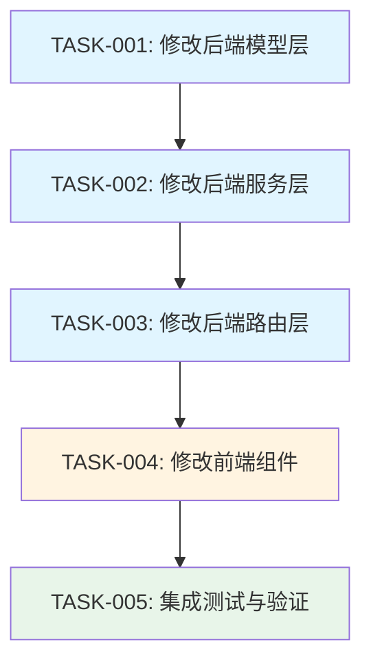

# 项目备注字段 - 任务拆分文档

## 一、任务拆分原则

- 每个任务可独立完成
- 任务复杂度可控
- 明确的输入输出契约
- 清晰的验收标准
- 按依赖关系排序

## 二、原子任务列表

### 任务1: 修改后端模型层 - Project类

**任务ID**: TASK-001  
**优先级**: P0（基础）  
**预计时间**: 10分钟

#### 输入契约
- 现有的 `backend/models/project.py` 文件
- DESIGN文档中的模型设计规范

#### 输出契约
- Project类包含remarks字段
- __init__方法接收remarks参数（默认''）
- validate方法验证remarks字段
- to_dict方法包含remarks字段
- from_dict方法兼容读取remarks字段
- update方法的allowed_fields包含remarks

#### 实现约束
- 保持与现有字段一致的处理方式
- 使用中文注释
- 验证规则：类型检查 + 长度限制（500字符）
- 兼容性：使用.get('remarks', '')读取

#### 验收标准
- [ ] remarks字段正确添加到__init__方法
- [ ] validate方法包含remarks验证逻辑
- [ ] to_dict包含remarks字段
- [ ] from_dict使用.get兼容旧数据
- [ ] update的allowed_fields包含remarks
- [ ] 代码注释完整

#### 依赖关系
- 前置依赖：无
- 后置任务：TASK-002

---

### 任务2: 修改后端服务层 - ProjectService

**任务ID**: TASK-002  
**优先级**: P0（基础）  
**预计时间**: 5分钟

#### 输入契约
- 完成的TASK-001（Project模型支持remarks）
- 现有的 `backend/services/project_service.py` 文件
- DESIGN文档中的服务层设计规范

#### 输出契约
- create方法接收remarks参数（默认''）
- create方法将remarks传递给Project构造函数
- update方法支持更新remarks字段

#### 实现约束
- 参数默认值：remarks=''
- 保持方法签名清晰
- 添加中文注释说明

#### 验收标准
- [ ] create方法签名包含remarks参数
- [ ] create方法将remarks传递给Project
- [ ] 方法文档字符串更新
- [ ] 代码与现有服务保持一致

#### 依赖关系
- 前置依赖：TASK-001
- 后置任务：TASK-003

---

### 任务3: 修改后端路由层 - projects路由

**任务ID**: TASK-003  
**优先级**: P0（基础）  
**预计时间**: 5分钟

#### 输入契约
- 完成的TASK-002（服务层支持remarks）
- 现有的 `backend/routes/projects.py` 文件
- DESIGN文档中的API接口规范

#### 输出契约
- POST /api/projects 支持接收remarks字段（可选）
- PUT /api/projects/:id 支持更新remarks字段
- allowed_fields列表包含remarks

#### 实现约束
- 使用data.get('remarks', '')读取
- remarks不在required_fields中
- 保持错误处理一致性
- 更新接口文档字符串

#### 验收标准
- [ ] create_project使用data.get('remarks', '')
- [ ] create_project将remarks传递给service.create
- [ ] update_project的allowed_fields包含remarks
- [ ] 接口文档字符串更新

#### 依赖关系
- 前置依赖：TASK-002
- 后置任务：TASK-004

---

### 任务4: 修改前端组件 - ProjectModal

**任务ID**: TASK-004  
**优先级**: P0（基础）  
**预计时间**: 15分钟

#### 输入契约
- 完成的TASK-003（后端API支持remarks）
- 现有的 `frontend/src/components/ProjectModal.jsx` 文件
- DESIGN文档中的前端组件设计规范

#### 输出契约
- 表单包含remarks字段（TextArea）
- 编辑模式正确回填remarks值
- 表单提交包含remarks数据
- 表单验证：最大500字符

#### 实现约束
- 位置：在"暂定"字段之后
- 组件：Input.TextArea
- 属性：rows=4, maxLength=500, showCount=true
- 验证：max: 500
- 兼容：使用 || '' 处理undefined

#### 验收标准
- [ ] 表单包含remarks的Form.Item
- [ ] useEffect中设置remarks回填逻辑
- [ ] handleSubmit中包含remarks字段
- [ ] 表单验证规则正确
- [ ] TextArea组件配置正确
- [ ] 注释清晰

#### 依赖关系
- 前置依赖：TASK-003
- 后置任务：TASK-005

---

### 任务5: 集成测试与验证

**任务ID**: TASK-005  
**优先级**: P1（验证）  
**预计时间**: 10分钟

#### 输入契约
- 完成的TASK-001至TASK-004（所有代码修改）
- 项目可以正常启动

#### 输出契约
- 所有功能测试通过
- 验收标准全部满足
- 无回归问题

#### 实现约束
- 测试环境：本地开发环境
- 测试数据：包含旧项目和新项目
- 测试方法：手动功能测试

#### 测试用例
1. **创建项目（含remarks）**
   - 输入：填写所有字段包括remarks
   - 预期：项目成功创建，remarks正确保存

2. **创建项目（不含remarks）**
   - 输入：不填写remarks字段
   - 预期：项目成功创建，remarks为空字符串

3. **编辑旧项目（无remarks）**
   - 输入：打开旧项目编辑
   - 预期：表单正常显示，remarks为空，可以保存

4. **编辑项目（修改remarks）**
   - 输入：修改项目的remarks字段
   - 预期：remarks正确更新并保存

5. **长度验证测试**
   - 输入：输入501字符的remarks
   - 预期：前端显示验证错误，无法提交

6. **空值测试**
   - 输入：remarks留空提交
   - 预期：项目正常保存，remarks为空字符串

#### 验收标准
- [ ] 新建项目（含remarks）成功
- [ ] 新建项目（不含remarks）成功
- [ ] 编辑旧项目不报错
- [ ] 修改remarks成功保存
- [ ] 长度验证生效
- [ ] 空值处理正确
- [ ] 无回归问题
- [ ] 数据正确存储到JSON文件

#### 依赖关系
- 前置依赖：TASK-001, TASK-002, TASK-003, TASK-004
- 后置任务：无

---

## 三、任务依赖图

**说明**：
- 蓝色：后端任务
- 黄色：前端任务
- 绿色：测试任务

## 四、执行顺序

按照依赖关系，任务必须按以下顺序执行：

1. **TASK-001**: 修改后端模型层（基础）
2. **TASK-002**: 修改后端服务层（依赖TASK-001）
3. **TASK-003**: 修改后端路由层（依赖TASK-002）
4. **TASK-004**: 修改前端组件（依赖TASK-003）
5. **TASK-005**: 集成测试与验证（依赖所有开发任务）

## 五、风险控制

### 5.1 关键检查点

**检查点1：TASK-001完成后**
- 验证模型单元测试（可选）
- 确认字段正确添加
- 确认验证逻辑正确

**检查点2：TASK-003完成后**
- 验证后端API（使用curl或Postman）
- 确认数据正确存储
- 确认旧数据兼容

**检查点3：TASK-004完成后**
- 验证前端表单渲染
- 验证表单验证规则
- 验证数据提交

**检查点4：TASK-005完成后**
- 完整的功能验证
- 确认所有验收标准通过

### 5.2 回滚计划

如果任何任务失败：
1. **TASK-001失败**：撤销模型修改，无影响
2. **TASK-002失败**：撤销服务修改，不影响现有功能
3. **TASK-003失败**：撤销路由修改，不影响现有功能
4. **TASK-004失败**：撤销前端修改，后端已支持但前端不显示
5. **TASK-005失败**：根据具体问题定位修复

## 六、时间估算

| 任务 | 预计时间 | 累计时间 |
|------|---------|---------|
| TASK-001 | 10分钟 | 10分钟 |
| TASK-002 | 5分钟 | 15分钟 |
| TASK-003 | 5分钟 | 20分钟 |
| TASK-004 | 15分钟 | 35分钟 |
| TASK-005 | 10分钟 | 45分钟 |
| **总计** | **45分钟** | - |

## 七、成功标准

任务被认为成功完成需满足：

1. ✅ 所有代码修改完成且符合规范
2. ✅ 所有验收标准通过
3. ✅ 集成测试全部通过
4. ✅ 无回归问题
5. ✅ 代码注释完整
6. ✅ 旧数据兼容性验证通过

## 八、交付物清单

1. 修改后的 `backend/models/project.py`
2. 修改后的 `backend/services/project_service.py`
3. 修改后的 `backend/routes/projects.py`
4. 修改后的 `frontend/src/components/ProjectModal.jsx`
5. ACCEPTANCE文档（测试结果记录）
6. FINAL文档（项目总结）
