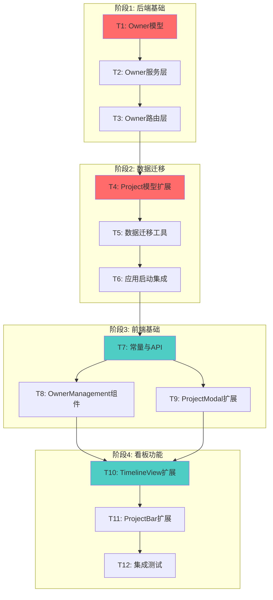

# TASK - 项目负责人与人员看板

## 任务拆分概览

本项目共拆分为 **12个原子任务**，按依赖关系分为4个阶段执行。

### 任务依赖图



## 阶段1: 后端基础（T1-T3）

### T1: 创建Owner模型

#### 输入契约
- 无前置依赖
- 需要参考现有的Project和ProductLine模型

#### 输出契约
- 文件：`backend/models/owner.py`
- 包含完整的Owner类定义
- 包含数据验证逻辑
- 包含颜色分配算法

#### 实现约束
- 遵循现有模型的代码风格
- 使用UUID生成ID
- 颜色格式为HEX（#RRGGBB）
- 包含完整的中文注释

#### 验收标准
- [ ] Owner类定义完整
- [ ] 字段验证逻辑正确
- [ ] 颜色分配算法实现（预定义池+HSL生成）
- [ ] 单元测试通过（可选）
- [ ] 代码符合Python规范

#### 详细实现
```python
# backend/models/owner.py
"""
人员数据模型
定义项目负责人的数据结构和验证逻辑
"""
import uuid
import time
import re


class Owner:
    """
    人员数据模型类
    
    Attributes:
        id: 人员唯一标识符（owner-{UUID}格式）
        name: 人员姓名（必填，1-50字符）
        color: 分配的颜色（HEX格式）
        createdAt: 创建时间戳（毫秒）
    """
    
    # 预定义颜色池（20种高对比度颜色）
    COLOR_POOL = [
        '#FF6B6B', '#4ECDC4', '#45B7D1', '#FFA07A', '#98D8C8',
        '#F7DC6F', '#BB8FCE', '#85C1E2', '#F8B739', '#52B788',
        '#E74C3C', '#3498DB', '#9B59B6', '#1ABC9C', '#F39C12',
        '#E67E22', '#95A5A6', '#34495E', '#16A085', '#27AE60'
    ]
    
    def __init__(self, name, id=None, color=None, createdAt=None):
        """初始化人员对象"""
        self.id = id or self._generate_id()
        self.name = name
        self.color = color  # 如果为None，在服务层分配
        self.createdAt = createdAt or self._get_current_timestamp()
        self.validate()
    
    @staticmethod
    def _generate_id():
        """生成唯一的人员ID"""
        return f"owner-{str(uuid.uuid4())}"
    
    @staticmethod
    def _get_current_timestamp():
        """获取当前时间戳（毫秒）"""
        return int(time.time() * 1000)
    
    def validate(self):
        """验证人员数据的有效性"""
        # 验证姓名
        if not self.name or not isinstance(self.name, str):
            raise ValueError("人员姓名必须是非空字符串")
        if not self.name.strip():
            raise ValueError("人员姓名不能为空白字符")
        if len(self.name) > 50:
            raise ValueError("人员姓名长度不能超过50个字符")
        
        # 验证颜色格式（如果提供）
        if self.color and not re.match(r'^#[0-9A-Fa-f]{6}$', self.color):
            raise ValueError("颜色格式必须是HEX格式（如#FF6B6B）")
    
    def to_dict(self):
        """将人员对象转换为字典"""
        return {
            'id': self.id,
            'name': self.name,
            'color': self.color,
            'createdAt': self.createdAt
        }
    
    @classmethod
    def from_dict(cls, data):
        """从字典创建人员对象"""
        return cls(
            name=data['name'],
            id=data.get('id'),
            color=data.get('color'),
            createdAt=data.get('createdAt')
        )
```

---

### T2: 创建Owner服务层

#### 输入契约
- 依赖：T1完成
- 需要file_handler工具

#### 输出契约
- 文件：`backend/services/owner_service.py`
- 实现所有人员CRUD操作
- 实现颜色分配算法
- 实现项目关联检查

#### 实现约束
- 使用file_handler进行文件操作
- 颜色分配使用混合策略
- 检查人员姓名唯一性
- 包含完整的错误处理

#### 验收标准
- [ ] get_all_owners()正常工作
- [ ] create_owner()正确分配颜色
- [ ] delete_owner()正确检查项目关联
- [ ] 姓名重复检查有效
- [ ] 颜色分配算法正确（前20个预定义，后续HSL）

---

### T3: 创建Owner路由层

#### 输入契约
- 依赖：T2完成
- 需要Flask框架

#### 输出契约
- 文件：`backend/routes/owners.py`
- 实现4个API端点
- 正确的HTTP状态码
- 完整的错误处理

#### 实现约束
- 遵循现有路由的代码风格
- 使用装饰器处理异常
- 返回JSON格式数据
- 包含CORS支持

#### 验收标准
- [ ] GET /api/owners 返回人员列表
- [ ] POST /api/owners 创建人员
- [ ] DELETE /api/owners/:id 删除人员
- [ ] GET /api/owners/:id/projects/count 返回项目数
- [ ] 错误处理完整
- [ ] API文档注释完整

---

## 阶段2: 数据迁移（T4-T6）

### T4: 扩展Project模型

#### 输入契约
- 依赖：T1-T3完成
- 现有Project模型文件

#### 输出契约
- 修改：`backend/models/project.py`
- 添加ownerId字段
- 添加ownerId验证

#### 实现约束
- 保持向后兼容
- ownerId为必填字段
- 验证ownerId存在性（在服务层）

#### 验收标准
- [ ] Project类包含ownerId字段
- [ ] ownerId验证逻辑正确
- [ ] to_dict()包含ownerId
- [ ] from_dict()支持ownerId
- [ ] 现有测试不受影响

---

### T5: 创建数据迁移工具

#### 输入契约
- 依赖：T4完成
- 需要访问owners和projects数据

#### 输出契约
- 文件：`backend/utils/migrate_owners.py`
- 实现数据迁移逻辑
- 创建默认人员
- 为现有项目分配默认人员

#### 实现约束
- 幂等性（可重复执行）
- 不破坏现有数据
- 记录迁移日志

#### 验收标准
- [ ] 自动创建owners.json
- [ ] 创建"未分配"默认人员
- [ ] 为现有项目添加ownerId
- [ ] 迁移可重复执行
- [ ] 迁移日志清晰

---

### T6: 集成到应用启动

#### 输入契约
- 依赖：T5完成
- 需要修改app.py

#### 输出契约
- 修改：`backend/app.py`
- 注册owners路由
- 启动时执行数据迁移

#### 实现约束
- 不影响现有路由
- 迁移失败不阻塞启动
- 记录迁移结果

#### 验收标准
- [ ] owners路由正确注册
- [ ] 启动时自动执行迁移
- [ ] 迁移错误有日志
- [ ] 应用正常启动

---

## 阶段3: 前端基础（T7-T9）

### T7: 添加常量与API服务

#### 输入契约
- 依赖：T6完成（后端API可用）
- 现有constants.js和api.js

#### 输出契约
- 修改：`frontend/src/utils/constants.js`
- 修改：`frontend/src/services/api.js`
- 添加人员颜色池常量
- 添加看板类型常量
- 添加人员API方法

#### 实现约束
- 颜色池与后端一致
- API方法使用async/await
- 错误处理完整

#### 验收标准
- [ ] OWNER_COLOR_POOL定义正确
- [ ] BOARD_TYPES定义正确
- [ ] getOwners() API正常
- [ ] createOwner() API正常
- [ ] deleteOwner() API正常
- [ ] getOwnerProjectCount() API正常

#### 详细实现
```javascript
// constants.js 新增
export const OWNER_COLOR_POOL = [
  '#FF6B6B', '#4ECDC4', '#45B7D1', '#FFA07A', '#98D8C8',
  '#F7DC6F', '#BB8FCE', '#85C1E2', '#F8B739', '#52B788',
  '#E74C3C', '#3498DB', '#9B59B6', '#1ABC9C', '#F39C12',
  '#E67E22', '#95A5A6', '#34495E', '#16A085', '#27AE60'
]

export const BOARD_TYPES = {
  STATUS: 'status',
  OWNER: 'owner'
}

// api.js 新增
export const getOwners = async () => {
  const response = await fetch(`${API_BASE_URL}/owners`)
  if (!response.ok) throw new Error('获取人员列表失败')
  return response.json()
}

export const createOwner = async (name) => {
  const response = await fetch(`${API_BASE_URL}/owners`, {
    method: 'POST',
    headers: { 'Content-Type': 'application/json' },
    body: JSON.stringify({ name })
  })
  if (!response.ok) {
    const error = await response.json()
    throw new Error(error.error || '创建人员失败')
  }
  return response.json()
}

export const deleteOwner = async (ownerId) => {
  const response = await fetch(`${API_BASE_URL}/owners/${ownerId}`, {
    method: 'DELETE'
  })
  if (!response.ok) {
    const error = await response.json()
    throw new Error(error.error || '删除人员失败')
  }
  return response.json()
}

export const getOwnerProjectCount = async (ownerId) => {
  const response = await fetch(`${API_BASE_URL}/owners/${ownerId}/projects/count`)
  if (!response.ok) throw new Error('获取项目数失败')
  return response.json()
}
```

---

### T8: 创建OwnerManagement组件

#### 输入契约
- 依赖：T7完成
- Ant Design组件库

#### 输出契约
- 文件：`frontend/src/components/OwnerManagement.jsx`
- 完整的人员管理界面
- 新增/删除功能
- 项目数显示

#### 实现约束
- 使用Ant Design组件
- 响应式布局
- 错误提示友好
- 加载状态显示

#### 验收标准
- [ ] 人员列表正确显示
- [ ] 可以新增人员
- [ ] 可以删除未关联项目的人员
- [ ] 不能删除有关联项目的人员
- [ ] 显示关联项目数
- [ ] 颜色标识清晰
- [ ] 交互流畅

---

### T9: 扩展ProjectModal组件

#### 输入契约
- 依赖：T7完成
- 现有ProjectModal组件

#### 输出契约
- 修改：`frontend/src/components/ProjectModal.jsx`
- 添加负责人选择器
- 支持快速新增人员
- 必填验证

#### 实现约束
- 保持现有功能不变
- 负责人选择器在产品线之后
- 支持下拉框内新增人员
- 显示人员颜色标识

#### 验收标准
- [ ] 表单包含负责人选择器
- [ ] 负责人为必填项
- [ ] 可以选择现有人员
- [ ] 可以快速新增人员
- [ ] 新增人员后自动选中
- [ ] 颜色标识显示
- [ ] 验证逻辑正确

---

## 阶段4: 看板功能（T10-T12）

### T10: 扩展TimelineView组件

#### 输入契约
- 依赖：T8, T9完成
- 现有TimelineView组件

#### 输出契约
- 修改：`frontend/src/components/Timeline/TimelineView.jsx`
- 添加看板切换控件
- 管理看板类型状态
- 传递owners数据

#### 实现约束
- 使用Segmented组件
- 状态持久化到localStorage
- 不影响现有时间轴功能

#### 验收标准
- [ ] 看板切换控件显示在顶部
- [ ] 可以切换进度/人员看板
- [ ] 切换立即生效
- [ ] 状态持久化
- [ ] owners数据正确传递
- [ ] boardType正确传递

---

### T11: 扩展ProjectBar组件

#### 输入契约
- 依赖：T10完成
- 现有ProjectBar组件

#### 输出契约
- 修改：`frontend/src/components/Timeline/ProjectBar.jsx`
- 支持双色彩模式
- 根据看板类型选择颜色

#### 实现约束
- 保持现有渲染逻辑
- 使用React.memo优化性能
- 颜色选择逻辑清晰

#### 验收标准
- [ ] 进度看板按状态显示颜色
- [ ] 人员看板按负责人显示颜色
- [ ] 颜色切换流畅
- [ ] 性能优化有效
- [ ] 暂停状态正确处理

#### 详细实现
```javascript
function ProjectBar({ project, timelineParams, row, onEdit, boardType, owners }) {
  // 根据看板类型选择颜色
  const getColor = () => {
    if (boardType === 'owner') {
      // 人员看板：按负责人显示颜色
      const owner = owners.find(o => o.id === project.ownerId)
      return owner?.color || '#95A5A6'
    } else {
      // 进度看板：按状态显示颜色
      return STATUS_COLORS[project.status] || '#999'
    }
  }
  
  const color = getColor()
  const isPaused = project.status === '暂停'
  
  // ... 其余渲染逻辑保持不变
}

export default React.memo(ProjectBar, (prevProps, nextProps) => {
  return (
    prevProps.project.id === nextProps.project.id &&
    prevProps.boardType === nextProps.boardType &&
    prevProps.project.ownerId === nextProps.project.ownerId &&
    prevProps.project.status === nextProps.project.status
  )
})
```

---

### T12: 集成测试与优化

#### 输入契约
- 依赖：T1-T11全部完成
- 完整的功能实现

#### 输出契约
- 完整的功能测试
- 性能优化
- Bug修复
- 文档更新

#### 实现约束
- 测试所有功能点
- 验证数据一致性
- 检查用户体验

#### 验收标准
- [ ] 所有功能正常工作
- [ ] 数据迁移成功
- [ ] 人员管理功能完整
- [ ] 项目负责人功能完整
- [ ] 看板切换功能完整
- [ ] 无明显bug
- [ ] 性能良好
- [ ] 文档完整

#### 测试清单
1. **人员管理测试**
   - [ ] 新增人员（正常、重名、空名）
   - [ ] 删除人员（无关联、有关联）
   - [ ] 人员列表显示
   - [ ] 项目数统计

2. **项目负责人测试**
   - [ ] 创建项目（选择负责人）
   - [ ] 编辑项目（修改负责人）
   - [ ] 快速新增人员
   - [ ] 必填验证

3. **看板切换测试**
   - [ ] 切换到人员看板
   - [ ] 切换到进度看板
   - [ ] 颜色正确显示
   - [ ] 状态持久化

4. **数据迁移测试**
   - [ ] 首次启动迁移
   - [ ] 重复启动不重复迁移
   - [ ] 现有项目正确关联

5. **边界测试**
   - [ ] 大量人员（>20个）
   - [ ] 大量项目
   - [ ] 网络错误处理
   - [ ] 并发操作

---

## 任务执行顺序

### 第1天：后端基础
1. T1: Owner模型（1小时）
2. T2: Owner服务层（2小时）
3. T3: Owner路由层（1小时）

### 第2天：数据迁移
4. T4: Project模型扩展（0.5小时）
5. T5: 数据迁移工具（1.5小时）
6. T6: 应用启动集成（0.5小时）

### 第3天：前端基础
7. T7: 常量与API服务（1小时）
8. T8: OwnerManagement组件（2小时）
9. T9: ProjectModal扩展（1.5小时）

### 第4天：看板功能
10. T10: TimelineView扩展（1小时）
11. T11: ProjectBar扩展（1小时）
12. T12: 集成测试与优化（2小时）

**预计总工时：15小时**

## 风险与应对

### 风险1：数据迁移失败
- **应对**：提供回滚机制，备份数据文件

### 风险2：颜色区分度不足
- **应对**：调整HSL算法参数，增加对比度

### 风险3：性能问题
- **应对**：使用React.memo，优化渲染逻辑

### 风险4：兼容性问题
- **应对**：充分测试，保持向后兼容

## 下一步

进入Approve阶段，等待人工审批确认任务拆分合理性。
