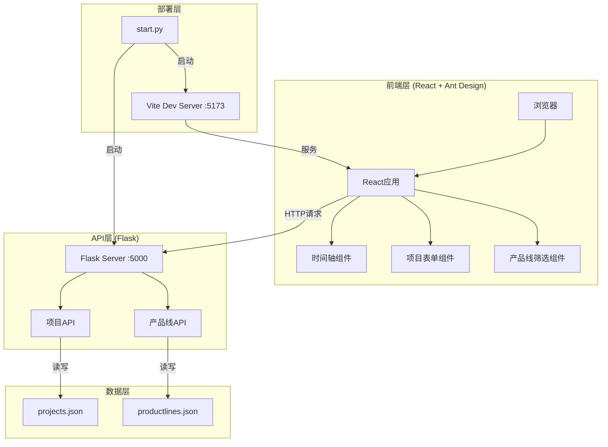
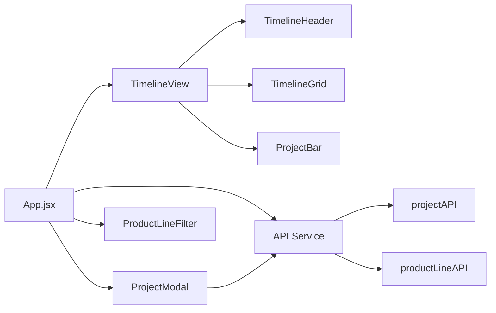
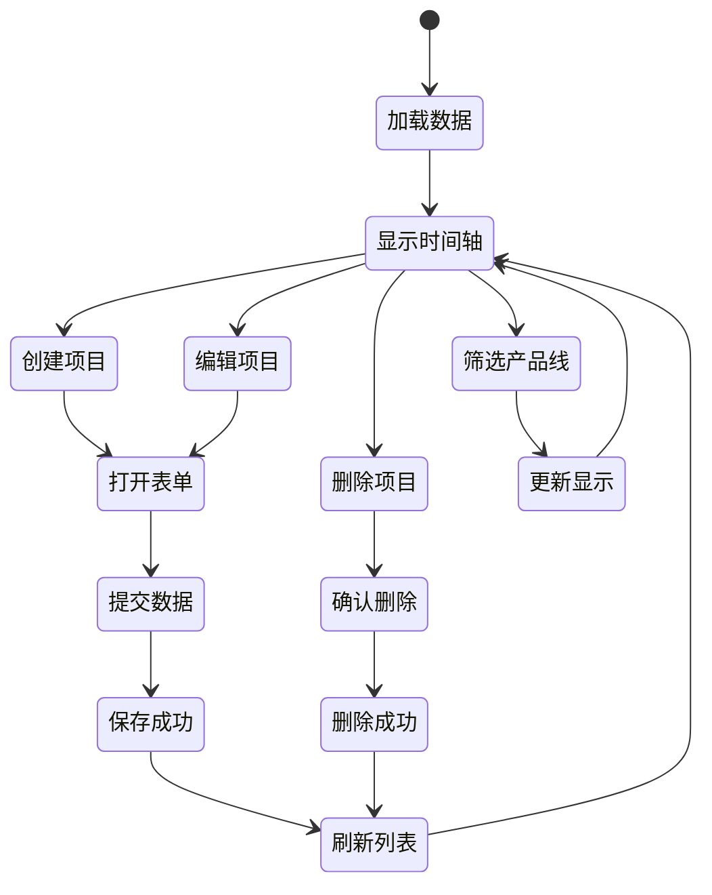
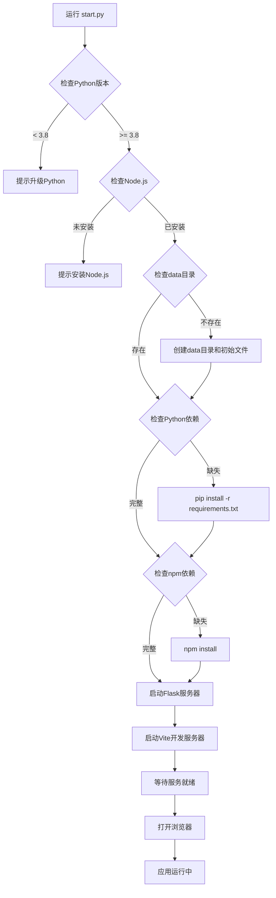

# 架构设计文档 - 项目路线图工具

## 1. 系统架构概览

### 1.1 整体架构图



### 1.2 技术栈分层

| 层级 | 技术 | 职责 |
|------|------|------|
| 展示层 | React 18 + Ant Design 5.0 | UI渲染、用户交互 |
| 状态层 | React Hooks | 状态管理、数据流 |
| 通信层 | Fetch API | HTTP请求、数据传输 |
| 服务层 | Flask + Flask-CORS | API服务、路由处理 |
| 数据层 | JSON文件 | 数据持久化 |
| 工具层 | dayjs | 日期计算、格式化 |

## 2. 核心模块设计

### 2.1 前端模块架构



#### 2.1.1 组件层次结构

```
src/
├── App.jsx                    # 根组件
├── components/
│   ├── Timeline/
│   │   ├── TimelineView.jsx   # 时间轴主视图
│   │   ├── TimelineHeader.jsx # 时间轴头部（月份刻度）
│   │   ├── TimelineGrid.jsx   # 背景网格（周刻度）
│   │   ├── ProjectBar.jsx     # 项目块
│   │   └── Swimlane.jsx       # 产品线泳道
│   ├── ProjectModal.jsx       # 项目创建/编辑弹窗
│   └── ProductLineFilter.jsx  # 产品线筛选器
├── services/
│   └── api.js                 # API服务封装
├── utils/
│   ├── dateUtils.js           # 日期工具函数
│   ├── layoutUtils.js         # 布局计算工具
│   └── constants.js           # 常量定义
└── styles/
    └── timeline.css           # 时间轴样式
```

### 2.2 后端模块架构

```
backend/
├── app.py                     # Flask应用入口
├── routes/
│   ├── projects.py            # 项目路由
│   └── productlines.py        # 产品线路由
├── services/
│   ├── project_service.py     # 项目业务逻辑
│   └── productline_service.py # 产品线业务逻辑
├── models/
│   ├── project.py             # 项目数据模型
│   └── productline.py         # 产品线数据模型
└── utils/
    └── file_handler.py        # 文件读写工具
```

## 3. 数据模型设计

### 3.1 产品线模型

```python
class ProductLine:
    """
    产品线数据模型
    """
    id: str          # UUID格式
    name: str        # 产品线名称
    createdAt: int   # 创建时间戳（毫秒）
```

**JSON示例**:
```json
{
  "id": "pl-uuid-001",
  "name": "核心业务线",
  "createdAt": 1704067200000
}
```

### 3.2 项目模型

```python
class Project:
    """
    项目数据模型
    """
    id: str              # UUID格式
    name: str            # 项目名称
    productLineId: str   # 所属产品线ID
    startDate: str       # 开始日期 YYYY-MM-DD
    endDate: str         # 结束日期 YYYY-MM-DD
    status: str          # 状态：规划|方案|设计|开发|测试|已上|暂停
    createdAt: int       # 创建时间戳（毫秒）
    updatedAt: int       # 更新时间戳（毫秒）
```

**JSON示例**:
```json
{
  "id": "proj-uuid-001",
  "name": "用户中心重构",
  "productLineId": "pl-uuid-001",
  "startDate": "2025-01-01",
  "endDate": "2025-03-31",
  "status": "开发",
  "createdAt": 1704067200000,
  "updatedAt": 1704067200000
}
```

### 3.3 数据文件结构

**data/productlines.json**:
```json
{
  "productlines": [
    {
      "id": "pl-uuid-001",
      "name": "核心业务线",
      "createdAt": 1704067200000
    }
  ]
}
```

**data/projects.json**:
```json
{
  "projects": [
    {
      "id": "proj-uuid-001",
      "name": "用户中心重构",
      "productLineId": "pl-uuid-001",
      "startDate": "2025-01-01",
      "endDate": "2025-03-31",
      "status": "开发",
      "createdAt": 1704067200000,
      "updatedAt": 1704067200000
    }
  ]
}
```

## 4. API接口设计

### 4.1 产品线API

| 方法 | 路径 | 说明 | 请求体 | 响应 |
|------|------|------|--------|------|
| GET | /api/productlines | 获取所有产品线 | - | `{productlines: [...]}` |
| POST | /api/productlines | 创建产品线 | `{name: string}` | `{id, name, createdAt}` |

### 4.2 项目API

| 方法 | 路径 | 说明 | 请求体 | 响应 |
|------|------|------|--------|------|
| GET | /api/projects | 获取所有项目 | - | `{projects: [...]}` |
| POST | /api/projects | 创建项目 | Project对象 | 创建的项目对象 |
| PUT | /api/projects/:id | 更新项目 | Project对象 | 更新后的项目对象 |
| DELETE | /api/projects/:id | 删除项目 | - | `{success: true}` |

### 4.3 API响应格式

**成功响应**:
```json
{
  "success": true,
  "data": {...}
}
```

**错误响应**:
```json
{
  "success": false,
  "error": "错误信息"
}
```

## 5. 核心算法设计

### 5.1 时间轴渲染算法

```javascript
/**
 * 计算时间轴渲染参数
 * @param {Array} projects - 项目列表
 * @returns {Object} 渲染参数
 */
function calculateTimelineParams(projects) {
  // 1. 找出最早和最晚日期
  const dates = projects.flatMap(p => [p.startDate, p.endDate]);
  const minDate = dayjs.min(dates).subtract(2, 'month');
  const maxDate = dayjs.max(dates).add(2, 'month');
  
  // 2. 计算总天数
  const totalDays = maxDate.diff(minDate, 'day');
  
  // 3. 计算像素比例（假设容器宽度为可滚动的）
  const pixelsPerDay = 3; // 每天3像素
  const totalWidth = totalDays * pixelsPerDay;
  
  return {
    minDate,
    maxDate,
    totalDays,
    pixelsPerDay,
    totalWidth
  };
}
```

### 5.2 项目块定位算法

```javascript
/**
 * 计算项目块的位置和尺寸
 * @param {Object} project - 项目对象
 * @param {Object} timelineParams - 时间轴参数
 * @returns {Object} 位置和尺寸
 */
function calculateProjectBarPosition(project, timelineParams) {
  const { minDate, pixelsPerDay } = timelineParams;
  
  // 计算起始位置
  const startOffset = dayjs(project.startDate).diff(minDate, 'day');
  const left = startOffset * pixelsPerDay;
  
  // 计算宽度
  const duration = dayjs(project.endDate).diff(project.startDate, 'day');
  const width = duration * pixelsPerDay;
  
  return { left, width };
}
```

### 5.3 重叠检测与行分配算法

```javascript
/**
 * 检测两个项目是否时间重叠
 * @param {Object} p1 - 项目1
 * @param {Object} p2 - 项目2
 * @returns {boolean} 是否重叠
 */
function isTimeOverlap(p1, p2) {
  const start1 = dayjs(p1.startDate);
  const end1 = dayjs(p1.endDate);
  const start2 = dayjs(p2.startDate);
  const end2 = dayjs(p2.endDate);
  
  return start1.isBefore(end2) && start2.isBefore(end1);
}

/**
 * 为项目分配行号（避免重叠）
 * @param {Array} projects - 同一产品线的项目列表
 * @returns {Array} 带行号的项目列表
 */
function assignRows(projects) {
  // 按开始时间排序
  const sorted = [...projects].sort((a, b) => 
    dayjs(a.startDate).diff(dayjs(b.startDate))
  );
  
  const result = [];
  
  for (const project of sorted) {
    let row = 0;
    
    // 找到第一个不冲突的行
    while (true) {
      const conflicts = result.filter(p => 
        p.row === row && isTimeOverlap(p, project)
      );
      
      if (conflicts.length === 0) {
        result.push({ ...project, row });
        break;
      }
      row++;
    }
  }
  
  return result;
}
```

### 5.4 月份刻度生成算法

```javascript
/**
 * 生成月份刻度
 * @param {Object} timelineParams - 时间轴参数
 * @returns {Array} 月份刻度数组
 */
function generateMonthTicks(timelineParams) {
  const { minDate, maxDate, pixelsPerDay } = timelineParams;
  const ticks = [];
  
  let current = minDate.startOf('month');
  
  while (current.isBefore(maxDate)) {
    const offset = current.diff(minDate, 'day') * pixelsPerDay;
    const daysInMonth = current.daysInMonth();
    const width = daysInMonth * pixelsPerDay;
    
    ticks.push({
      date: current.format('YYYY-MM'),
      label: current.format('YYYY年MM月'),
      offset,
      width
    });
    
    current = current.add(1, 'month');
  }
  
  return ticks;
}
```

### 5.5 周刻度网格算法

```javascript
/**
 * 生成周刻度网格线
 * @param {Object} timelineParams - 时间轴参数
 * @returns {Array} 周刻度位置数组
 */
function generateWeekGridLines(timelineParams) {
  const { minDate, maxDate, pixelsPerDay } = timelineParams;
  const lines = [];
  
  let current = minDate.startOf('week');
  
  while (current.isBefore(maxDate)) {
    const offset = current.diff(minDate, 'day') * pixelsPerDay;
    lines.push(offset);
    current = current.add(1, 'week');
  }
  
  return lines;
}
```

## 6. 状态管理设计

### 6.1 全局状态

```javascript
// App.jsx中的状态
const [projects, setProjects] = useState([]);
const [productLines, setProductLines] = useState([]);
const [selectedProductLines, setSelectedProductLines] = useState([]);
const [isModalVisible, setIsModalVisible] = useState(false);
const [editingProject, setEditingProject] = useState(null);
```

### 6.2 状态流转图



## 7. 样式设计规范

### 7.1 状态颜色常量

```javascript
export const STATUS_COLORS = {
  '规划': '#87CEEB',  // 浅蓝色
  '方案': '#4169E1',  // 蓝色
  '设计': '#32CD32',  // 绿色
  '开发': '#FF8C00',  // 橙色
  '测试': '#FFD700',  // 黄色
  '已上': '#DC143C',  // 深红色
  '暂停': '#808080'   // 灰色
};
```

### 7.2 项目块样式

```css
.project-bar {
  height: 40px;
  border-radius: 4px;
  padding: 8px 12px;
  cursor: pointer;
  transition: all 0.3s;
  box-shadow: 0 2px 4px rgba(0,0,0,0.1);
}

.project-bar:hover {
  transform: translateY(-2px);
  box-shadow: 0 4px 8px rgba(0,0,0,0.15);
}

.project-bar.status-暂停 {
  border: 2px dashed #808080;
  background-color: #f5f5f5;
}
```

### 7.3 时间轴样式

```css
.timeline-header {
  height: 60px;
  background: #fafafa;
  border-bottom: 2px solid #d9d9d9;
  position: sticky;
  top: 0;
  z-index: 10;
}

.timeline-grid {
  position: relative;
  background: 
    repeating-linear-gradient(
      to right,
      transparent,
      transparent calc(7 * 3px - 1px),
      #e8e8e8 calc(7 * 3px - 1px),
      #e8e8e8 calc(7 * 3px)
    );
}
```

## 8. 部署架构设计

### 8.1 启动脚本流程



### 8.2 目录结构

```
项目路线图/
├── frontend/                  # 前端代码
│   ├── src/
│   ├── public/
│   ├── package.json
│   └── vite.config.js
├── backend/                   # 后端代码
│   ├── app.py
│   ├── routes/
│   ├── services/
│   ├── models/
│   └── requirements.txt
├── data/                      # 数据文件
│   ├── projects.json
│   └── productlines.json
├── docs/                      # 文档
│   └── 项目路线图工具/
├── start.py                   # 启动脚本
└── README.md                  # 项目说明
```

## 9. 错误处理设计

### 9.1 前端错误处理

```javascript
// API调用错误处理
async function fetchWithErrorHandling(url, options) {
  try {
    const response = await fetch(url, options);
    if (!response.ok) {
      throw new Error(`HTTP ${response.status}: ${response.statusText}`);
    }
    return await response.json();
  } catch (error) {
    message.error(`请求失败: ${error.message}`);
    throw error;
  }
}
```

### 9.2 后端错误处理

```python
# Flask错误处理装饰器
def handle_errors(f):
    @wraps(f)
    def decorated_function(*args, **kwargs):
        try:
            return f(*args, **kwargs)
        except FileNotFoundError:
            return jsonify({'success': False, 'error': '数据文件不存在'}), 404
        except json.JSONDecodeError:
            return jsonify({'success': False, 'error': '数据格式错误'}), 500
        except Exception as e:
            return jsonify({'success': False, 'error': str(e)}), 500
    return decorated_function
```

## 10. 性能优化策略

### 10.1 前端优化
- 使用React.memo避免不必要的重渲染
- 虚拟滚动处理大量项目
- 防抖处理筛选操作
- 懒加载组件

### 10.2 后端优化
- 文件读写缓存
- 批量操作支持
- 响应数据压缩

### 10.3 渲染优化
- CSS transform代替position变化
- 使用will-change提示浏览器
- 减少DOM操作次数

## 11. 测试策略

### 11.1 单元测试
- 日期计算函数测试
- 重叠检测算法测试
- API服务测试

### 11.2 集成测试
- 前后端API对接测试
- 数据持久化测试

### 11.3 E2E测试
- 项目创建流程测试
- 时间轴交互测试
- 筛选功能测试

## 12. 下一步

进入Atomize阶段，将设计拆分为可执行的原子任务。
