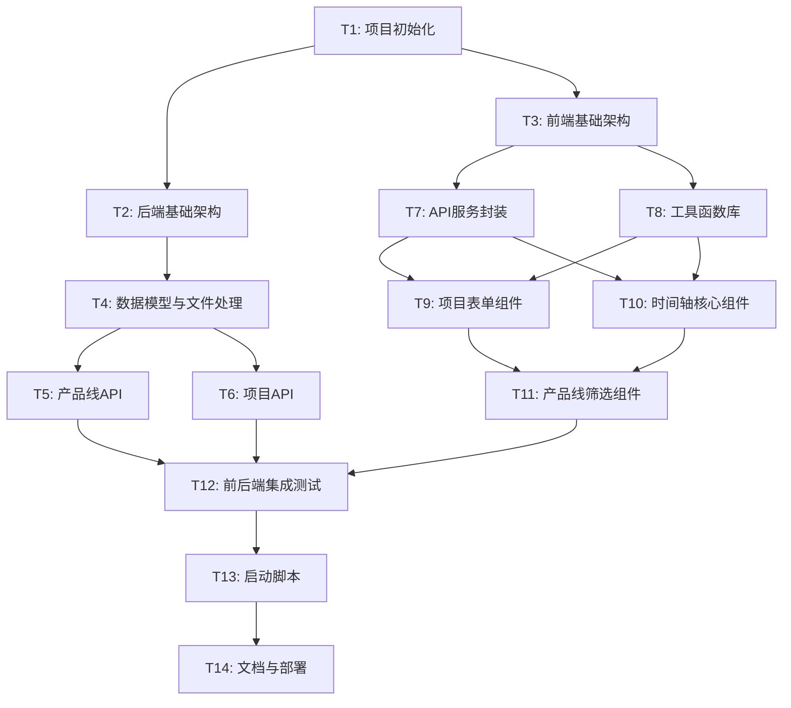

# 任务拆分文档 - 项目路线图工具

## 任务依赖关系图

## 原子任务列表

### T1: 项目初始化

**优先级**: P0 (最高)  
**预计时间**: 30分钟  
**依赖**: 无

#### 输入契约
- 空的工作目录
- 已安装Python 3.8+
- 已安装Node.js 16+

#### 任务内容
1. 创建项目目录结构
2. 初始化前端项目（Vite + React）
3. 初始化后端项目（Flask）
4. 创建基础配置文件
5. 创建data目录和初始JSON文件

#### 输出契约
- 完整的目录结构
- `frontend/package.json` 配置完成
- `backend/requirements.txt` 配置完成
- `data/projects.json` 和 `data/productlines.json` 初始化
- `.gitignore` 文件

#### 验收标准
- [ ] 目录结构符合设计文档
- [ ] 前端项目可以运行 `npm install`
- [ ] 后端项目可以运行 `pip install -r requirements.txt`
- [ ] data目录包含初始JSON文件

---

### T2: 后端基础架构

**优先级**: P0  
**预计时间**: 45分钟  
**依赖**: T1

#### 输入契约
- T1完成的项目结构
- Flask已安装

#### 任务内容
1. 创建Flask应用入口 `app.py`
2. 配置CORS支持
3. 创建路由蓝图结构
4. 实现错误处理中间件
5. 配置开发服务器

#### 输出契约
- `backend/app.py` - Flask应用主文件
- `backend/routes/__init__.py` - 路由包初始化
- CORS配置完成
- 错误处理装饰器实现

#### 验收标准
- [ ] Flask服务器可以启动
- [ ] CORS配置正确，前端可以跨域访问
- [ ] 错误处理中间件正常工作
- [ ] 访问根路径返回健康检查信息

---

### T3: 前端基础架构

**优先级**: P0  
**预计时间**: 45分钟  
**依赖**: T1

#### 输入契约
- T1完成的项目结构
- Node.js依赖已安装

#### 任务内容
1. 配置Vite
2. 安装Ant Design 5.0
3. 安装dayjs
4. 创建基础App组件
5. 配置路由（如需要）
6. 创建基础样式文件

#### 输出契约
- `frontend/vite.config.js` 配置完成
- `frontend/src/App.jsx` 根组件
- `frontend/src/main.jsx` 入口文件
- Ant Design主题配置
- 基础CSS文件

#### 验收标准
- [ ] Vite开发服务器可以启动
- [ ] Ant Design组件可以正常使用
- [ ] dayjs可以正常导入使用
- [ ] 页面可以正常显示

---

### T4: 数据模型与文件处理

**优先级**: P0  
**预计时间**: 1小时  
**依赖**: T2

#### 输入契约
- T2完成的后端基础架构
- data目录存在

#### 任务内容
1. 实现文件读写工具 `file_handler.py`
2. 创建产品线数据模型 `productline.py`
3. 创建项目数据模型 `project.py`
4. 实现数据验证逻辑
5. 实现UUID生成

#### 输出契约
- `backend/utils/file_handler.py` - 文件操作工具
- `backend/models/productline.py` - 产品线模型
- `backend/models/project.py` - 项目模型
- 数据验证函数

#### 验收标准
- [ ] 可以读取JSON文件
- [ ] 可以写入JSON文件
- [ ] 数据模型验证正确
- [ ] UUID生成唯一且格式正确
- [ ] 文件锁机制防止并发问题

---

### T5: 产品线API

**优先级**: P1  
**预计时间**: 45分钟  
**依赖**: T4

#### 输入契约
- T4完成的数据模型
- Flask路由结构就绪

#### 任务内容
1. 实现产品线服务层 `productline_service.py`
2. 实现产品线路由 `productlines.py`
3. GET /api/productlines - 获取所有产品线
4. POST /api/productlines - 创建产品线

#### 输出契约
- `backend/services/productline_service.py`
- `backend/routes/productlines.py`
- 两个API端点实现

#### 验收标准
- [ ] GET请求返回所有产品线
- [ ] POST请求可以创建新产品线
- [ ] 数据持久化到JSON文件
- [ ] 错误处理正确
- [ ] 使用Postman测试通过

---

### T6: 项目API

**优先级**: P1  
**预计时间**: 1.5小时  
**依赖**: T4

#### 输入契约
- T4完成的数据模型
- Flask路由结构就绪

#### 任务内容
1. 实现项目服务层 `project_service.py`
2. 实现项目路由 `projects.py`
3. GET /api/projects - 获取所有项目
4. POST /api/projects - 创建项目
5. PUT /api/projects/:id - 更新项目
6. DELETE /api/projects/:id - 删除项目

#### 输出契约
- `backend/services/project_service.py`
- `backend/routes/projects.py`
- 四个API端点实现

#### 验收标准
- [ ] GET请求返回所有项目
- [ ] POST请求可以创建新项目
- [ ] PUT请求可以更新项目
- [ ] DELETE请求可以删除项目
- [ ] 日期验证正确（结束日期>=开始日期）
- [ ] 数据持久化正确
- [ ] 使用Postman测试通过

---

### T7: API服务封装

**优先级**: P1  
**预计时间**: 45分钟  
**依赖**: T3

#### 输入契约
- T3完成的前端基础架构
- 后端API设计文档

#### 任务内容
1. 创建API服务模块 `api.js`
2. 封装fetch请求
3. 实现错误处理
4. 实现产品线API调用
5. 实现项目API调用

#### 输出契约
- `frontend/src/services/api.js`
- 统一的API调用接口
- 错误处理机制

#### 验收标准
- [ ] API调用函数封装完整
- [ ] 错误处理正确显示消息
- [ ] 支持所有CRUD操作
- [ ] 请求和响应格式统一

---

### T8: 工具函数库

**优先级**: P1  
**预计时间**: 1.5小时  
**依赖**: T3

#### 输入契约
- T3完成的前端基础架构
- dayjs已安装

#### 任务内容
1. 实现日期工具函数 `dateUtils.js`
   - 时间轴参数计算
   - 月份刻度生成
   - 周刻度生成
2. 实现布局工具函数 `layoutUtils.js`
   - 项目块定位计算
   - 重叠检测
   - 行分配算法
3. 定义常量 `constants.js`
   - 状态颜色映射
   - 像素比例常量

#### 输出契约
- `frontend/src/utils/dateUtils.js`
- `frontend/src/utils/layoutUtils.js`
- `frontend/src/utils/constants.js`

#### 验收标准
- [ ] 时间轴参数计算正确
- [ ] 月份刻度生成正确
- [ ] 周刻度生成正确
- [ ] 项目块定位计算准确
- [ ] 重叠检测算法正确
- [ ] 行分配算法无冲突
- [ ] 单元测试通过

---

### T9: 项目表单组件

**优先级**: P1  
**预计时间**: 2小时  
**依赖**: T7, T8

#### 输入契约
- T7完成的API服务
- T8完成的工具函数
- Ant Design可用

#### 任务内容
1. 创建ProjectModal组件
2. 实现表单字段
   - 项目名称输入
   - 产品线选择（支持新建）
   - 开始日期选择器
   - 结束日期选择器
   - 状态选择
3. 实现表单验证
4. 实现创建/编辑模式切换
5. 实现提交逻辑

#### 输出契约
- `frontend/src/components/ProjectModal.jsx`
- 完整的表单组件
- 表单验证逻辑

#### 验收标准
- [ ] 表单可以正常显示
- [ ] 所有字段验证正确
- [ ] 日期选择器限制正确
- [ ] 可以新建产品线
- [ ] 创建模式正常工作
- [ ] 编辑模式正常工作
- [ ] 提交后数据保存成功

---

### T10: 时间轴核心组件

**优先级**: P1  
**预计时间**: 3小时  
**依赖**: T7, T8

#### 输入契约
- T7完成的API服务
- T8完成的工具函数
- 项目数据可获取

#### 任务内容
1. 创建TimelineView主组件
2. 创建TimelineHeader组件（月份刻度）
3. 创建TimelineGrid组件（周背景）
4. 创建ProjectBar组件（项目块）
5. 创建Swimlane组件（产品线泳道）
6. 实现水平滚动
7. 实现项目块点击编辑

#### 输出契约
- `frontend/src/components/Timeline/TimelineView.jsx`
- `frontend/src/components/Timeline/TimelineHeader.jsx`
- `frontend/src/components/Timeline/TimelineGrid.jsx`
- `frontend/src/components/Timeline/ProjectBar.jsx`
- `frontend/src/components/Timeline/Swimlane.jsx`
- `frontend/src/styles/timeline.css`

#### 验收标准
- [ ] 时间轴正确显示月份刻度
- [ ] 背景显示周刻度网格
- [ ] 项目块位置准确对应时间
- [ ] 项目块长度准确对应时间跨度
- [ ] 项目块颜色正确映射状态
- [ ] 重叠项目自动分行
- [ ] 按产品线分组显示
- [ ] 水平滚动流畅
- [ ] 点击项目块可以编辑

---

### T11: 产品线筛选组件

**优先级**: P2  
**预计时间**: 1小时  
**依赖**: T9, T10

#### 输入契约
- T9完成的表单组件
- T10完成的时间轴组件
- 产品线数据可获取

#### 任务内容
1. 创建ProductLineFilter组件
2. 实现多选复选框
3. 实现筛选逻辑
4. 实现"新建项目"按钮
5. 实现状态图例

#### 输出契约
- `frontend/src/components/ProductLineFilter.jsx`
- 筛选器组件
- 图例组件

#### 验收标准
- [ ] 显示所有产品线选项
- [ ] 多选功能正常
- [ ] 筛选立即生效
- [ ] 新建按钮打开表单
- [ ] 状态图例显示正确

---

### T12: 前后端集成测试

**优先级**: P2  
**预计时间**: 1.5小时  
**依赖**: T5, T6, T11

#### 输入契约
- 所有功能组件完成
- 前后端都可以独立运行

#### 任务内容
1. 测试项目创建流程
2. 测试项目编辑流程
3. 测试项目删除流程
4. 测试产品线创建
5. 测试筛选功能
6. 测试数据持久化
7. 修复发现的bug

#### 输出契约
- 测试报告
- Bug修复

#### 验收标准
- [ ] 所有CRUD操作正常
- [ ] 数据持久化正确
- [ ] 页面刷新后数据保留
- [ ] 筛选功能正常
- [ ] 无明显bug

---

### T13: 启动脚本

**优先级**: P2  
**预计时间**: 2小时  
**依赖**: T12

#### 输入契约
- 前后端都可以正常运行
- 所有功能测试通过

#### 任务内容
1. 创建start.py启动脚本
2. 实现依赖检查
   - Python版本检查
   - Node.js版本检查
3. 实现依赖安装
   - pip install
   - npm install
4. 实现服务启动
   - 启动Flask服务器
   - 启动Vite开发服务器
5. 实现浏览器自动打开
6. 实现优雅关闭

#### 输出契约
- `start.py` 启动脚本
- 完整的启动流程

#### 验收标准
- [ ] 脚本可以一键运行
- [ ] 自动检查依赖版本
- [ ] 自动安装缺失依赖
- [ ] 自动启动前后端服务
- [ ] 自动打开浏览器
- [ ] Ctrl+C可以优雅关闭
- [ ] 错误提示清晰

---

### T14: 文档与部署

**优先级**: P3  
**预计时间**: 1小时  
**依赖**: T13

#### 输入契约
- 所有功能完成
- 启动脚本可用

#### 任务内容
1. 编写README.md
   - 项目介绍
   - 功能特性
   - 安装要求
   - 使用说明
   - 常见问题
2. 编写用户手册
3. 创建示例数据
4. 最终测试

#### 输出契约
- `README.md` 完整文档
- 示例数据文件
- 最终测试报告

#### 验收标准
- [ ] README文档完整清晰
- [ ] 示例数据可用
- [ ] 新用户可以按文档快速上手
- [ ] 所有功能正常工作

---

## 任务执行顺序

### 第一阶段：基础搭建（并行）
- T1: 项目初始化
- T2: 后端基础架构（依赖T1）
- T3: 前端基础架构（依赖T1）

### 第二阶段：核心功能（部分并行）
- T4: 数据模型与文件处理（依赖T2）
- T5: 产品线API（依赖T4）
- T6: 项目API（依赖T4）
- T7: API服务封装（依赖T3）
- T8: 工具函数库（依赖T3）

### 第三阶段：UI组件（部分并行）
- T9: 项目表单组件（依赖T7, T8）
- T10: 时间轴核心组件（依赖T7, T8）

### 第四阶段：完善功能
- T11: 产品线筛选组件（依赖T9, T10）
- T12: 前后端集成测试（依赖T5, T6, T11）

### 第五阶段：部署交付
- T13: 启动脚本（依赖T12）
- T14: 文档与部署（依赖T13）

## 总预计时间

- 基础搭建：2小时
- 核心功能：5.5小时
- UI组件：5小时
- 完善功能：2.5小时
- 部署交付：3小时

**总计：约18小时**

## 风险提示

1. **时间轴渲染性能**：如果项目数量超过100，可能需要优化渲染算法
2. **日期计算精度**：跨年、跨月计算需要仔细测试
3. **浏览器兼容性**：需要在Chrome、Safari、Firefox上测试

## 下一步

进入Approve阶段，等待人工审批后开始执行。
